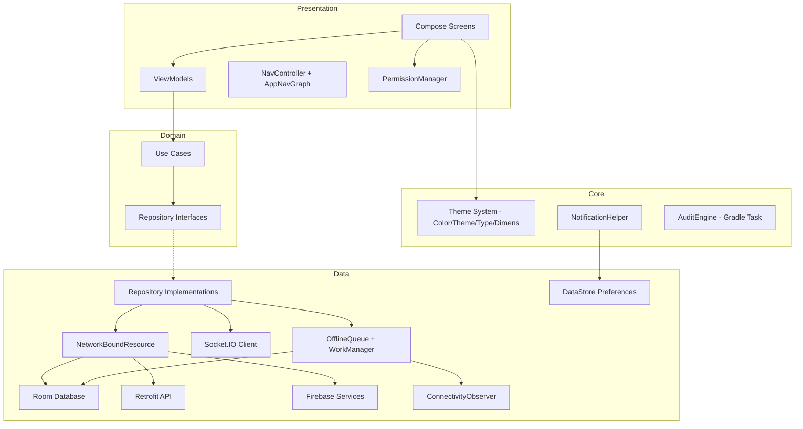

# Design Document: Android Project Enhancement

## Overview

This design covers the comprehensive enhancement of the "Where" Android application across 14 requirements spanning codebase audit tooling, Material 3 theme migration, design system documentation, UI/UX redesign, animations, navigation, feature completion, permission handling, offline-first support, network optimization, notification management, code cleanup, and production readiness.

The existing architecture follows Clean Architecture with a `data` → `domain` → `presentation` layering, Hilt DI, Room local persistence, Firebase + Retrofit + Socket.IO for remote data, and Jetpack Compose for UI. This design preserves that architecture while introducing new cross-cutting components (ConnectivityObserver, OfflineQueue, PermissionManager, NotificationHelper) and migrating the visual layer to a #5170FF-based Material 3 palette.

### Key Design Decisions

1. **Audit Engine as a Gradle task** — Runs as a custom Gradle task (`auditCodebase`) that parses Kotlin source files using regex-based scanning (not a full compiler plugin) to keep build complexity low.
2. **Theme migration in-place** — Color.kt, Theme.kt updated directly; no parallel theme system.
3. **Offline queue via WorkManager** — Leverages existing WorkManager dependency with Room-backed operation persistence.
4. **NetworkBoundResource as a reusable utility** — Generic inline function in the data layer, parameterized by cache and network types.
5. **Single PermissionManager** — A composable-level wrapper that encapsulates rationale dialogs, system permission requests, and settings deep-links.
6. **NotificationHelper as @Singleton** — Hilt-provided singleton centralizing channel creation and notification posting.

---

## Architecture



### Layer Responsibilities

| Layer | Responsibility |
|-------|---------------|
| **Presentation** | Compose UI, ViewModels, Navigation, PermissionManager composable |
| **Domain** | Use cases, repository interfaces, domain models |
| **Data** | Repository implementations, NetworkBoundResource, Room DAOs, DataStore, Retrofit, Firebase, Socket.IO, OfflineQueue, ConnectivityObserver |
| **Core** | Theme system, NotificationHelper, AuditEngine, constants, utilities |

---

## Components and Interfaces

### 1. AuditEngine (Requirement 1)

```kotlin
// buildSrc or app/build.gradle.kts custom task
abstract class AuditCodebaseTask : DefaultTask() {
    @get:InputDirectory abstract val sourceDir: DirectoryProperty
    @get:OutputFile abstract val outputFile: RegularFileProperty
    
    @TaskAction fun execute()
}

data class AuditResult(
    val screenStates: List<ScreenStateEntry>,
    val todoMarkers: List<CodeMarker>,
    val unusedCode: List<CodeMarker>,
    val debugLogs: List<CodeMarker>,
    val permissions: List<PermissionMapping>,
    val networkCalls: List<NetworkCallEntry>,
    val notificationChannels: List<ChannelEntry>,
    val parseErrors: List<ParseError>
)
```

### 2. Theme System (Requirements 2, 3)

Updated files: `Color.kt`, `Theme.kt` (unchanged: `Type.kt`, `Dimens.kt`, `WhereShapes`)

```kotlin
// Color.kt — new primary #5170FF tonal palette
val Primary10 = Color(0xFF001452)
val Primary20 = Color(0xFF002984)
val Primary30 = Color(0xFF003DB8)
val Primary40 = Color(0xFF5170FF)  // primary (light)
val Primary80 = Color(0xFFB6C4FF)  // primary (dark)
val Primary90 = Color(0xFFDCE1FF)  // primaryContainer (light)
val Primary99 = Color(0xFFFEFBFF)
```

### 3. PermissionManager (Requirement 9)

```kotlin
@Composable
fun rememberPermissionManager(): PermissionManagerState

interface PermissionManagerState {
    fun requestPermission(
        permission: String,
        rationale: PermissionRationale,
        onGranted: () -> Unit,
        onDenied: () -> Unit
    )
    fun requestBackgroundLocation(
        onGranted: () -> Unit,
        onDenied: () -> Unit
    )
}

data class PermissionRationale(
    val permissionName: String,
    val explanation: String
)
```

### 4. ConnectivityObserver (Requirement 10)

```kotlin
interface ConnectivityObserver {
    val isConnected: StateFlow<Boolean>
}

@Singleton
class NetworkConnectivityObserver @Inject constructor(
    @ApplicationContext private val context: Context
) : ConnectivityObserver {
    override val isConnected: StateFlow<Boolean>
}
```

### 5. OfflineQueue (Requirement 10)

```kotlin
@Entity(tableName = "offline_operations")
data class OfflineOperationEntity(
    @PrimaryKey val id: String = UUID.randomUUID().toString(),
    val type: OperationType,
    val payload: String,  // JSON-serialized
    val createdAt: Long = System.currentTimeMillis(),
    val status: OperationStatus = OperationStatus.PENDING,
    val retryCount: Int = 0
)

enum class OperationType { SEND_MESSAGE, CREATE_GROUP, UPDATE_PROFILE, ... }
enum class OperationStatus { PENDING, IN_PROGRESS, FAILED, COMPLETED }

@Dao
interface OfflineOperationDao {
    @Query("SELECT * FROM offline_operations WHERE status = 'PENDING' ORDER BY createdAt ASC LIMIT 50")
    suspend fun getPendingOperations(): List<OfflineOperationEntity>
    
    @Insert(onConflict = OnConflictStrategy.REPLACE)
    suspend fun insert(operation: OfflineOperationEntity)
    
    @Query("SELECT COUNT(*) FROM offline_operations WHERE status IN ('PENDING', 'IN_PROGRESS')")
    suspend fun getActiveCount(): Int
}

class OfflineQueueWorker(
    context: Context,
    params: WorkerParameters
) : CoroutineWorker(context, params)
```

### 6. NetworkBoundResource (Requirement 11)

```kotlin
inline fun <ResultType, RequestType> networkBoundResource(
    crossinline query: () -> Flow<ResultType>,
    crossinline fetch: suspend () -> RequestType,
    crossinline saveFetchResult: suspend (RequestType) -> Unit,
    crossinline shouldFetch: (ResultType?) -> Boolean = { true },
    crossinline onFetchFailed: (Throwable) -> Unit = {}
): Flow<Resource<ResultType>>

sealed class Resource<out T> {
    data class Success<T>(val data: T) : Resource<T>()
    data class Error<T>(val throwable: Throwable, val data: T? = null) : Resource<T>()
    data class Loading<T>(val data: T? = null) : Resource<T>()
}
```

### 7. NotificationHelper (Requirement 12)

```kotlin
@Singleton
class NotificationHelper @Inject constructor(
    @ApplicationContext private val context: Context,
    private val preferencesRepository: NotificationPreferencesRepository
) {
    fun createChannels()
    suspend fun postNotification(type: NotificationType, data: NotificationData)
    fun buildDeepLinkPendingIntent(type: NotificationType, data: NotificationData): PendingIntent
    fun groupMessageNotifications(conversationId: String, notifications: List<NotificationData>)
}

enum class NotificationType {
    NEW_MESSAGE, FRIEND_REQUEST, FRIEND_ACCEPTED,
    MEMBER_JOINED, MEMBER_LEFT, LOCATION_UPDATE, GENERAL
}

data class NotificationData(
    val title: String,
    val body: String,
    val targetId: String? = null,
    val conversationId: String? = null,
    val groupId: String? = null,
    val userId: String? = null
)
```

### 8. Navigation Architecture (Requirement 7)

The existing `Screen` sealed class and `AppNavGraph` are preserved but enhanced:

```kotlin
// Enhanced Screen.kt with type-safe arguments via kotlinx.serialization
@Serializable sealed class Screen {
    @Serializable object Onboarding : Screen()
    @Serializable data class Chat(val conversationId: String) : Screen()
    @Serializable data class UserProfile(val userId: String) : Screen()
    @Serializable data class GroupDetails(val groupId: String) : Screen()
    @Serializable data class GroupMap(val groupId: String) : Screen()
    // ... all 19 destinations
}
```

Transition animations updated from slide to fade-through (300–400ms, EaseInOut).

### 9. Settings Sub-Screens (Requirement 8)

New screens added under `presentation/settings/`:

| Screen | ViewModel | DataStore Keys |
|--------|-----------|----------------|
| NotificationPreferencesScreen | NotificationPrefsViewModel | `pref_notif_friend_requests`, `pref_notif_location`, `pref_notif_group`, `pref_notif_chat` |
| AppearanceScreen | AppearanceViewModel | `pref_theme_mode` (light/dark/system) |
| DataStorageScreen | DataStorageViewModel | — (reads cache size dynamically) |
| SecurityScreen | SecurityViewModel | — (Firebase Auth actions) |
| PrivacyScreen | PrivacyViewModel | `pref_location_sharing`, `pref_profile_visibility` |
| HelpScreen | — (static content) | — |
| AboutScreen | — (static content) | — |

---

## Data Models

### Room Entities (new/modified)

```kotlin
@Entity(tableName = "offline_operations")
data class OfflineOperationEntity(
    @PrimaryKey val id: String,
    val type: String,           // OperationType serialized
    val payload: String,        // JSON blob
    val createdAt: Long,
    val status: String,         // OperationStatus serialized
    val retryCount: Int,
    val lastAttemptAt: Long?
)

@Entity(tableName = "cache_metadata")
data class CacheMetadataEntity(
    @PrimaryKey val key: String,    // e.g., "user_profile_{userId}"
    val lastFetchedAt: Long,
    val eTag: String?
)
```

### DataStore Preferences

```kotlin
object PreferenceKeys {
    // Notification preferences
    val NOTIF_FRIEND_REQUESTS = booleanPreferencesKey("pref_notif_friend_requests")
    val NOTIF_LOCATION_UPDATES = booleanPreferencesKey("pref_notif_location")
    val NOTIF_GROUP_ACTIVITY = booleanPreferencesKey("pref_notif_group")
    val NOTIF_CHAT_MESSAGES = booleanPreferencesKey("pref_notif_chat")
    
    // Appearance
    val THEME_MODE = stringPreferencesKey("pref_theme_mode") // "light", "dark", "system"
    
    // Privacy
    val LOCATION_SHARING = stringPreferencesKey("pref_location_sharing") // "always", "friends", "never"
    val PROFILE_VISIBILITY = stringPreferencesKey("pref_profile_visibility") // "everyone", "friends", "hidden"
}
```

### Notification Channel Configuration

```kotlin
data class ChannelConfig(
    val id: String,
    val name: String,
    val importance: Int
)

val NOTIFICATION_CHANNELS = listOf(
    ChannelConfig("messages", "Messages", NotificationManager.IMPORTANCE_HIGH),
    ChannelConfig("social", "Social", NotificationManager.IMPORTANCE_DEFAULT),
    ChannelConfig("location_updates", "Location Updates", NotificationManager.IMPORTANCE_HIGH),
    ChannelConfig("group_activity", "Group Activity", NotificationManager.IMPORTANCE_DEFAULT),
    ChannelConfig("general", "General", NotificationManager.IMPORTANCE_DEFAULT)
)
```

---


## Correctness Properties

*A property is a characteristic or behavior that should hold true across all valid executions of a system — essentially, a formal statement about what the system should do. Properties serve as the bridge between human-readable specifications and machine-verifiable correctness guarantees.*

### Property 1: Audit pattern scanner completeness

*For any* Kotlin source file containing N instances of a target pattern (TODO/FIXME/HACK/STUB markers, Timber.d/Log.d calls, Retrofit interface declarations, Firestore queries, or Socket.IO event registrations), the AuditEngine scanner SHALL detect exactly N instances, each with the correct file path and line number.

**Validates: Requirements 1.3, 1.5, 1.7**

### Property 2: Audit screen state detection

*For any* Kotlin source file defining a Screen composable with a known set of UI state handlers (loading, error, empty, content), the AuditEngine SHALL correctly classify each state as "present" or "missing" based on whether the composable or its ViewModel handles that state.

**Validates: Requirements 1.2**

### Property 3: Deep link routing correctness

*For any* URI with scheme "where://", if the path matches a registered route pattern (chat/{id}, user_profile/{id}, group_details/{id}, group_map/{id}, friend_requests), the deep link router SHALL resolve to the corresponding Screen with the correct arguments; if the path does not match any registered pattern, the router SHALL return null without throwing an exception.

**Validates: Requirements 7.4, 7.5**

### Property 4: Background location permission ordering

*For any* permission request sequence that includes ACCESS_BACKGROUND_LOCATION, the PermissionManager SHALL verify that ACCESS_FINE_LOCATION or ACCESS_COARSE_LOCATION is already granted before issuing the background location request to the system.

**Validates: Requirements 9.4**

### Property 5: Offline queue round-trip persistence

*For any* write operation (send message, create group, update profile) performed while the device is offline, the OfflineQueue SHALL persist the operation to Room with status=PENDING, and when connectivity is restored, the operation SHALL be executed with the original payload intact.

**Validates: Requirements 10.4**

### Property 6: Offline queue replay ordering

*For any* set of pending operations in the OfflineQueue, replay SHALL process them in ascending order of their `createdAt` timestamp, with a maximum batch size of 50 operations per replay cycle.

**Validates: Requirements 10.6**

### Property 7: Offline queue capacity enforcement

*For any* state where the OfflineQueue contains 200 or more pending/in-progress operations, attempting to enqueue a new operation SHALL be rejected and the user SHALL be informed that the queue is full.

**Validates: Requirements 10.8**

### Property 8: NetworkBoundResource state machine

*For any* combination of initial cache state (empty, stale, fresh) and network response (success with data, failure with exception), the NetworkBoundResource SHALL emit the correct sequence of Resource states: Loading(cachedData) first, then either Success(freshData) on network success or Error(exception, cachedData) on network failure — never discarding existing cached data on failure.

**Validates: Requirements 11.2, 11.3**

### Property 9: ETag cache validation

*For any* cached response with a stored ETag value, subsequent fetch requests SHALL include an `If-None-Match` header with that ETag, and when the server responds with 304 Not Modified, the NetworkBoundResource SHALL serve the cached data without overwriting the local store.

**Validates: Requirements 11.4**

### Property 10: Cache staleness threshold

*For any* cached entry with a `lastFetchedAt` timestamp, `shouldFetch` SHALL return true if and only if the current time minus `lastFetchedAt` exceeds 5 minutes (300,000 milliseconds).

**Validates: Requirements 11.5**

### Property 11: Firestore listener concurrency limit

*For any* sequence of Firestore snapshot listener registration requests, the number of concurrently active listeners SHALL never exceed 10. When the limit is reached, new listener requests SHALL be queued or combined with existing collection-level queries.

**Validates: Requirements 11.7**

### Property 12: Notification deep-link routing

*For any* NotificationType and associated NotificationData, the NotificationHelper SHALL produce a PendingIntent whose deep-link URI resolves to the correct Screen: NEW_MESSAGE → Chat(conversationId), FRIEND_REQUEST → FriendRequests, FRIEND_ACCEPTED → UserProfile(userId), MEMBER_JOINED/MEMBER_LEFT → GroupDetails(groupId), LOCATION_UPDATE → GroupMap(groupId).

**Validates: Requirements 12.4**

### Property 13: Notification grouping invariant

*For any* set of active message notifications, all notifications sharing the same conversationId SHALL be grouped under a single NotificationCompat.Group, and a summary notification SHALL be displayed if and only if there are 2 or more distinct conversationIds with active notifications.

**Validates: Requirements 12.5**

### Property 14: Notification channel preference enforcement

*For any* notification to be posted, if the user has disabled the target channel in DataStore preferences, the NotificationHelper SHALL suppress the notification without displaying it. If the notification type is unrecognized, it SHALL be routed to the "general" channel.

**Validates: Requirements 12.6, 12.7**

---

## Error Handling

### Error Handling Strategy by Layer

| Layer | Strategy |
|-------|----------|
| **Network (Retrofit/Firebase)** | Catch exceptions in repository, wrap in `Resource.Error`, propagate to ViewModel |
| **Room** | Catch `SQLiteException` in DAO calls, log via Timber.w, return empty/stale data |
| **OfflineQueue** | Exponential backoff (3 retries), mark as FAILED, surface to UI with retry option |
| **PermissionManager** | Graceful degradation — cancel operation, return to previous screen |
| **NotificationHelper** | Silently discard if permission denied; route unknown types to general channel |
| **DeepLinkRouter** | Discard unrecognized URIs silently (no-op) |
| **AuditEngine** | Log parse errors in dedicated section, continue scanning remaining files |

### Error UI Components

1. **ErrorView** — Full-screen error with message + retry button. Used when primary data fetch fails and no cache exists.
2. **Inline Error Banner** — Non-blocking banner (max 48dp height) for connectivity loss or background operation failures.
3. **Snackbar** — Transient error messages for non-critical failures (e.g., failed to refresh, undo timeout).
4. **Dialog** — Destructive action failures (delete account, clear cache) that need user acknowledgment.

### Retry Policies

| Operation | Max Retries | Backoff | Timeout |
|-----------|-------------|---------|---------|
| OfflineQueue operations | 3 | Exponential (30s base) | None (WorkManager managed) |
| NetworkBoundResource fetch | 0 (single attempt) | N/A | 30s per request |
| Pull-to-refresh | 0 | N/A | 10s |
| Firebase Auth actions | 1 | 2s | 15s |

---

## Testing Strategy

### Testing Approach

This project uses a dual testing approach:

1. **Property-based tests (Kotest Property)** — Verify universal properties across generated inputs. Minimum 100 iterations per property. Used for: pattern scanning, deep link routing, offline queue logic, NetworkBoundResource state machine, notification routing, cache staleness.

2. **Example-based unit tests (JUnit 4/5 + MockK)** — Verify specific scenarios, edge cases, and integration points. Used for: theme configuration, UI component behavior, settings persistence, permission flows.

3. **Compose UI tests** — Verify layout structure, component rendering, and interaction behavior. Used for: shimmer placeholders, error views, bottom navigation, pull-to-refresh, swipe-to-dismiss.

4. **Integration tests** — Verify cross-layer behavior with real Room database and mocked network. Used for: NetworkBoundResource end-to-end, offline queue replay, notification channel creation.

### Property-Based Testing Configuration

- **Library**: Kotest Property (already in project dependencies)
- **Runner**: JUnit 5 Platform via `kotest-runner-junit5`
- **Iterations**: Minimum 100 per property (default Kotest config)
- **Tag format**: `// Feature: android-project-enhancement, Property {N}: {title}`

### Test Organization

```
app/src/test/java/com/ovi/where/
├── audit/
│   └── AuditPatternScannerPropertyTest.kt    // Properties 1, 2
├── navigation/
│   └── DeepLinkRouterPropertyTest.kt         // Property 3
├── permission/
│   └── PermissionManagerPropertyTest.kt      // Property 4
├── data/
│   ├── OfflineQueuePropertyTest.kt           // Properties 5, 6, 7
│   ├── NetworkBoundResourcePropertyTest.kt   // Properties 8, 9, 10
│   └── FirestoreListenerLimitPropertyTest.kt // Property 11
├── notification/
│   └── NotificationHelperPropertyTest.kt     // Properties 12, 13, 14
├── theme/
│   └── ThemeConfigTest.kt                    // Example-based
└── settings/
    └── SettingsPreferencesTest.kt            // Example-based
```

### Key Test Generators (Kotest Arbs)

```kotlin
// Source file content with embedded patterns
val arbSourceWithMarkers: Arb<Pair<String, List<ExpectedMarker>>>

// Valid and invalid deep link URIs
val arbValidDeepLink: Arb<Pair<String, Screen>>
val arbInvalidDeepLink: Arb<String>

// Offline operations with various types and payloads
val arbOfflineOperation: Arb<OfflineOperationEntity>

// Cache states and network responses for NetworkBoundResource
val arbCacheState: Arb<CacheState>
val arbNetworkResponse: Arb<NetworkResponse>

// Notification types with associated data
val arbNotificationTypeAndData: Arb<Pair<NotificationType, NotificationData>>
```

### Coverage Targets

| Category | Target |
|----------|--------|
| Property tests (14 properties × 100 iterations) | 1,400+ test executions |
| Example-based unit tests | 80%+ line coverage on domain/data layers |
| Compose UI tests | All 19 screens render without crash |
| Integration tests | NetworkBoundResource, OfflineQueue, NotificationHelper |
