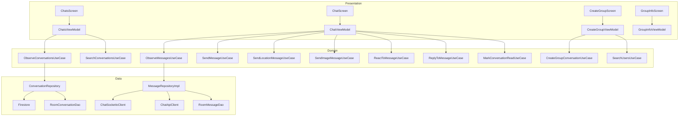
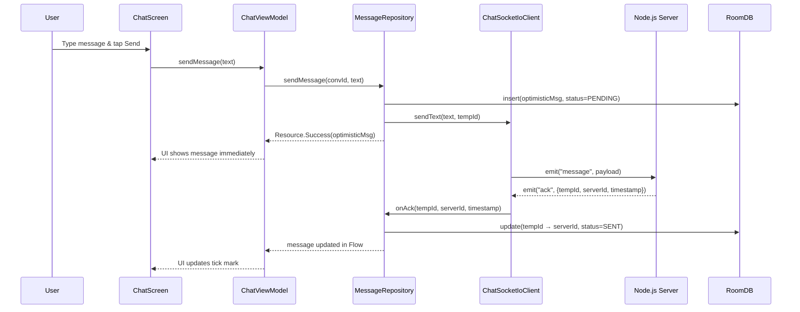
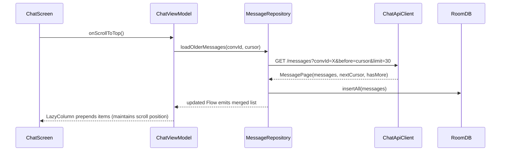
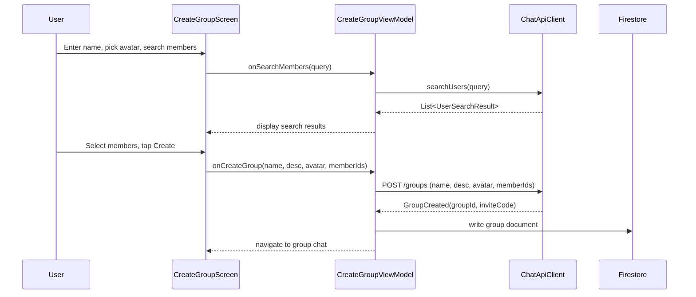

# Design Document: Chat Screen Redesign

## Overview

This design covers the complete redesign of the WHERE app's chat system — the Chat List screen, individual Chat screen, and Group Creation flow — to align with the DESIGN.md visual specification ("Glassy. Dynamic. Warm."). The redesign introduces cursor-based pagination, message reactions, reply/quote, read receipts UI, media messages, animated typing indicators, online/offline status, and a fully professional group creation experience with member selection and avatar picker. Performance is a primary concern: Firestore reads are minimized by leveraging Socket.IO for real-time updates and local caching with Room, while Firestore serves only as the source of truth for conversation metadata with snapshot listeners scoped to visible data.

The architecture follows the existing Clean Architecture pattern (Presentation → Domain → Data) with Jetpack Compose, Hilt DI, and a Socket.IO + REST hybrid for messaging. New capabilities are added as incremental layers on the existing foundation rather than rewrites, ensuring backward compatibility and testability.

## Architecture



## Sequence Diagrams

### Message Send Flow (Optimistic + Socket.IO)



### Cursor-Based Pagination Flow



### Group Creation Flow



## Components and Interfaces

### Component 1: ChatScreen (Redesigned)

**Purpose**: Individual conversation view with full DESIGN.md compliance — custom dark theme, glassmorphism elements, animated typing indicator, reactions, replies, read receipts, and media messages.

**Interface**:
```kotlin
@Composable
fun ChatScreen(
    conversationId: String,
    onNavigateBack: () -> Unit,
    onNavigateToUserProfile: (String) -> Unit,
    onNavigateToGroupInfo: (String) -> Unit,
    onNavigateToGroupMap: (String) -> Unit,
    viewModel: ChatViewModel = hiltViewModel()
)
```

**Responsibilities**:
- Render message list with cursor-based pagination (load older on scroll-to-top)
- Display message bubbles per DESIGN.md spec (Accent Primary sent, Background Elevated received, tail shapes)
- Show animated 3-dot typing indicator
- Display read receipts (double-tick with user avatars)
- Support long-press for reactions and reply
- Render media/image message bubbles
- Pill-shaped input bar with attachment, location share, animated send button
- Header with avatar, name, online status, member count

### Component 2: ChatsScreen (Redesigned)

**Purpose**: Conversation list mirroring Instagram DMs / WhatsApp style per DESIGN.md.

**Interface**:
```kotlin
@Composable
fun ChatsScreen(
    contentPadding: PaddingValues,
    onNavigateToChat: (String) -> Unit,
    onNavigateToSearchPeople: () -> Unit,
    onNavigateToCreateGroup: () -> Unit,
    viewModel: ChatsViewModel = hiltViewModel()
)
```

**Responsibilities**:
- Display conversations with unread highlighting (Background Elevated tint)
- Show online/live status indicators on avatars
- Search/filter conversations locally
- Swipe actions (archive, mute)
- Empty state per DESIGN.md spec

### Component 3: CreateGroupScreen (Full Redesign)

**Purpose**: Professional group creation with member selection, avatar picker, and invite flow.

**Interface**:
```kotlin
@Composable
fun CreateGroupScreen(
    onNavigateBack: () -> Unit,
    onGroupCreated: (groupId: String) -> Unit,
    viewModel: CreateGroupViewModel = hiltViewModel()
)
```

**Responsibilities**:
- Group avatar picker (camera, gallery, emoji)
- Group name and description inputs
- Member search with real-time results
- Selected members chip row with remove capability
- "Invite Only" toggle
- Create button with loading state
- Post-creation: show invite code with share action

### Component 4: GroupInfoScreen (New)

**Purpose**: Group chat details — member list, settings, leave/delete group.

**Interface**:
```kotlin
@Composable
fun GroupInfoScreen(
    groupId: String,
    onNavigateBack: () -> Unit,
    onNavigateToUserProfile: (String) -> Unit,
    onNavigateToEditGroup: (String) -> Unit,
    viewModel: GroupInfoViewModel = hiltViewModel()
)
```

**Responsibilities**:
- Display group avatar, name, description
- Member list with roles (admin badge)
- Add members, remove members (admin only)
- Mute notifications toggle
- Leave group / Delete group (admin)
- Shared media gallery

### Component 5: MessageRepositoryImpl (Enhanced)

**Purpose**: Message data layer with Room caching, cursor pagination, optimistic updates, and new message types.

**Interface**:
```kotlin
interface MessageRepository {
    fun observeMessages(conversationId: String): Flow<List<Message>>
    suspend fun loadOlderMessages(conversationId: String, beforeCursor: String?, limit: Int = 30): MessagePage
    suspend fun sendMessage(conversationId: String, text: String, replyToId: String? = null): Resource<Message>
    suspend fun sendLocationMessage(conversationId: String, lat: Double, lng: Double): Resource<Message>
    suspend fun sendImageMessage(conversationId: String, imageUri: Uri): Resource<Message>
    suspend fun reactToMessage(conversationId: String, messageId: String, emoji: String): Resource<Unit>
    suspend fun removeReaction(conversationId: String, messageId: String, emoji: String): Resource<Unit>
    suspend fun markRead(conversationId: String, userId: String)
    suspend fun searchMessages(conversationId: String, query: String): List<Message>
}
```

### Component 6: ChatSocketIoClient (Enhanced)

**Purpose**: Socket.IO client extended with new events for reactions, read receipts, and image messages.

**Interface**:
```kotlin
@Singleton
class ChatSocketIoClient {
    val incomingFrames: SharedFlow<ServerFrame>
    val connectionState: StateFlow<ConnectionState>

    fun connect(conversationId: String, firebaseToken: String)
    fun disconnect()
    suspend fun sendText(text: String, tempId: String, replyToId: String? = null)
    suspend fun sendLocation(latitude: Double, longitude: Double, tempId: String)
    suspend fun sendImage(imageUrl: String, tempId: String)
    suspend fun sendTyping(isTyping: Boolean)
    suspend fun sendRead()
    suspend fun sendReaction(messageId: String, emoji: String)
    suspend fun removeReaction(messageId: String, emoji: String)
}
```

## Data Models

### Enhanced Message Model

```kotlin
data class Message(
    val id: String,
    val conversationId: String,
    val senderId: String,
    val senderName: String,
    val senderPhotoUrl: String? = null,
    val text: String,
    val type: MessageType,
    val timestamp: Long,
    val status: MessageStatus = MessageStatus.SENT,
    // Location
    val latitude: Double? = null,
    val longitude: Double? = null,
    // Media
    val imageUrl: String? = null,
    val thumbnailUrl: String? = null,
    // Reply
    val replyToId: String? = null,
    val replyToText: String? = null,
    val replyToSenderName: String? = null,
    // Reactions
    val reactions: Map<String, List<String>> = emptyMap(), // emoji -> list of userIds
    // Read receipts
    val readBy: List<String> = emptyList()
)

enum class MessageType { TEXT, LOCATION, IMAGE, SYSTEM }
enum class MessageStatus { PENDING, SENT, DELIVERED, READ, FAILED }
```

**Validation Rules**:
- `text` must be non-empty for TEXT type
- `latitude`/`longitude` must be non-null for LOCATION type
- `imageUrl` must be non-null for IMAGE type
- `timestamp` must be > 0
- `senderId` must be non-empty

### Enhanced Conversation Model

```kotlin
data class Conversation(
    val id: String,
    val name: String,
    val type: ConversationType,
    val memberIds: List<String>,
    val photoUrl: String? = null,
    val groupId: String? = null,
    val lastMessageText: String = "",
    val lastMessageTimestamp: Long = 0,
    val lastMessageSenderId: String = "",
    val unreadCounts: Map<String, Any> = emptyMap(),
    // New fields
    val mutedBy: List<String> = emptyList(),
    val pinnedBy: List<String> = emptyList(),
    val onlineMembers: Set<String> = emptySet(),
    val typingMembers: Map<String, String> = emptyMap() // userId -> userName
)
```

### MessagePage (Pagination)

```kotlin
data class MessagePage(
    val messages: List<Message>,
    val nextCursor: String?,  // null = no more pages
    val hasMore: Boolean
)
```

### Room Entity for Local Cache

```kotlin
@Entity(tableName = "messages")
data class MessageEntity(
    @PrimaryKey val id: String,
    val conversationId: String,
    val senderId: String,
    val senderName: String,
    val senderPhotoUrl: String?,
    val text: String,
    val type: String,
    val timestamp: Long,
    val status: String,
    val latitude: Double?,
    val longitude: Double?,
    val imageUrl: String?,
    val thumbnailUrl: String?,
    val replyToId: String?,
    val replyToText: String?,
    val replyToSenderName: String?,
    val reactionsJson: String,  // JSON serialized Map<String, List<String>>
    val readByJson: String      // JSON serialized List<String>
)

@Entity(tableName = "conversations")
data class ConversationEntity(
    @PrimaryKey val id: String,
    val name: String,
    val type: String,
    val photoUrl: String?,
    val groupId: String?,
    val lastMessageText: String,
    val lastMessageTimestamp: Long,
    val lastMessageSenderId: String,
    val unreadCount: Int,
    val memberIdsJson: String,
    val lastSyncTimestamp: Long
)
```

**Validation Rules**:
- `conversationId` index for efficient message queries
- `timestamp` index for cursor-based pagination ordering
- `status` must be one of PENDING, SENT, DELIVERED, READ, FAILED


## Algorithmic Pseudocode

### Message Pagination Algorithm

```kotlin
/**
 * Loads messages using cursor-based pagination.
 * First load fetches from Room cache, then syncs with server.
 * Subsequent loads fetch older messages from server and persist to Room.
 */
suspend fun loadMessages(
    conversationId: String,
    cursor: String? = null,
    limit: Int = 30
): MessagePage {
    // PRECONDITION: conversationId is non-empty
    // PRECONDITION: limit > 0 && limit <= 100

    if (cursor == null) {
        // Initial load: serve from cache first, then background sync
        val cached = messageDao.getLatestMessages(conversationId, limit)
        if (cached.isNotEmpty()) {
            emitCachedMessages(cached)
        }
        // Background sync with server
        val serverPage = chatApi.getMessages(conversationId, before = null, limit = limit)
        messageDao.upsertAll(serverPage.messages.map { it.toEntity() })
        return serverPage
    } else {
        // Pagination: fetch older messages from server
        val serverPage = chatApi.getMessages(conversationId, before = cursor, limit = limit)
        messageDao.insertAll(serverPage.messages.map { it.toEntity() })
        return serverPage
    }

    // POSTCONDITION: returned messages are sorted by timestamp descending
    // POSTCONDITION: all returned messages are persisted in Room
}
```

### Optimistic Send with Retry Algorithm

```kotlin
/**
 * Sends a message optimistically: inserts locally with PENDING status,
 * emits via Socket.IO, and updates status on ack or retries on failure.
 */
suspend fun sendMessageOptimistic(
    conversationId: String,
    text: String,
    replyToId: String? = null
): Resource<Message> {
    // PRECONDITION: text.isNotBlank()
    // PRECONDITION: conversationId.isNotEmpty()
    // PRECONDITION: WebSocket is connected OR will queue for retry

    val tempId = UUID.randomUUID().toString()
    val optimistic = Message(
        id = tempId,
        conversationId = conversationId,
        senderId = currentUserId,
        senderName = currentUserName,
        text = text,
        type = MessageType.TEXT,
        timestamp = System.currentTimeMillis(),
        status = MessageStatus.PENDING,
        replyToId = replyToId
    )

    // Step 1: Persist locally
    messageDao.insert(optimistic.toEntity())

    // Step 2: Emit to server
    try {
        wsClient.sendText(text, tempId, replyToId)
    } catch (e: Exception) {
        // Mark as failed, will retry
        messageDao.updateStatus(tempId, MessageStatus.FAILED)
        return Resource.Error("Send failed, will retry")
    }

    // Step 3: Wait for ack (handled by frame observer)
    // On ack: update tempId → serverId, status → SENT
    // On delivery confirmation: status → DELIVERED
    // On read: status → READ

    return Resource.Success(optimistic)

    // POSTCONDITION: message exists in local DB with status >= PENDING
    // POSTCONDITION: if WebSocket connected, message was emitted
}
```

### Firestore Read Optimization Algorithm

```kotlin
/**
 * Minimizes Firestore reads by:
 * 1. Using Room as primary data source for conversation list
 * 2. Listening to Firestore only for metadata changes (not messages)
 * 3. Using Socket.IO for all real-time message delivery
 * 4. Batching unread count updates
 */
fun observeConversationsOptimized(userId: String): Flow<List<Conversation>> {
    // PRECONDITION: userId is non-empty
    // PRECONDITION: Room database is initialized

    return merge(
        // Source 1: Local Room cache (immediate, no network)
        conversationDao.observeAll(userId),

        // Source 2: Firestore snapshot listener (metadata only)
        // Scoped to conversations where userId is a member
        // Only triggers on: name change, member change, photo change
        firestoreConversationListener(userId)
            .onEach { conversations ->
                conversationDao.upsertAll(conversations.map { it.toEntity() })
            }
    ).map { 
        conversationDao.getAll(userId).map { it.toDomain() }
    }

    // POSTCONDITION: emits conversation list sorted by lastMessageTimestamp DESC
    // INVARIANT: Room is always the single source of truth for UI
    // INVARIANT: Firestore listener only syncs metadata, never message content
}
```

### Reaction Processing Algorithm

```kotlin
/**
 * Handles adding/removing reactions with optimistic UI update.
 * Toggle behavior: if user already reacted with same emoji, remove it.
 */
suspend fun toggleReaction(
    conversationId: String,
    messageId: String,
    emoji: String,
    userId: String
): Resource<Unit> {
    // PRECONDITION: messageId exists in local cache
    // PRECONDITION: emoji is a valid Unicode emoji string
    // PRECONDITION: userId is non-empty

    val message = messageDao.getById(messageId) ?: return Resource.Error("Message not found")
    val currentReactions = message.reactions.toMutableMap()
    val usersForEmoji = currentReactions.getOrDefault(emoji, emptyList()).toMutableList()

    val isRemoving = userId in usersForEmoji

    if (isRemoving) {
        usersForEmoji.remove(userId)
        if (usersForEmoji.isEmpty()) currentReactions.remove(emoji)
        else currentReactions[emoji] = usersForEmoji
    } else {
        usersForEmoji.add(userId)
        currentReactions[emoji] = usersForEmoji
    }

    // Optimistic update
    messageDao.updateReactions(messageId, currentReactions)

    // Send to server
    try {
        if (isRemoving) wsClient.removeReaction(messageId, emoji)
        else wsClient.sendReaction(messageId, emoji)
    } catch (e: Exception) {
        // Rollback optimistic update
        messageDao.updateReactions(messageId, message.reactions)
        return Resource.Error("Failed to update reaction")
    }

    return Resource.Success(Unit)

    // POSTCONDITION: local cache reflects new reaction state
    // POSTCONDITION: server notified of reaction change
}
```

## Key Functions with Formal Specifications

### Function 1: ChatViewModel.loadInitialMessages()

```kotlin
fun loadInitialMessages(conversationId: String)
```

**Preconditions:**
- `conversationId` is a valid non-empty string
- ViewModel is in active lifecycle state
- Firebase auth token is available

**Postconditions:**
- `uiState.messages` contains the most recent N messages (N = page size, default 30)
- `uiState.isLoading` transitions from `true` to `false`
- Messages are sorted by timestamp ascending (oldest first for display)
- Room cache is populated with loaded messages
- If no messages exist, empty state is shown

**Loop Invariants:** N/A

### Function 2: ChatViewModel.loadOlderMessages()

```kotlin
fun loadOlderMessages()
```

**Preconditions:**
- `uiState.hasMoreMessages` is `true`
- `uiState.isLoadingMore` is `false` (prevents concurrent loads)
- `uiState.paginationCursor` is non-null (set after initial load)

**Postconditions:**
- New messages are prepended to `uiState.messages`
- `uiState.paginationCursor` is updated to the new oldest message's cursor
- `uiState.hasMoreMessages` is updated based on server response
- Scroll position is maintained (user doesn't jump)
- `uiState.isLoadingMore` returns to `false`

**Loop Invariants:**
- Messages remain sorted by timestamp ascending at all times
- No duplicate messages exist in the list (enforced by ID uniqueness)

### Function 3: MessageRepositoryImpl.observeMessages()

```kotlin
fun observeMessages(conversationId: String): Flow<List<Message>>
```

**Preconditions:**
- `conversationId` is non-empty
- Room database is initialized and accessible

**Postconditions:**
- Returns a Flow that emits whenever messages change for the conversation
- Emissions include both cached messages and real-time Socket.IO messages
- Messages are always sorted by timestamp ascending
- Optimistic messages (PENDING status) are included in emissions
- Failed messages are included with FAILED status for retry UI

**Loop Invariants:**
- The Flow never completes while the repository is alive
- Each emission is a complete snapshot (not a diff)

### Function 4: CreateGroupViewModel.onCreateGroup()

```kotlin
fun onCreateGroup()
```

**Preconditions:**
- `uiState.name` is non-blank and length >= 3
- `uiState.selectedMembers` has at least 1 member (besides creator)
- `uiState.isLoading` is `false`
- Network is available

**Postconditions:**
- On success: group is created on server, conversation is created, navigation event emitted
- On failure: `uiState.error` is set with descriptive message
- `uiState.isLoading` returns to `false` in all cases
- If avatar was selected, it's uploaded before group creation

**Loop Invariants:** N/A

### Function 5: ChatsViewModel.observeConversations()

```kotlin
private fun observeConversations()
```

**Preconditions:**
- User is authenticated (Firebase currentUser is non-null)
- Room database is initialized

**Postconditions:**
- `uiState.conversations` is populated with all user's conversations
- Conversations are sorted by `lastMessageTimestamp` descending
- Unread counts are accurate per the local cache
- Online status indicators reflect Socket.IO presence data
- `uiState.isLoading` is `false` after first emission

**Loop Invariants:**
- Conversation list is always sorted by most recent activity
- Unread counts are non-negative integers

## Example Usage

### Sending a Message with Reply

```kotlin
// In ChatViewModel
fun sendMessage() {
    val text = _uiState.value.inputText.trim()
    if (text.isEmpty()) return
    val convId = _uiState.value.conversationId ?: return
    val replyTo = _uiState.value.replyingToMessage?.id

    _uiState.value = _uiState.value.copy(
        inputText = "",
        replyingToMessage = null
    )

    viewModelScope.launch {
        messageRepository.sendMessage(convId, text, replyToId = replyTo)
    }
}
```

### Paginated Message Loading

```kotlin
// In ChatViewModel
fun onScrolledToTop() {
    val state = _uiState.value
    if (state.isLoadingMore || !state.hasMoreMessages) return

    _uiState.value = state.copy(isLoadingMore = true)

    viewModelScope.launch {
        val page = messageRepository.loadOlderMessages(
            conversationId = state.conversationId!!,
            beforeCursor = state.paginationCursor,
            limit = 30
        )
        _uiState.value = _uiState.value.copy(
            messages = page.messages.map { it.toUiModel(currentUserId) } + _uiState.value.messages,
            paginationCursor = page.nextCursor,
            hasMoreMessages = page.hasMore,
            isLoadingMore = false
        )
    }
}
```

### Reaction Toggle in UI

```kotlin
// In ChatScreen composable
MessageBubble(
    message = message,
    onLongPress = { showReactionPicker = true },
    onReactionTap = { emoji ->
        viewModel.toggleReaction(message.id, emoji)
    },
    reactions = message.reactions
)

// In ChatViewModel
fun toggleReaction(messageId: String, emoji: String) {
    val convId = _uiState.value.conversationId ?: return
    viewModelScope.launch {
        messageRepository.reactToMessage(convId, messageId, emoji)
    }
}
```

### Group Creation with Member Selection

```kotlin
// In CreateGroupViewModel
fun onSearchMembers(query: String) {
    if (query.length < 2) return
    viewModelScope.launch {
        _uiState.value = _uiState.value.copy(isSearching = true)
        when (val result = searchUsersUseCase(query)) {
            is Resource.Success -> {
                _uiState.value = _uiState.value.copy(
                    searchResults = result.data?.filter { it.id !in selectedMemberIds } ?: emptyList(),
                    isSearching = false
                )
            }
            is Resource.Error -> {
                _uiState.value = _uiState.value.copy(isSearching = false)
            }
        }
    }
}

fun onMemberSelected(user: UserSearchResult) {
    val current = _uiState.value.selectedMembers.toMutableList()
    current.add(user)
    _uiState.value = _uiState.value.copy(
        selectedMembers = current,
        searchResults = _uiState.value.searchResults.filter { it.id != user.id }
    )
}
```

## Correctness Properties

*A property is a characteristic or behavior that should hold true across all valid executions of a system — essentially, a formal statement about what the system should do. Properties serve as the bridge between human-readable specifications and machine-verifiable correctness guarantees.*

### Property 1: Message Ordering Invariant

*For any* sequence of message operations (insert, paginate, receive via Socket.IO, ack), the message list in a conversation SHALL remain sorted by timestamp in ascending order at all times.

**Validates: Requirements 14.1, 2.3**

### Property 2: Optimistic Insert Consistency

*For any* valid non-blank message text and valid conversation ID, sending the message SHALL result in the message appearing in the local Room_Cache with PENDING status immediately, before any server response.

**Validates: Requirements 1.1, 1.6**

### Property 3: No Duplicate Messages on Ack

*For any* server acknowledgment that maps a temporary ID to a server ID, the total message count in the conversation SHALL not increase — the existing optimistic message is updated in-place.

**Validates: Requirements 1.2, 14.2**

### Property 4: Pagination Completeness and Deduplication

*For any* conversation with N messages, loading all pages sequentially using cursor-based pagination SHALL yield exactly N unique messages with no gaps and no duplicates, regardless of concurrent real-time message insertions.

**Validates: Requirements 14.3, 2.3**

### Property 5: Reaction Toggle Idempotency

*For any* message and any emoji, toggling a reaction twice by the same user SHALL return the message's reaction state to its original value for that user (toggle is its own inverse).

**Validates: Requirements 3.3, 3.4**

### Property 6: Reaction Rollback on Failure

*For any* reaction operation that fails to reach the server, the local message reaction state SHALL be rolled back to the state before the optimistic update was applied.

**Validates: Requirement 3.5**

### Property 7: Read Receipt Monotonicity

*For any* message and any sequence of read receipt events, the readBy list SHALL only grow — once a user ID is added, it is never removed.

**Validates: Requirements 5.2, 5.4**

### Property 8: Conversation Sort Order Invariant

*For any* set of conversations displayed on ChatsScreen, the list SHALL always be sorted by lastMessageTimestamp in descending order after any update (new message, metadata change).

**Validates: Requirement 9.1**

### Property 9: Conversation Search Filter Correctness

*For any* search query string, the filtered conversation results SHALL be a subset of all conversations where the conversation name or last message content contains the query string.

**Validates: Requirement 9.3**

### Property 10: Member Selection State Consistency

*For any* member selection action during group creation, the selected member SHALL appear in the selected members list and SHALL NOT appear in the search results, and the union of selected members and search results SHALL equal the original full search result set.

**Validates: Requirements 10.2, 10.3**

### Property 11: Group Name Validation

*For any* string with length less than 3 characters, the group creation form SHALL reject the input and prevent the create action from executing.

**Validates: Requirement 10.1**

### Property 12: Exponential Backoff Sequence

*For any* sequence of reconnection attempts by ChatSocketIoClient, the delay between attempts SHALL follow the pattern 1s, 2s, 4s, 8s, capped at 30s maximum.

**Validates: Requirement 13.2**

### Property 13: Offline Queue Ordering

*For any* set of messages queued while offline, when the connection is restored, the messages SHALL be flushed in the exact order they were originally queued (FIFO).

**Validates: Requirements 1.6, 13.3**

### Property 14: Typing Indicator Debounce

*For any* sequence of keystroke events occurring within a 300ms window, the ChatSocketIoClient SHALL emit at most one typing event.

**Validates: Requirement 7.1**

### Property 15: Location Message Validation

*For any* location message, the MessageRepository SHALL reject sending if latitude or longitude is null, ensuring all sent location messages contain valid coordinates.

**Validates: Requirement 15.3**

### Property 16: Image Compression Bounds

*For any* image selected for sending, the compression algorithm SHALL produce output with dimensions not exceeding 1920px on the longest side.

**Validates: Requirement 6.1**

### Property 17: Non-Admin Action Hiding

*For any* user without admin role viewing a GroupInfoScreen, all admin-only actions (remove member, delete group) SHALL be hidden from the UI.

**Validates: Requirement 11.3**

### Property 18: Presence State Update

*For any* presence event received for a group conversation member, the Conversation's onlineMembers set SHALL accurately reflect the member's current online/offline status.

**Validates: Requirement 8.3**

### Property 19: Reply Message Payload Completeness

*For any* message sent as a reply, the message payload SHALL contain non-null replyToId, replyToText, and replyToSenderName fields.

**Validates: Requirement 4.2**

## Error Handling

### Error Scenario 1: Socket.IO Disconnection During Chat

**Condition**: WebSocket connection drops while user is in a chat screen
**Response**: 
- Show subtle "Reconnecting..." banner at top of chat (Background Elevated, Accent Warning text)
- Queue any outgoing messages locally with PENDING status
- Attempt exponential backoff reconnection (1s, 2s, 4s, 8s, max 30s)
**Recovery**: 
- On reconnect: flush queued messages in order
- Sync any missed messages via REST API (fetch messages after last known timestamp)
- Remove reconnecting banner with fade-out animation

### Error Scenario 2: Message Send Failure

**Condition**: Message fails to send (network error, server error, timeout after 10s)
**Response**:
- Update message status to FAILED in Room and UI
- Show red error indicator on the message bubble
- Display "Tap to retry" label below the failed message
**Recovery**:
- User taps failed message → retry send via Socket.IO
- If retry fails 3 times → show "Message could not be sent" toast
- Failed messages persist across app restarts for manual retry

### Error Scenario 3: Image Upload Failure

**Condition**: Image upload to Cloud Storage fails (network, size limit, format)
**Response**:
- Show upload progress bar on image bubble (0-100%)
- On failure: show error overlay on image thumbnail with retry icon
- If file too large (>10MB): show immediate validation error before upload
**Recovery**:
- Tap retry → re-attempt upload
- Image is compressed client-side before upload (max 1920px, 80% quality JPEG)

### Error Scenario 4: Pagination Load Failure

**Condition**: REST API call for older messages fails
**Response**:
- Show "Couldn't load older messages" inline at top of message list
- Show "Tap to retry" button
- Do not clear existing messages
**Recovery**:
- User taps retry → re-attempt with same cursor
- If offline: show "You're offline" message instead

### Error Scenario 5: Group Creation Failure

**Condition**: Server rejects group creation (validation, network, duplicate name)
**Response**:
- Show error message below the Create button
- Keep all form data intact (name, description, selected members, avatar)
- Specific error messages for: name too short, too many members, network error
**Recovery**:
- User fixes the issue and taps Create again
- No data loss on retry

## Testing Strategy

### Unit Testing Approach

- **ViewModels**: Test state transitions for all user actions (send, react, paginate, search)
- **Repository**: Test optimistic update logic, cache merging, pagination cursor management
- **Use Cases**: Test business rule validation (message length limits, reaction limits)
- **Mappers**: Test domain → UI model transformations (time formatting, bubble direction, status icons)

Key test cases:
- Message ordering after pagination merge
- Optimistic message → ack update flow
- Reaction toggle state machine
- Conversation sort order after new message
- Offline queue persistence and replay

### Property-Based Testing Approach

**Property Test Library**: Kotest property testing (io.kotest:kotest-property)

Properties to test:
- Message list is always sorted by timestamp after any operation (insert, paginate, ack)
- Reaction toggle is its own inverse (toggle twice = original state)
- Pagination produces no duplicates regardless of concurrent inserts
- Unread count is always >= 0 and <= total messages in conversation
- Search results are a subset of all messages in the conversation

### Integration Testing Approach

- **Socket.IO Integration**: Test connect/disconnect/reconnect cycles with mock server
- **Room + Repository**: Test cache population, query performance, migration
- **End-to-End Chat Flow**: Send message → receive ack → other user receives → read receipt
- **Pagination E2E**: Load initial → scroll up → load more → verify no gaps

## Performance Considerations

### Firestore Read Reduction Strategy

| Current Behavior | New Behavior | Savings |
|---|---|---|
| Observe all conversations (full docs) | Observe metadata only, messages via Socket.IO | ~80% fewer reads |
| Load all message history on chat open | Cursor-based pagination (30 per page) | ~90% fewer reads on long conversations |
| Real-time message listener per conversation | Socket.IO for real-time, REST for history | Eliminates per-message Firestore reads |
| Unread count from Firestore on every change | Local Room counter, synced on app foreground | ~70% fewer writes |

### Compose Performance

- Use `key` parameter on all `LazyColumn` items (message ID)
- Mark UI models as `@Stable` or `@Immutable` to prevent unnecessary recompositions
- Use `derivedStateOf` for computed values (unread badge visibility, typing indicator text)
- Avoid lambda allocations in item composables (use remembered callbacks)
- Image messages use `SubcomposeAsyncImage` with placeholder for smooth loading
- Pagination trigger uses `snapshotFlow` on `LazyListState.firstVisibleItemIndex`

### Memory Management

- Message cache limited to 200 messages per conversation in memory
- Older messages evicted from memory but retained in Room
- Image thumbnails cached with Coil's disk cache (50MB limit)
- Socket.IO frame buffer limited to 64 items (backpressure via `MutableSharedFlow`)

### Network Optimization

- Batch read receipt updates (debounce 2 seconds, send once)
- Typing indicator debounced (300ms) to avoid excessive Socket.IO emissions
- Image upload uses chunked transfer with resumable uploads
- REST API responses use gzip compression

## Security Considerations

- Firebase ID token validated on every Socket.IO connection and REST API call
- Message content is not encrypted end-to-end (server can read for moderation)
- Image uploads validated server-side (file type, size, malware scan)
- Rate limiting on message sends (max 30 messages/minute per user)
- Group creation rate limited (max 5 groups/hour per user)
- Member search results exclude blocked users
- Socket.IO connection authenticated via query parameter token (short-lived Firebase token)
- Room database encrypted with SQLCipher for local data protection

## Dependencies

### New Dependencies

| Dependency | Purpose | Version |
|---|---|---|
| `androidx.room:room-runtime` | Local message/conversation cache | 2.6.1 |
| `androidx.room:room-ktx` | Coroutines support for Room | 2.6.1 |
| `io.coil-kt:coil-compose` | Image loading (already present) | 2.6.0 |
| `androidx.paging:paging-compose` | Optional: Compose paging integration | 3.3.0 |
| `net.zetetic:android-database-sqlcipher` | Room database encryption | 4.5.6 |

### Existing Dependencies (Already in Project)

- `io.socket:socket.io-client` — Socket.IO real-time messaging
- `com.squareup.retrofit2:retrofit` — REST API for history loading
- `com.google.dagger:hilt-android` — Dependency injection
- `androidx.compose.*` — Jetpack Compose UI
- `com.google.firebase:firebase-auth` — Authentication
- `com.google.firebase:firebase-firestore` — Conversation metadata

### Server-Side Requirements (Node.js)

New Socket.IO events to implement:
- `reaction` (client → server): `{ messageId, emoji }`
- `remove_reaction` (client → server): `{ messageId, emoji }`
- `reaction_update` (server → client): `{ messageId, emoji, userId, action: "add"|"remove" }`
- `image_message` (client → server): `{ tempId, imageUrl }`
- `read_receipt` (server → client): `{ messageId, userId }`
- `presence` (server → client): `{ userId, status: "online"|"offline" }`

New REST API endpoints:
- `GET /messages?conversationId=X&before=cursor&limit=N` — Cursor-based pagination
- `GET /messages/search?conversationId=X&q=query` — Message search
- `POST /groups` — Enhanced group creation with members and avatar
- `GET /users/search?q=query` — User search for group member selection
- `POST /upload/image` — Image upload endpoint returning URL
