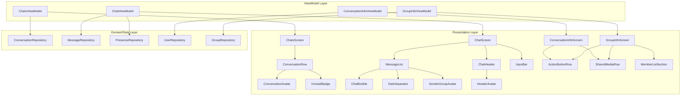

# Design Document: Chat UI Redesign

## Overview

This design covers the visual and structural redesign of the chat experience in the Where Android app to align with modern Messenger-style patterns. The redesign touches two primary screens (ChatsScreen and ChatScreen), introduces two new info screens (Conversation Info and Group Info), and applies visual polish across the chat flow.

The existing MVVM architecture with Jetpack Compose, Hilt DI, and Firebase/Firestore backend remains unchanged. The redesign is purely a presentation-layer effort that modifies existing composables, introduces new UI components, and extends existing UI models with additional display fields.

### Key Design Decisions

1. **Extend existing UI models** rather than creating new ones — `ConversationUiModel` and `MessageUiModel` already contain most needed fields (title, photoUrl, isOtherUserOnline, senderName, etc.)
2. **Component-based architecture** — each visual element (Avatar, ChatBubble, InputBar, ConversationRow) is a standalone composable with clear inputs
3. **Material 3 color scheme** — leverage the existing `WhereTheme` color tokens (primary, surfaceContainerHigh, onSurfaceVariant) rather than hardcoded colors
4. **Reuse existing navigation routes** — `Screen.UserProfile` and `Screen.GroupDetails` already exist for info screen navigation
5. **Message grouping logic** lives in the ViewModel/mapper layer, not in the composable, to keep UI declarative

## Architecture



### Affected Files

| Layer | File | Change Type |
|-------|------|-------------|
| Presentation | `chat/ChatsScreen.kt` | Modify — new ConversationRow layout |
| Presentation | `chat/ChatScreen.kt` | Modify — bubble redesign, grouping, date separators |
| Presentation | `chat/ChatHeader.kt` | Modify — compact header with avatar + online status |
| Presentation | `chat/components/ChatInputBar.kt` | Modify — Messenger-style input |
| Presentation | `chat/components/ChatBubble.kt` | New — extracted bubble composable |
| Presentation | `chat/components/DateSeparator.kt` | New — date pill component |
| Presentation | `chat/components/ConversationAvatar.kt` | New — extracted avatar with online indicator |
| Presentation | `chat/ConversationInfoScreen.kt` | New — DM info screen |
| Presentation | `chat/GroupInfoScreen.kt` | New — group info screen |
| Presentation | `chat/ConversationInfoViewModel.kt` | New — info screen state |
| Presentation | `chat/GroupInfoViewModel.kt` | New — group info state |
| Model | `model/MessageUiModel.kt` | Modify — add grouping metadata |
| Model | `model/ConversationUiModel.kt` | Minor — ensure fallback logic |
| Navigation | `navigation/Screen.kt` | Modify — add ConversationInfo route |

## Components and Interfaces

### 1. ConversationRow (Redesigned)

```kotlin
@Composable
fun ConversationRow(
    conversation: ConversationUiModel,
    isOnline: Boolean,
    onClick: () -> Unit,
    onLongClick: () -> Unit,
    modifier: Modifier = Modifier
)
```

**Layout spec:**
- 56dp circular avatar with 14dp online indicator (green dot, 2dp white border) at bottom-right
- Title line: `bodyLarge` + `FontWeight.SemiBold`, timestamp at trailing edge in `labelSmall`
- Preview line: `bodyMedium` + `onSurfaceVariant`, unread badge (20dp filled circle) at trailing edge
- Padding: 16dp horizontal, 12dp vertical
- No dividers between rows (removed `HorizontalDivider`)
- Unread state: title uses `FontWeight.Bold`, preview uses `FontWeight.Medium`

### 2. ChatBubble (New Component)

```kotlin
@Composable
fun ChatBubble(
    message: MessageUiModel,
    isGroupChat: Boolean,
    isFirstInGroup: Boolean,
    isLastInGroup: Boolean,
    showSenderAvatar: Boolean,
    modifier: Modifier = Modifier
)
```

**Layout spec:**
- Sent: primary background, white text, right-aligned
- Received: surfaceContainerHigh background, onSurface text, left-aligned
- Corner radius: 18dp all corners, 4dp on tail corner (bottom-right sent, bottom-left received)
- Intermediate bubbles in a group: 18dp all corners (no tail)
- Max width: 75% of screen
- Content padding: 12dp horizontal, 8dp vertical
- Timestamp below text: `labelSmall`, 0.7 opacity
- Group chat: 28dp avatar to left of first received bubble in sender group

### 3. ChatHeader (Redesigned)

```kotlin
@Composable
fun ChatHeader(
    conversation: ConversationUiModel,
    onNavigateBack: () -> Unit,
    onNavigateToInfo: () -> Unit,
    onCallTap: () -> Unit,
    onVideoCallTap: () -> Unit,
    modifier: Modifier = Modifier
)
```

**Layout spec:**
- Compact height: 64dp, surface background, 1dp bottom shadow
- Back arrow (24dp) → 8dp → Avatar (36dp) with 10dp online indicator → 8dp → Title column
- Title: `titleSmall` + `FontWeight.SemiBold`
- Subtitle: "Active now" (green/tertiary) when online, "Offline" (onSurfaceVariant) when offline, "{N} members" for groups
- Trailing actions: phone, video, info icons (24dp, onSurfaceVariant), max 3 visible
- Tapping avatar/title area navigates to info screen

### 4. InputBar (Redesigned)

```kotlin
@Composable
fun ChatInputBar(
    text: String,
    onTextChange: (String) -> Unit,
    onSend: () -> Unit,
    onCameraTap: () -> Unit,
    onAttachmentTap: () -> Unit,
    modifier: Modifier = Modifier
)
```

**Layout spec:**
- Rounded text field: 24dp corner radius, surfaceContainerHigh background, no border
- Send button: 40dp circular, primary color, visible only when text is non-empty
- Empty state: camera + attachment icons on trailing edge instead of send button
- Placeholder: "Aa" in onSurfaceVariant
- Multi-line: expands up to 5 lines, then scrolls internally
- Padding: 8dp from screen edges, 8dp vertical from message list

### 5. ConversationInfoScreen (New)

```kotlin
@Composable
fun ConversationInfoScreen(
    conversationId: String,
    onNavigateBack: () -> Unit,
    onNavigateToMediaGallery: () -> Unit,
    modifier: Modifier = Modifier
)
```

**Layout spec:**
- Large centered avatar (80dp) + name (`headlineSmall`, `FontWeight.Bold`)
- Online status: "Active now" or "Active Xh ago" in `bodyMedium`
- Action button row: Audio Call, Video Call, Profile, Mute, Search — 40dp icon circles with labels
- Sections: "Customize Chat", "More Actions", "Privacy & Support" (DM only)
- Shared media: horizontal scrollable row (3 visible) + "See All"
- Scrollable Column, section headers in `labelLarge` + `FontWeight.SemiBold`, 16dp top margin

### 6. GroupInfoScreen (New)

```kotlin
@Composable
fun GroupInfoScreen(
    groupId: String,
    onNavigateBack: () -> Unit,
    onNavigateToMediaGallery: () -> Unit,
    onNavigateToAddMembers: () -> Unit,
    modifier: Modifier = Modifier
)
```

**Layout spec:**
- Large centered group avatar (80dp) + group name + member count
- Action button row: Add Members, Audio Call, Video Call, Mute, Search
- Members section: 40dp avatar + name (`bodyLarge`) + "Admin" chip for admins
- Admin actions: overflow menu per member ("Make Admin", "Remove from Group")
- Sections: "Customize Chat", "Shared Media", "Leave Group" (error color), "Delete Group" (admin only)
- Invite link section with copy + share buttons (admin only)
- Online indicator on each member avatar

### 7. DateSeparator (New Component)

```kotlin
@Composable
fun DateSeparator(
    label: String, // "Today", "Yesterday", or formatted date
    modifier: Modifier = Modifier
)
```

**Layout spec:**
- Rounded chip: surfaceContainerHigh background, onSurfaceVariant text, `labelSmall`
- Centered horizontally, 16dp vertical margin

### 8. Message Grouping Logic

Message grouping is computed in the ViewModel/mapper layer and exposed via metadata on `MessageUiModel`:

```kotlin
data class MessageGroupMetadata(
    val isFirstInGroup: Boolean,
    val isLastInGroup: Boolean,
    val showDateSeparator: Boolean,
    val dateSeparatorLabel: String?
)
```

**Grouping rules:**
- Consecutive messages from the same sender within 2 minutes form a group
- Spacing between grouped messages: 2dp (vs normal 8dp)
- Only the last bubble in a group shows the tail corner
- Only the first bubble in a received group shows the sender avatar (group chats)

## Data Models

### Extended ConversationUiModel Fields

The existing `ConversationUiModel` already contains all necessary fields:
- `title` — resolved display name (partner name for DM, group name for group)
- `photoUrl` — avatar image URL
- `isOtherUserOnline` — online status for DM
- `unreadCount` — unread message count
- `memberCount` — group member count
- `lastMessageText` — message preview
- `lastMessageTime` — formatted timestamp

**Mapper change:** Update the fallback in `toUiModel()` from `name.ifBlank { "Chat" }` to:
- `"Unknown User"` for direct messages
- `"Unnamed Group"` for group conversations

### Extended MessageUiModel Fields

Add grouping metadata to support bubble grouping:

```kotlin
// Added to MessageUiModel
val isFirstInGroup: Boolean = true,
val isLastInGroup: Boolean = true,
val showDateSeparator: Boolean = false,
val dateSeparatorLabel: String? = null
```

These fields are computed by the ViewModel when mapping the message list, based on:
- Same `senderId` as adjacent message
- Timestamp difference ≤ 2 minutes (120,000ms)
- Different `dateKey` triggers a date separator

### ConversationInfoUiState

```kotlin
data class ConversationInfoUiState(
    val conversationTitle: String = "",
    val photoUrl: String? = null,
    val isOnline: Boolean = false,
    val lastActiveTime: String? = null, // "Active Xh ago"
    val sharedMedia: List<MediaThumbnail> = emptyList(),
    val isMuted: Boolean = false,
    val isLoading: Boolean = true
)

data class MediaThumbnail(
    val id: String,
    val thumbnailUrl: String,
    val type: MediaType // IMAGE, VIDEO
)
```

### GroupInfoUiState

```kotlin
data class GroupInfoUiState(
    val groupName: String = "",
    val groupPhotoUrl: String? = null,
    val memberCount: Int = 0,
    val members: List<GroupMemberUiModel> = emptyList(),
    val inviteLink: String? = null,
    val isCurrentUserAdmin: Boolean = false,
    val sharedMedia: List<MediaThumbnail> = emptyList(),
    val isMuted: Boolean = false,
    val isLoading: Boolean = true
)
```

The existing `GroupMemberUiModel` already contains `displayName`, `photoUrl`, `isAdmin`, and `isOnline` fields.

### Navigation Route Addition

```kotlin
@Serializable
data class ConversationInfo(val conversationId: String) : Screen("conversation_info/${conversationId}") {
    companion object {
        const val ROUTE = "conversation_info/{conversationId}"
        fun createRoute(conversationId: String) = "conversation_info/$conversationId"
    }
}
```


## Correctness Properties

*A property is a characteristic or behavior that should hold true across all valid executions of a system — essentially, a formal statement about what the system should do. Properties serve as the bridge between human-readable specifications and machine-verifiable correctness guarantees.*

### Property 1: Conversation title resolution produces correct fallback

*For any* `Conversation` domain object with a blank or empty `name` field, the `toUiModel()` mapper SHALL either resolve a display name from participant metadata (if available) or produce `"Unknown User"` for direct messages and `"Unnamed Group"` for group conversations. The result SHALL never be blank.

**Validates: Requirements 1.2, 1.4**

### Property 2: Blank sender name displays "Unknown"

*For any* `MessageUiModel` where the `senderName` field is empty or composed entirely of whitespace characters, the displayed sender label SHALL be `"Unknown"`.

**Validates: Requirements 2.4**

### Property 3: Initials computation produces valid uppercase characters

*For any* non-blank display name string, the computed initials SHALL be 1-2 uppercase characters where the first character is the uppercase of the first character of the first word, and the second character (if present) is the uppercase of the first character of the second word. For blank names, the result SHALL be `"?"`.

**Validates: Requirements 3.3**

### Property 4: Message grouping correctness

*For any* ordered list of messages, two consecutive messages SHALL be in the same group if and only if they share the same `senderId` AND their timestamps differ by at most 2 minutes (120,000 milliseconds). The `isFirstInGroup` flag SHALL be true only for the first message in each group, and `isLastInGroup` SHALL be true only for the last message in each group.

**Validates: Requirements 4.6, 4.7**

### Property 5: Date separator insertion at day boundaries

*For any* ordered list of messages, a date separator SHALL be inserted between two consecutive messages if and only if their `dateKey` values differ (i.e., they belong to different calendar days). The separator label SHALL be `"Today"` for the current date, `"Yesterday"` for the previous date, or a formatted date string for older dates.

**Validates: Requirements 10.3**

## Error Handling

### Conversation Title Resolution Errors

| Scenario | Handling |
|----------|----------|
| `Conversation.name` is blank and participant metadata is unavailable | Display "Unknown User" (DM) or "Unnamed Group" (group) |
| `photoUrl` fails to load (network error, 404) | Show initials fallback avatar with colored background |
| `senderName` is blank on a message | Display "Unknown" as sender label |

### Network and Data Errors

| Scenario | Handling |
|----------|----------|
| Online status unavailable (Firestore listener disconnected) | Hide online indicator; do not show "Offline" — absence of indicator implies unknown |
| Shared media thumbnails fail to load | Show placeholder image with retry affordance |
| Member list fails to load on Group Info | Show error state with retry button |
| Conversation info screen data fails | Show centered error with "Retry" action |

### Input Bar Errors

| Scenario | Handling |
|----------|----------|
| Message send fails (network) | Show retry icon on the failed bubble (existing `MessageStatus.FAILED` handling) |
| Attachment file too large | Show snackbar with size limit message |
| Camera permission denied | Show permission rationale dialog |

### Navigation Errors

| Scenario | Handling |
|----------|----------|
| ConversationInfo screen opened for deleted conversation | Navigate back with snackbar "Conversation not found" |
| GroupInfo screen opened for group user was removed from | Navigate back with snackbar "You are no longer a member" |

## Testing Strategy

### Unit Tests (Example-Based)

Unit tests cover specific rendering behaviors, conditional visibility, and styling:

- **ConversationRow rendering**: Verify avatar size (56dp), online indicator visibility, unread badge display, font weight changes for unread state
- **ChatBubble styling**: Verify sent/received color schemes, corner radius configuration, max width constraint
- **ChatHeader layout**: Verify compact height, avatar placement, subtitle text for online/offline/group states
- **InputBar behavior**: Verify send button visibility toggle, placeholder text, action icon swap
- **ConversationInfoScreen sections**: Verify section visibility based on conversation type (DM vs group)
- **GroupInfoScreen admin actions**: Verify overflow menu and admin-only options visibility

### Property-Based Tests

Property-based tests verify universal correctness properties using generated inputs. The project will use [Kotest](https://kotest.io/) with its property testing module (`kotest-property`).

**Configuration:**
- Minimum 100 iterations per property test
- Each test tagged with feature and property reference

| Property | Test Description | Tag |
|----------|-----------------|-----|
| Property 1 | Generate random Conversation objects with blank names and varying types/metadata, verify mapper output | `Feature: chat-ui-redesign, Property 1: Conversation title resolution produces correct fallback` |
| Property 2 | Generate random whitespace strings as senderName, verify "Unknown" is displayed | `Feature: chat-ui-redesign, Property 2: Blank sender name displays "Unknown"` |
| Property 3 | Generate random name strings (single word, multi-word, empty, unicode), verify initials computation | `Feature: chat-ui-redesign, Property 3: Initials computation produces valid uppercase characters` |
| Property 4 | Generate random message sequences with varying senders and timestamps, verify grouping flags | `Feature: chat-ui-redesign, Property 4: Message grouping correctness` |
| Property 5 | Generate random message sequences spanning multiple days, verify date separator insertion | `Feature: chat-ui-redesign, Property 5: Date separator insertion at day boundaries` |

### Integration Tests

- **Navigation flow**: Verify tapping header avatar navigates to correct info screen (UserProfile for DM, GroupDetails for group)
- **Firestore listener**: Verify online status updates propagate to UI in real-time
- **Message send flow**: Verify message appears in list after successful Firestore write

### Compose UI Tests

- **Accessibility**: Verify all interactive elements have content descriptions
- **Dark mode**: Verify color scheme adapts correctly in dark theme
- **RTL layout**: Verify bubble alignment flips correctly for RTL locales
