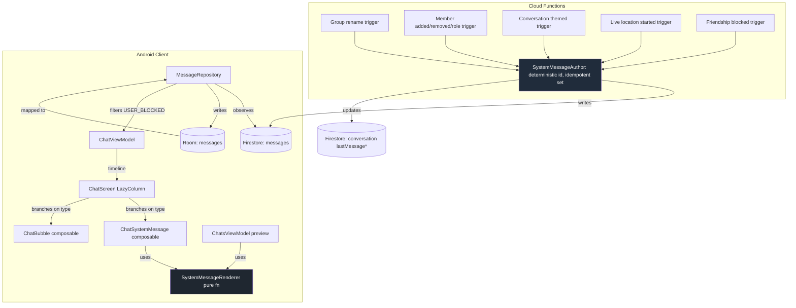

# Design Document: Group System Messages

## Overview

Adds Messenger / WhatsApp style "info messages" inline in the chat timeline. Each event (group rename, member added, role change, theme change, etc.) produces a single centered grey line that is persisted alongside regular messages. Authoring is server-authoritative via Cloud Functions so two clients can't race or duplicate. Rendering is a pure-Compose composable with localised templates.

The work fans across four layers: **server (Cloud Functions)**, **data (Room + Firestore mapping)**, **domain (Message + renderer)**, and **presentation (ChatScreen + chat list preview)**.

### Key Design Decisions

1. **Server-authored events.** Cloud Functions watch Firestore writes and emit one system message per event. Idempotent via deterministic `messageId`. Avoids the "two clients both write the same event" race that plagues client-authored designs.
2. **Reuse `MessageType.SYSTEM` and the existing messages collection.** No parallel `events` table or subcollection — system messages are interleaved by `timestamp` so chat-list pagination, scroll, day dividers, and preview logic all continue working with one extra branch.
3. **Typed payload via JSON column.** `systemEventPayload: Map<String, String>` is JSON-encoded into a single Room column. Schema-flexible, room-friendly, and forward-compatible if we add a payload field later.
4. **Pure-function renderer.** `SystemMessageRenderer` takes the typed payload + actor / target names + a `StringResources` abstraction and returns the final string. No `Context`, easy unit tests, swappable for future i18n.
5. **Client-side filter for `USER_BLOCKED`.** Avoids Cloud Function complexity (no per-recipient writes); instead we filter out messages where the *receiving* user isn't the target. Cheap and reversible.
6. **No FCM notifications, no unread bumps.** System events are informational — buzzing the phone for "Ovi changed the chat color" is the kind of thing that gets users to mute the app.
7. **Backwards compat via `text`.** Older clients that don't know about `systemEventType` still see the English fallback in `Message.text`. The new typed fields are purely additive.

## Architecture



## Data Model

### `Message` (domain)

Two new fields, both nullable for non-system messages:

```kotlin
data class Message(
    // ... existing fields ...
    val systemEventType: SystemEventType? = null,
    val systemEventPayload: Map<String, String> = emptyMap(),
    val targetUserId: String? = null
)

enum class SystemEventType {
    GROUP_RENAMED,
    GROUP_DESCRIPTION_CHANGED,
    GROUP_PHOTO_CHANGED,
    MEMBER_ADDED,
    MEMBER_REMOVED,
    MEMBER_LEFT,
    MEMBER_JOINED,
    MEMBER_PROMOTED,
    MEMBER_DEMOTED,
    NICKNAME_CHANGED,
    THEME_COLOR_CHANGED,
    EMOJI_SHORTCUT_CHANGED,
    LIVE_LOCATION_STARTED,
    USER_BLOCKED
}
```

`Message.isValid()` gains a branch for `SYSTEM` requiring `systemEventType != null`.

### `MessageEntity` (Room)

Three new columns:

| Column | Type | Notes |
|---|---|---|
| `systemEventType` | `TEXT NULL` | Stores enum name; null for non-system messages |
| `systemEventPayload` | `TEXT NULL` | JSON-encoded `Map<String, String>` |
| `targetUserId` | `TEXT NULL` | Foreign-keyed to user id; not enforced (Firestore is source of truth) |

Migration is additive — `ALTER TABLE messages ADD COLUMN ...` with default `NULL`. Bump schema version. The mapper handles JSON parse failure by treating payload as empty and logging via Timber.

### Firestore message document

Same structure as today plus three optional fields:

```jsonc
{
  "id": "sys_GROUP_RENAMED_<convId>_<bucket>_<actorId>",
  "conversationId": "...",
  "senderId": "<actorId>",
  "senderName": "Ovi",
  "type": "SYSTEM",
  "text": "Ovi renamed the group to \"Trip\"",   // fallback for old clients
  "timestamp": 1750000000000,
  "systemEventType": "GROUP_RENAMED",
  "systemEventPayload": { "oldName": "Group", "newName": "Trip" },
  "targetUserId": null
}
```

## Cloud Functions

Implemented in `server/functions/` (Node + firebase-functions). Each function follows the same skeleton:

```js
// Pseudocode
exports.onGroupRenamed = onDocumentUpdated('groups/{groupId}', async (event) => {
  const before = event.data.before.data();
  const after  = event.data.after.data();
  if (before.name === after.name) return;

  const conversationId = await resolveConversationId(after);
  await writeSystemMessage({
    conversationId,
    eventType: 'GROUP_RENAMED',
    actorId: after.updatedBy ?? 'system',
    targetUserId: null,
    payload: { oldName: before.name, newName: after.name },
    fallbackText: `${actorName} renamed the group to "${after.name}"`,
  });
});
```

`writeSystemMessage` is a shared helper:

1. Computes the deterministic id: `sys_{eventType}_{conversationId}_{floor(now/1000)}_{actorId}_{targetUserId ?? ''}`.
2. Resolves `senderName` by reading the actor's user doc once, with a 30-minute in-memory LRU cache so a flurry of events doesn't hammer Firestore.
3. Writes the message document with `set` (overwriting on retry).
4. Updates the conversation doc's `lastMessage*` fields in the same batched write.
5. Skips updating `unreadCounts`.

Triggers required:
- `onDocumentUpdated('groups/{groupId}')` → diffs `name`, `description`, `avatarUrl`
- `onDocumentCreated('groups/{groupId}/members/{uid}')` → MEMBER_ADDED / MEMBER_JOINED
- `onDocumentDeleted('groups/{groupId}/members/{uid}')` → MEMBER_REMOVED / MEMBER_LEFT
- `onDocumentUpdated('groups/{groupId}/members/{uid}')` → role change
- `onDocumentUpdated('conversations/{convId}')` → diffs `nicknames.{uid}`, `themeColor`, `emojiShortcut`
- `onDocumentCreated('activeLocations/{uid}')` → LIVE_LOCATION_STARTED, fan-out one message per `targetIds[]` entry
- `onDocumentUpdated('friendships/{id}')` → USER_BLOCKED when status flips to BLOCKED

### Caller-attribution

The triggers need to know **who** did the change (the actor) for events like `GROUP_RENAMED`. Firestore triggers don't carry auth context, so we require all client-side updates to also write an `updatedBy` field set to `request.auth.uid`. Existing `GroupRepositoryImpl.updateGroup` and friends will be patched to include this field.

For events with implicit actors (someone leaving a group → actor is themselves), the function uses `targetUid` as the actor.

## Android Client Changes

### Repository layer

`MessageRepositoryImpl` only changes in two places:

1. **`mapMessageEntityToDomain`** — pulls the three new columns and JSON-decodes the payload.
2. **`mapMessageDomainToEntity`** — JSON-encodes the payload.
3. **Filter `USER_BLOCKED` in the observe stream**: the repository injects `firebaseAuth`, so it can drop messages where `systemEventType == USER_BLOCKED && targetUserId != currentUid`.

No changes to the actual Firestore listener — system messages flow through the same snapshot.

### `ChatViewModel`

No changes needed. The mapper already produces `Message` objects with the new fields; the existing `messages` flow carries them.

### `ChatScreen` LazyColumn

```kotlin
items(messages, key = { it.id }) { msg ->
    when (msg.type) {
        MessageType.SYSTEM -> ChatSystemMessage(msg, currentUserId, /* ... */)
        else -> ChatBubble(msg, /* ... */)
    }
}
```

Day dividers, scroll-to-latest, and pagination are unchanged.

### `ChatSystemMessage` composable

```kotlin
@Composable
fun ChatSystemMessage(
    message: Message,
    currentUserId: String,
    actorName: String,
    targetName: String?,
    modifier: Modifier = Modifier
) {
    val text = remember(message, currentUserId, actorName, targetName) {
        SystemMessageRenderer.render(
            eventType = message.systemEventType ?: return@remember message.text,
            payload = message.systemEventPayload,
            actorName = actorName,
            targetName = targetName,
            currentUserId = currentUserId,
            actorId = message.senderId,
            targetId = message.targetUserId,
            fallback = message.text
        )
    }
    var showTimestamp by remember { mutableStateOf(false) }
    Column(
        Modifier.fillMaxWidth().padding(vertical = 12.dp).clickable { showTimestamp = !showTimestamp },
        horizontalAlignment = Alignment.CenterHorizontally
    ) {
        Text(
            text = text,
            style = MaterialTheme.typography.labelMedium,
            color = MaterialTheme.colorScheme.onSurfaceVariant,
            textAlign = TextAlign.Center,
            maxLines = 2,
            overflow = TextOverflow.Ellipsis
        )
        AnimatedVisibility(showTimestamp) {
            Text(formatRelativeTimestamp(message.timestamp), /* ... */)
        }
    }
    // Auto-hide after 2s using LaunchedEffect on showTimestamp
}
```

The composable resolves `actorName` / `targetName` via a name-resolver function passed from `ChatViewModel` (which already maintains a `participantNames` map on the conversation).

### `SystemMessageRenderer` (pure)

```kotlin
object SystemMessageRenderer {
    fun render(
        eventType: SystemEventType,
        payload: Map<String, String>,
        actorName: String,
        targetName: String?,
        currentUserId: String,
        actorId: String,
        targetId: String?,
        fallback: String
    ): String {
        val actor = if (actorId == currentUserId) "You" else actorName
        val target = when {
            targetId == currentUserId -> "you"
            targetName != null -> targetName
            else -> ""
        }
        return when (eventType) {
            GROUP_RENAMED -> "$actor renamed the group to \"${payload["newName"].orEmpty()}\""
            GROUP_DESCRIPTION_CHANGED -> "$actor updated the group description"
            GROUP_PHOTO_CHANGED -> "$actor changed the group photo"
            MEMBER_ADDED -> "$actor added $target"
            MEMBER_REMOVED -> "$actor removed $target"
            MEMBER_LEFT -> "$actor left the group"
            MEMBER_JOINED -> "$actor joined the group"
            MEMBER_PROMOTED -> "$actor made $target an admin"
            MEMBER_DEMOTED -> "$actor removed $target as admin"
            NICKNAME_CHANGED -> {
                val newNick = payload["newNickname"].orEmpty()
                if (newNick.isNotEmpty()) "$actor set $target's nickname to \"$newNick\""
                else "$actor cleared $target's nickname"
            }
            THEME_COLOR_CHANGED -> "$actor changed the chat color"
            EMOJI_SHORTCUT_CHANGED -> "$actor set the emoji shortcut to ${payload["newEmoji"].orEmpty()}"
            LIVE_LOCATION_STARTED -> "$actor started sharing their live location"
            USER_BLOCKED -> "$actor blocked you"
        }
    }
}
```

Easy to unit-test, easy to swap for a localised version later (replace the literal strings with `StringResources` lookups).

### Chat list preview override

`ConversationPreviewMapper` currently produces preview text from `Conversation.lastMessageText` and `lastMessageType`. New branch: when `lastMessageType == SYSTEM`, use the rendered string. This requires the conversation document to also carry `lastMessageSystemEventType` and `lastMessageSystemEventPayload` — written by the same Cloud Function batch update.

For `USER_BLOCKED` lastMessage: the function still writes the conversation field, but the client mapper checks `targetUserId == currentUid` and falls back to the previous non-system message preview if not.

## Notification Pipeline

The existing FCM trigger (`onMessageCreated`) already exists in the Functions codebase. Modify it to early-return when `message.type == 'SYSTEM'`. One-line change.

## Testing Strategy

1. **Unit (renderer)**: one test per `SystemEventType` × four "is the current user actor / target" combinations (4×14 = 56 cases). Validates Requirement 6.
2. **Property (entity ↔ domain mapping)**: Kotest Property Testing, 100+ iterations of arbitrary `Map<String, String>` payloads, asserting JSON round-trip lossless. Validates Requirements 1.1, 2.4.
3. **Compose preview screenshot**: `ChatSystemMessage` for `MEMBER_ADDED`, `GROUP_RENAMED`, `USER_BLOCKED`. Validates Requirement 5.
4. **Cloud Function emulator**: Firebase Emulator Suite tests for the idempotency rule (write → trigger fires twice → assert one message). Validates Requirement 4.
5. **Integration (chat list preview)**: VM test that sends a SYSTEM lastMessage and asserts preview output. Validates Requirement 7.
6. **Manual smoke**: rename group, kick member, change photo, block user, observe lines in real chat.

## Migration & Rollout

1. **Schema migration runs on first launch of new client** — additive, zero-data migration.
2. **Cloud Functions deploy first**, then client. Older clients fall back to `Message.text` (Requirement 10) until they update.
3. **Feature flag (optional)**: gate `ChatSystemMessage` rendering on a `FeatureFlags.SHOW_SYSTEM_MESSAGES` value defaulting to `true` in production. Lets us disable client rendering remotely if a renderer bug ships.
4. **Backfill**: not needed. Existing groups simply have no historical events; new events start showing once functions deploy.

## Open Questions

1. **Localisation timing.** Renderer is hardcoded English in v1. Adding string resources is straightforward but punted to a follow-up so this scope stays bounded.
2. **`MEMBER_JOINED` vs `MEMBER_ADDED` heuristic.** Cloud Function infers based on whether `actorId == targetId`. There's a tiny edge case where an admin uses an invite link to add themselves (they'd show as `JOINED`); accepted as fine.
3. **Theme color preview.** Should `THEME_COLOR_CHANGED` show a tiny color swatch next to the text? Out of scope for v1.
4. **Bulk events.** Adding 5 members at once produces 5 MEMBER_ADDED lines. Future polish: collapse consecutive same-actor adds into "Ovi added Sara, Mike, and 3 others." Not in v1.


## Components and Interfaces

### Domain
- **`Message`** — extended with `systemEventType: SystemEventType?`, `systemEventPayload: Map<String, String>`, `targetUserId: String?`. No new public methods.
- **`SystemEventType`** — sealed enum of 14 event variants (Requirement 1.2).
- **`SystemMessageRenderer`** — pure object with `render(eventType, payload, actorName, targetName, currentUserId, actorId, targetId, fallback): String`. Stateless, Android-free.

### Data
- **`MessageEntity`** — Room entity with three new nullable text columns matching the domain fields (`systemEventPayload` JSON-encoded).
- **`MessageMapper`** — handles JSON encode/decode. Failure mode: empty map + Timber log, never drops the row.
- **`MessageRepositoryImpl`** — adds a single filter step in the message observe flow that drops `USER_BLOCKED` messages where `targetUserId != currentUid`. Reuses the existing Firestore listener.
- **`Conversation`** — extended with `lastMessageSystemEventType: SystemEventType?` and `lastMessageSystemEventPayload: Map<String, String>` so chat list previews can render the same template logic without reloading the message itself.

### Server
- **`writeSystemMessage` helper** — single point of authoring. Takes `{ conversationId, eventType, actorId, targetUserId?, payload, fallbackText }`, computes the deterministic id, resolves actor display name (LRU-cached), batches the message write + conversation `lastMessage*` update.
- **Triggers** — one per Firestore source path (groups doc, group members subcollection, conversation doc, activeLocations, friendships). Each trigger diffs the change, decides which event variant applies, and calls `writeSystemMessage`.
- **`onMessageCreated` (existing FCM trigger)** — modified with an early-return for `type === 'SYSTEM'`.

### Presentation
- **`ChatSystemMessage`** — Compose composable, centered text + tappable timestamp reveal. Receives `Message` plus `currentUserId` and a `nameResolver: (userId: String) -> String` lambda.
- **`ChatScreen` LazyColumn** — single new branch in the `items` block routing `SYSTEM` to `ChatSystemMessage`. Everything else (date dividers, scroll, pagination) unchanged.
- **`ConversationPreviewMapper`** — branches on `lastMessageType == SYSTEM` and routes through `SystemMessageRenderer`.

## Data Models

See the **Data Model** section above for the full Kotlin data class shapes. Summary:

| Layer | Type | New fields |
|---|---|---|
| Domain | `Message` | `systemEventType: SystemEventType?`, `systemEventPayload: Map<String, String>`, `targetUserId: String?` |
| Domain | `SystemEventType` | new enum, 14 values |
| Domain | `Conversation` | `lastMessageSystemEventType`, `lastMessageSystemEventPayload` |
| Room | `MessageEntity` | `systemEventType: String?`, `systemEventPayload: String?` (JSON), `targetUserId: String?` |
| Firestore | `messages/{id}` | `systemEventType` (string), `systemEventPayload` (map), `targetUserId` (string) |
| Firestore | `conversations/{id}` | `lastMessageSystemEventType`, `lastMessageSystemEventPayload`, plus a new `updatedBy` audit field on writes |

## Correctness Properties

### Property 1: Idempotent emission
`writeSystemMessage(args)` called twice within the same second produces exactly one Firestore document. Verified by the deterministic id derivation in Requirement 4.1 and the `set` (no merge) in 4.2.

**Validates: Requirements 4.1, 4.2**

### Property 2: Payload round-trip
For any `Map<String, String>` `m`, `decode(encode(m)) == m`. Validated by property test in tasks 2.4 / 11.2.

**Validates: Requirements 1.1, 2.4, 11.2**

### Property 3: Renderer purity
`SystemMessageRenderer.render(...)` is referentially transparent — same inputs always produce the same output, no Android dependencies, no I/O.

**Validates: Requirements 6.1, 6.7**

### Property 4: Self-reference avoidance
When `actorId == currentUserId == targetId`, the rendered string never contains `"You ... you"`; the renderer chooses a single-pronoun variant per template (Requirement 6.6).

**Validates: Requirements 6.6**

### Property 5: Visibility filter is one-way
A `USER_BLOCKED` message can never accidentally render to a non-target user — the filter runs before the message reaches the ViewModel, so even a UI bug downstream couldn't surface it.

**Validates: Requirements 9.2, 9.3**

### Property 6: No ordering inversion
System messages share the `timestamp` field with regular messages; the chat list and chat timeline already sort by timestamp ASC, so no additional ordering logic is introduced.

**Validates: Requirements 5.7, 5.8**

## Error Handling

| Failure | Surface | Recovery |
|---|---|---|
| Cloud Function fails to write the system message | Structured error log with `eventType`, `conversationId`, `actorId`. Underlying data change still commits. | Retried automatically by Cloud Functions runtime. After max retries, the event is silently lost — accepted because the underlying state change (rename, member add) is what actually matters. |
| `systemEventPayload` JSON parse failure on the client | Timber error log with the raw payload string. | Mapper treats payload as empty `Map`; renderer falls back to `Message.text`. Row is preserved. |
| Unknown `systemEventType` (e.g. server adds a new variant before client updates) | No log; it's expected during rollouts. | Client renders `Message.text` directly via the fallback path. |
| Actor displayName resolution fails in Cloud Function | Warning log; uses `"Someone"` as the displayName. | Future renames of that user won't retroactively fix old messages — accepted. |
| Conversation `lastMessage*` update fails after message write | Timber error; the message itself is committed. | Chat list preview will be momentarily stale; next regular message write fixes it. |
| Force-downgrade to older app version after migration ran | None | Older client ignores the new columns, reads the row, displays `Message.text`. Validated by task 15.2. |
| Two distinct field changes within the same `timestampBucket` | None | Deterministic id includes the field name (Requirement 4.3) so they get different ids. |
