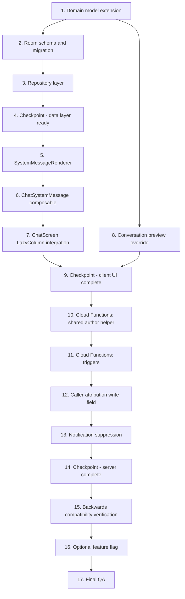

# Implementation Plan: Group System Messages

## Overview

This plan converts the design into incremental coding tasks across four layers:

1. **Domain & data** — extend `Message` + `MessageEntity`, JSON payload mapping, Room migration.
2. **Server** — Cloud Functions for each event trigger, idempotent `writeSystemMessage` helper, FCM suppression.
3. **Renderer** — `SystemMessageRenderer` pure function with full unit coverage.
4. **Presentation** — `ChatSystemMessage` composable, `ChatScreen` LazyColumn branch, chat list preview override.

Tasks are ordered so the data layer is fully testable before any UI work, and the server is deployable independently of the client.

## Tasks

- [ ] 1. Domain model extension
  - [ ] 1.1 Add `SystemEventType` enum in `domain/model/Message.kt` covering all 14 event types listed in Requirement 1.2
    - _Requirements: 1.2_
  - [ ] 1.2 Add `systemEventType: SystemEventType?`, `systemEventPayload: Map<String, String>`, and `targetUserId: String?` fields to `Message` data class
    - Update `Message.isValid()` to require `systemEventType != null` for `MessageType.SYSTEM`
    - _Requirements: 1.1, 1.4, 1.6_
  - [ ] 1.3 Add unit test for `Message.isValid()` covering SYSTEM with and without `systemEventType`
    - _Requirements: 1.6_

- [ ] 2. Room schema and migration
  - [ ] 2.1 Add `systemEventType: String?`, `systemEventPayload: String?` (JSON), `targetUserId: String?` columns to `MessageEntity`
    - _Requirements: 2.1_
  - [ ] 2.2 Bump database version and write a `Migration_N_N+1` that runs three additive `ALTER TABLE messages ADD COLUMN` statements with default `NULL`
    - Register the migration in the `AppDatabase` builder
    - _Requirements: 2.2_
  - [ ] 2.3 Update the entity-domain mapper in `data/mapper/MessageMapper.kt` (or wherever it lives) to:
    - JSON-encode `systemEventPayload` on entity write
    - JSON-decode on entity read, treating parse failures as empty payload + Timber log
    - Convert `systemEventType` string ↔ enum
    - _Requirements: 1.5, 2.4_
  - [ ] 2.4 Property test for the round-trip: arbitrary `Map<String, String>` → JSON → back must equal input
    - Use Kotest Property Testing (≥100 iterations)
    - Tag: `Feature: group-system-messages, Property 1: Payload round-trip lossless`
    - _Requirements: 2.4, 11.2_

- [ ] 3. Repository layer
  - [ ] 3.1 Update `MessageRepositoryImpl` Firestore→domain mapper to read `systemEventType`, `systemEventPayload`, `targetUserId` from the document
    - _Requirements: 1.1_
  - [ ] 3.2 Inject `FirebaseAuth` (if not already) into `MessageRepositoryImpl` and add a filter step in the `observeMessages` flow that drops messages where `systemEventType == USER_BLOCKED && targetUserId != currentUid`
    - _Requirements: 9.2_
  - [ ] 3.3 Update `Message.isValid()` validation in `MessageRepositoryImpl.sendMessage` to reject SYSTEM messages without a `systemEventType` at the repo boundary
    - _Requirements: 1.6_

- [ ] 4. Checkpoint - data layer ready
  - Run all tests, confirm Room migration works on a fresh install and on an upgrade from current production schema. Ask the user before continuing.

- [ ] 5. SystemMessageRenderer (pure)
  - [ ] 5.1 Create `presentation/chat/system/SystemMessageRenderer.kt` as a pure object with the `render(...)` function described in the design
    - No Android dependencies; takes raw strings and ids, returns a single rendered line
    - _Requirements: 6.1, 6.7_
  - [ ] 5.2 Implement all 14 templates per Requirement 6.3
    - _Requirements: 6.3_
  - [ ] 5.3 Implement You / you substitution per Requirements 6.2, 6.4, 6.5
    - _Requirements: 6.2, 6.4, 6.5_
  - [ ] 5.4 Implement self-reference fallback per Requirement 6.6 (e.g. "You added yourself" → "You joined the group" — define case-by-case in the implementation)
    - _Requirements: 6.6_
  - [ ] 5.5 Unit test every `SystemEventType` × four actor/target permutations (current-user-actor, current-user-target, both, neither)
    - At least 56 cases total
    - _Requirements: 6.1, 6.2, 6.3, 6.4, 6.5, 6.6, 11.1_

- [ ] 6. ChatSystemMessage composable
  - [ ] 6.1 Create `presentation/chat/components/ChatSystemMessage.kt`
    - Centered `Text` using `labelMedium` + `onSurfaceVariant`, vertical padding 12.dp, max 2 lines with ellipsis
    - Tap to toggle a small floating timestamp (auto-hide after 2s via `LaunchedEffect`)
    - No avatar, no sender name, no status, no reaction bar, no long-press selection
    - _Requirements: 5.1, 5.2, 5.3, 5.4, 5.5, 5.6_
  - [ ] 6.2 Resolve `actorName` and `targetName` from the `participantNames` map already on the conversation; if missing, fall back to "Someone"
    - _Requirements: 6.1_
  - [ ] 6.3 Add screenshot preview tests in `app/src/screenshotTest/...` for `MEMBER_ADDED`, `GROUP_RENAMED`, `USER_BLOCKED`
    - _Requirements: 5.1, 11.3_

- [ ] 7. ChatScreen LazyColumn integration
  - [ ] 7.1 In `ChatScreen.kt`, add a `when (msg.type)` branch in the `items(messages, key = { it.id })` block that routes `MessageType.SYSTEM` to `ChatSystemMessage` and everything else to `ChatBubble`
    - Pass `currentUserId` (already available from `uiState`) and a name resolver lambda
    - _Requirements: 5.1, 5.7_
  - [ ] 7.2 Verify date dividers still render correctly between system and regular messages (no code change expected; existing logic uses `timestamp`)
    - _Requirements: 5.8_

- [ ] 8. Conversation preview override
  - [ ] 8.1 Extend `Conversation` domain model with `lastMessageSystemEventType: SystemEventType?` and `lastMessageSystemEventPayload: Map<String, String>` (mirroring the message-level fields)
    - _Requirements: 7.1_
  - [ ] 8.2 Update the conversation Firestore mapper and Room mapper to read/write these new fields
    - _Requirements: 7.1_
  - [ ] 8.3 In `ConversationPreviewMapper` (or wherever chat list preview text is computed), branch when `lastMessageType == SYSTEM` and route through `SystemMessageRenderer`
    - _Requirements: 7.1, 7.2_
  - [ ] 8.4 For `USER_BLOCKED` lastMessage in a DM: when current user is *not* the target, fall through to the previous non-system message preview
    - This requires loading one extra message (penultimate) — either store it on the conversation doc or query lazily on miss
    - _Requirements: 7.3_
  - [ ] 8.5 Unit test the preview override per Requirement 11.5
    - _Requirements: 11.5_

- [ ] 9. Checkpoint - client UI complete
  - End-to-end manual test using mock SYSTEM messages inserted directly into Room. Confirm rendering, scroll position, day dividers, preview text. Ask the user before continuing.

- [ ] 10. Cloud Functions: shared author helper
  - [ ] 10.1 Create `server/functions/src/systemMessages/writeSystemMessage.ts` (or `.js`) implementing the deterministic-id idempotent write described in the design
    - Computes id as `sys_{eventType}_{convId}_{floor(now/1000)}_{actorId}_{targetId ?? ''}`
    - Resolves actor displayName via a 30-min in-memory LRU
    - Writes message + updates conversation `lastMessage*` in a `WriteBatch`
    - Skips `unreadCounts` update
    - _Requirements: 3.1, 3.2, 3.3, 3.4, 4.1, 4.2_
  - [ ] 10.2 Add a unit test (or emulator test) asserting that calling the helper twice with the same args produces a single message document
    - _Requirements: 4.1, 4.2, 11.4_

- [ ] 11. Cloud Functions: triggers
  - [ ] 11.1 `onGroupUpdated` trigger watching `groups/{groupId}` — diffs `name`, `description`, `avatarUrl`; emits one event per changed field
    - Requires resolving `conversationId` from `group.conversationId` or via a query
    - _Requirements: 3.6, 3.7_
  - [ ] 11.2 `onGroupMemberCreated` watching `groups/{groupId}/members/{uid}` — distinguishes `MEMBER_ADDED` from `MEMBER_JOINED` based on `actorId == targetId`
    - _Requirements: 3.6_
  - [ ] 11.3 `onGroupMemberDeleted` watching the same path — distinguishes `MEMBER_LEFT` from `MEMBER_REMOVED`
    - _Requirements: 3.6_
  - [ ] 11.4 `onGroupMemberRoleChanged` watching `groups/{groupId}/members/{uid}` — emits `MEMBER_PROMOTED` or `MEMBER_DEMOTED`
    - _Requirements: 3.6_
  - [ ] 11.5 `onConversationUpdated` watching `conversations/{convId}` — diffs `nicknames.{uid}`, `themeColor`, `emojiShortcut`
    - _Requirements: 3.6_
  - [ ] 11.6 `onActiveLocationCreated` watching `activeLocations/{uid}` — for each `targetIds[]` entry that is a conversation id, emit `LIVE_LOCATION_STARTED`
    - _Requirements: 3.6_
  - [ ] 11.7 `onFriendshipBlocked` watching `friendships/{id}` — when status flips to `BLOCKED`, emit `USER_BLOCKED` into the corresponding DM
    - Resolves DM conversation id via the existing `getOrCreateDirectConversation` flow or a query on `conversations` where `participantIds == [a, b]`
    - _Requirements: 3.6_

- [ ] 12. Caller-attribution write field
  - [ ] 12.1 Patch `GroupRepositoryImpl.updateGroup` and `addMember`/`removeMember`/`updateMemberRole` to include `updatedBy = currentUid` in the Firestore writes
    - _Requirements: 3.2_
  - [ ] 12.2 Patch `ConversationRepositoryImpl` updates for `nicknames`, `themeColor`, `emojiShortcut` to include `updatedBy`
    - _Requirements: 3.2_

- [ ] 13. Notification suppression
  - [ ] 13.1 Modify the existing `onMessageCreated` Cloud Function (FCM trigger) to early-return when `message.type === 'SYSTEM'`
    - _Requirements: 8.1, 8.2_
  - [ ] 13.2 Verify the in-app message-arrival animation in `ChatScreen` does not run for SYSTEM messages — animations are usually keyed on bubble entry, but worth a manual check
    - _Requirements: 8.3_

- [ ] 14. Checkpoint - server complete
  - Deploy Cloud Functions to a staging project. Manually trigger each event and confirm one (and only one) system message appears in the chat. Ask the user before continuing to production rollout.

- [ ] 15. Backwards compatibility verification
  - [ ] 15.1 Build an older client (production version) and connect it to the staging project. Confirm SYSTEM messages render their `text` field as readable English, even though the typed fields are dropped
    - _Requirements: 10.1, 10.3_
  - [ ] 15.2 Run a force-downgrade SQLite test: create a Room database with the new schema, replace the `AppDatabase` with the previous version, confirm reads still work (older code ignores the new columns)
    - _Requirements: 10.2_

- [ ] 16. Optional feature flag
  - [ ] 16.1 Add `FeatureFlags.SHOW_SYSTEM_MESSAGES = true`
    - When false, `ChatScreen` falls through SYSTEM messages to ChatBubble (which renders as plain text using `Message.text`), and the chat list preview override is bypassed
    - Lets us disable rendering remotely if a renderer bug ships
    - _Requirements: 10.1_

- [ ] 17. Final QA
  - Walk through every event type in a real conversation. Confirm:
    - Correct line text including pronouns
    - No FCM notification
    - No unread bump
    - Chat list preview shows the latest event
    - Older client compatibility
    - Day dividers correct
  - Ask the user to sign off before merge.


## Task Dependency Graph



```json
{
  "waves": [
    { "wave": 1, "tasks": ["1"] },
    { "wave": 2, "tasks": ["2"] },
    { "wave": 3, "tasks": ["3", "8"] },
    { "wave": 4, "tasks": ["4"] },
    { "wave": 5, "tasks": ["5"] },
    { "wave": 6, "tasks": ["6"] },
    { "wave": 7, "tasks": ["7"] },
    { "wave": 8, "tasks": ["9"] },
    { "wave": 9, "tasks": ["10"] },
    { "wave": 10, "tasks": ["11"] },
    { "wave": 11, "tasks": ["12"] },
    { "wave": 12, "tasks": ["13"] },
    { "wave": 13, "tasks": ["14"] },
    { "wave": 14, "tasks": ["15"] },
    { "wave": 15, "tasks": ["16"] },
    { "wave": 16, "tasks": ["17"] }
  ]
}
```

Critical path: 1 → 2 → 3 → 5 → 6 → 7 → 9 → 10 → 11 → 12 → 13 → 14 → 17.

Tasks 8 (preview override) and 16 (feature flag) can be parallelised once their predecessors complete; 15 requires a deployed staging server (after 14).

## Notes

- **Renderer hardcoded English in v1.** Swap to `StringResources` lookups when the rest of the app gets localised. Tracked as an open question in `design.md`.
- **Bulk-event collapsing** ("Ovi added Sara, Mike, and 3 others") is explicitly out of scope. Each member add produces its own line. Future polish.
- **Nickname change events** fire even when the change is `null → ""` (initial state); the renderer's `cleared` branch covers it but server triggers should suppress no-op writes (`oldNickname == newNickname` after normalisation).
- **Theme color preview swatch** (small color dot next to `THEME_COLOR_CHANGED` text) is out of scope. Easy to add later as an extra parameter in the renderer signature.
- **Caller-attribution** (task 12) is required server-side. Without it, all rename/photo-change events would attribute to `"system"`. Patch the existing repo writes to include `updatedBy = currentUid` first, otherwise the server triggers can't resolve actor names.
- **Cloud Function emulator setup**: tasks 10.2 and 14 assume the Firebase Emulator Suite is wired in `server/`. If it isn't, add it as a prerequisite — running these triggers against production for verification is risky.
