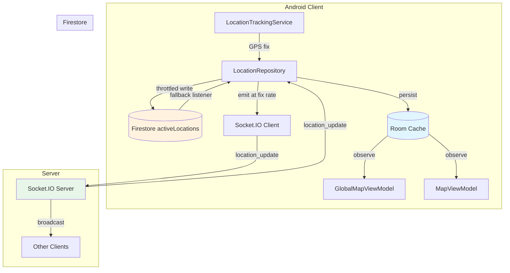
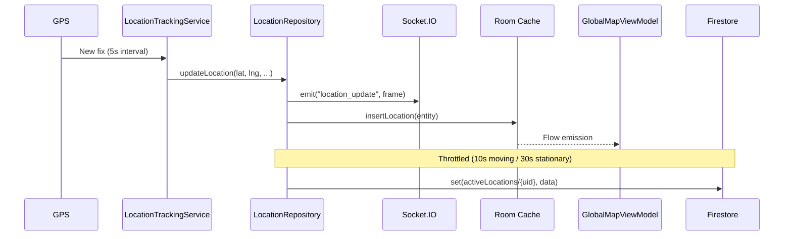
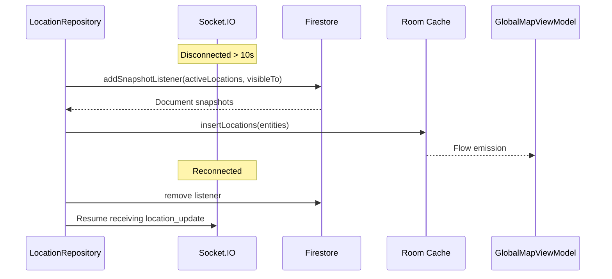
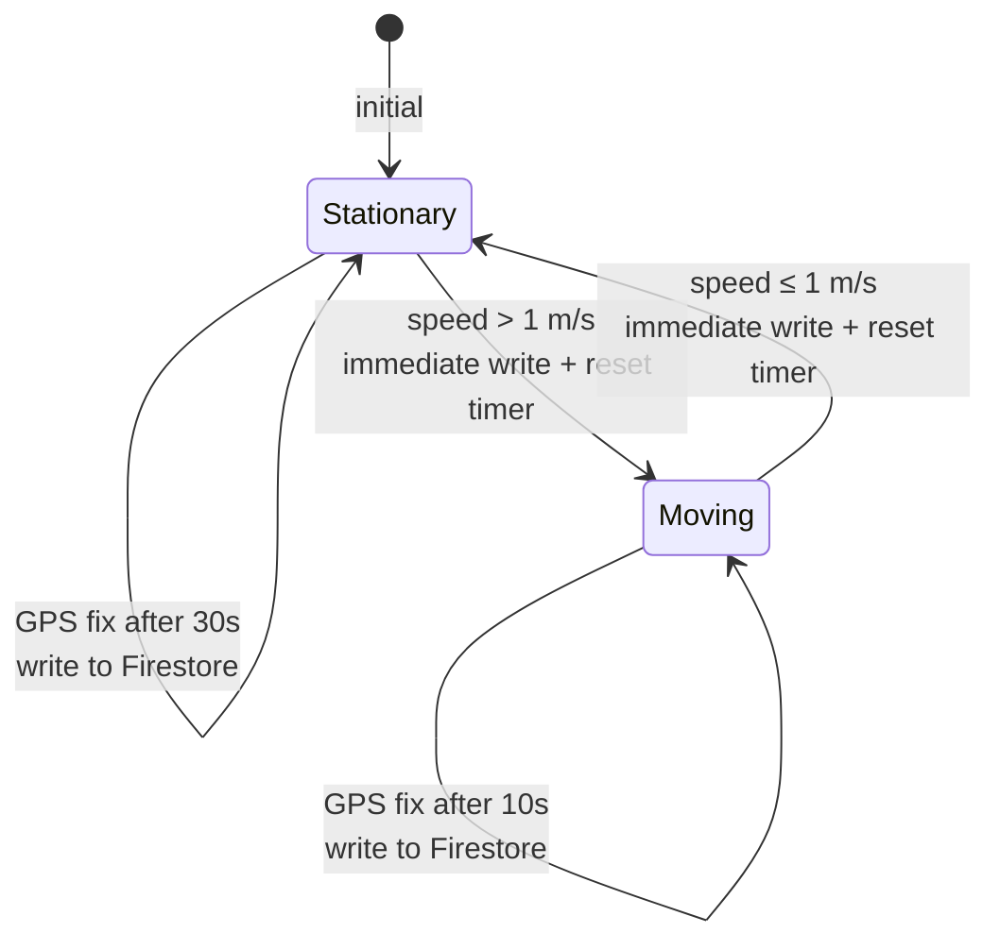

# Design Document: Location Sharing Optimization

## Overview

This design transforms the WHERE app's location sharing system from a costly dual-write Firestore architecture to a Socket.IO-primary, cache-first system with Firestore as fallback. The core strategy is:

1. **Single write target** — All location writes go to `activeLocations/{uid}` with denormalized profile data, eliminating legacy subcollection writes and separate user profile reads.
2. **Socket.IO relay** — Real-time location updates flow through the Socket.IO server, bypassing Firestore reads entirely during normal operation.
3. **Room as single source of truth** — The local Room database serves cached locations instantly on screen open, with updates persisted before UI emission.
4. **Adaptive throttling** — Firestore writes are throttled based on movement state (10s moving, 30s stationary) while Socket.IO emissions remain at GPS fix rate.

### Cost Impact

| Metric | Before | After |
|--------|--------|-------|
| Writes per location update | 2 (consolidated + legacy) | 1 (consolidated only) |
| Reads per map open | N listeners × M docs | 0 (Socket.IO) or 1 listener (fallback) |
| Profile reads per user | 1 per unknown user | 0 (denormalized) |
| Sharing status checks | 2+ reads (consolidated + legacy) | 0 (in-memory) or 1 (cache miss) |

## Architecture



### Data Flow (Normal Operation)



### Data Flow (Fallback)



## Components and Interfaces

### 1. LocationRepository (Modified)

**Responsibilities:**
- Single write to `activeLocations/{uid}` with denormalized profile data
- Speed-dependent Firestore write throttle (10s moving, 30s stationary)
- Socket.IO emission at GPS fix rate (5s moving, 30s stationary)
- Socket.IO primary / Firestore fallback listener management
- Persist-before-emit to Room cache
- In-memory sharing status cache

**Key Interface Changes:**

```kotlin
interface LocationRepository {
    // Existing — behavior changes (no legacy writes)
    suspend fun startLocationSharing(groupId: String, durationMinutes: Long): Resource<Unit>
    suspend fun stopLocationSharing(groupId: String): Resource<Unit>
    suspend fun updateLocation(groupId: String, lat: Double, lng: Double, accuracy: Float, speed: Float, bearing: Float): Resource<Unit>
    
    // New — Socket.IO emission
    suspend fun emitLocationViaSocket(frame: LocationUpdateFrame)
    
    // Existing — consolidated listener (unchanged)
    fun observeActiveLocations(): Flow<List<SharedLocation>>
    
    // Existing — Room cache observation
    fun observeCachedLocations(): Flow<List<SharedLocation>>
    
    // Modified — uses in-memory map first, single doc read fallback
    suspend fun checkSharingStatus(groupId: String): Boolean
    fun isSharingLocation(groupId: String): Boolean
}
```

### 2. Socket.IO Location Relay Server (New Handler)

**Responsibilities:**
- Authenticate clients via Firebase ID token (existing middleware)
- Join clients to location rooms via `locationRoom` query parameter
- Validate incoming `location_update` frames
- Broadcast valid frames to room members (excluding sender)
- Emit `location_user_offline` on disconnect

**New Event Handlers:**

```javascript
// New location room join on connection
socket.on('connection', (socket) => {
    const locationRoom = socket.handshake.query.locationRoom;
    if (locationRoom) {
        socket.join(locationRoom);
    }
    
    socket.on('location_update', (frame) => {
        if (!validateLocationFrame(frame)) return;
        socket.to(locationRoom).emit('location_update', frame);
    });
    
    socket.on('disconnect', () => {
        if (locationRoom) {
            socket.to(locationRoom).emit('location_user_offline', { userId: socket.user.uid });
        }
    });
});
```

### 3. GlobalMapViewModel (Modified)

**Changes:**
- Observe Room cache for instant display (< 100ms)
- Use denormalized `displayName`/`photoUrl` from location documents
- Fallback chain: denormalized field → in-memory user cache → userId
- Expose countdown string for active sharing sessions
- Show stale indicator for locations > 5 minutes old
- Show offline indicator when no network

### 4. MapViewModel (Modified)

**Changes:**
- Replace `ObserveGroupLocationsUseCase` with `ObserveActiveLocationsUseCase`
- Client-side filter by `targetId` matching current `groupId`
- Read `displayName`/`photoUrl` from `SharedLocation` fields directly
- No `GetUsersUseCase` dependency

### 5. SharedLocationEntity (Modified)

**New Fields:**
- `photoUrl: String?` (nullable, default null)
- `targetType: String` (non-null, default "")
- `targetId: String` (non-null, default "")
- `visibleTo: String?` (nullable, JSON-serialized list)

### 6. LocationDao (Modified)

**New Query:**
```kotlin
@Query("SELECT * FROM shared_location WHERE targetId = :targetId AND isSharingActive = 1 ORDER BY timestamp DESC")
fun observeByTargetId(targetId: String): Flow<List<SharedLocationEntity>>
```

## Data Models

### Location_Update_Frame (Socket.IO Payload)

```kotlin
data class LocationUpdateFrame(
    val userId: String,          // Firebase UID
    val latitude: Double,        // -90 to 90
    val longitude: Double,       // -180 to 180
    val accuracy: Float,         // meters, >= 0
    val speed: Float,            // m/s, >= 0
    val bearing: Float,          // 0 to 360
    val timestamp: Long          // Unix epoch milliseconds
)
```

### Active Location Document (Firestore)

```
activeLocations/{uid}
├── userId: string
├── latitude: number
├── longitude: number
├── accuracy: number
├── speed: number
├── bearing: number
├── timestamp: number
├── isSharingActive: boolean
├── sharingExpiresAt: number
├── targetType: string ("group" | "direct")
├── targetId: string
├── visibleTo: string[]
├── displayName: string          ← NEW (denormalized)
└── photoUrl: string             ← NEW (denormalized)
```

### SharedLocationEntity (Room)

```kotlin
@Entity(tableName = "shared_location")
data class SharedLocationEntity(
    @PrimaryKey val id: String,
    val userId: String,
    val groupId: String,
    val latitude: Double,
    val longitude: Double,
    val accuracy: Float,
    val speed: Float,
    val bearing: Float,
    val timestamp: Long,
    val isSharingActive: Boolean,
    val sharingExpiresAt: Long,
    val displayName: String = "",
    val sharingStartedAt: Long = 0L,
    // New fields
    val photoUrl: String? = null,
    val targetType: String = "",
    val targetId: String = "",
    val visibleTo: String? = null  // JSON-serialized list
)
```

### Room Migration

```kotlin
val MIGRATION_X_Y = object : Migration(X, Y) {
    override fun migrate(db: SupportSQLiteDatabase) {
        db.execSQL("ALTER TABLE shared_location ADD COLUMN photoUrl TEXT DEFAULT NULL")
        db.execSQL("ALTER TABLE shared_location ADD COLUMN targetType TEXT NOT NULL DEFAULT ''")
        db.execSQL("ALTER TABLE shared_location ADD COLUMN targetId TEXT NOT NULL DEFAULT ''")
        db.execSQL("ALTER TABLE shared_location ADD COLUMN visibleTo TEXT DEFAULT NULL")
    }
}
```

### Write Throttle State Machine



### Firestore Security Rules (activeLocations)

```
match /activeLocations/{userId} {
    allow read: if isAuthenticated()
        && (request.auth.uid == userId
            || request.auth.uid in resource.data.visibleTo);
    allow write: if isAuthenticated() && request.auth.uid == userId;
}
```

## Correctness Properties

*A property is a characteristic or behavior that should hold true across all valid executions of a system — essentially, a formal statement about what the system should do. Properties serve as the bridge between human-readable specifications and machine-verifiable correctness guarantees.*

### Property 1: Single Write Target

*For any* location operation (start, update, or stop) with any valid userId and groupId, the only Firestore document written to SHALL be `activeLocations/{uid}`, and zero writes SHALL target legacy subcollection paths (`groups/{groupId}/locations/{uid}` or `directLocationShares/{shareId}/locations/{uid}`).

**Validates: Requirements 1.1, 1.2, 1.3, 1.4**

### Property 2: VisibleTo Array Correctness

*For any* location sharing session start with a given userId and target (group or direct), the `visibleTo` array on the written document SHALL contain exactly the set of UIDs permitted to read the location: for direct shares, `[uid, friendId]`; for group shares, all group member UIDs including the sharer.

**Validates: Requirements 1.5**

### Property 3: Denormalized Profile Inclusion

*For any* write to `activeLocations/{uid}` (start or update), the document SHALL contain `displayName` (truncated to 50 characters if longer) and `photoUrl` (max 2048 characters) sourced from the authenticated user's profile.

**Validates: Requirements 2.1**

### Property 4: Denormalized Field Fallback Resolution

*For any* location document with null or empty `displayName` or `photoUrl`, the ViewModel SHALL resolve the value by first checking the in-memory user cache for that userId, and if no cache entry exists, SHALL use the userId as the display name fallback or a placeholder avatar for photoUrl.

**Validates: Requirements 2.3, 2.4**

### Property 5: Client-Side Group Filtering

*For any* list of SharedLocation objects and any active group filter (targetId), the filtered output SHALL contain only locations where `SharedLocation.targetId` equals the filter value, `isSharingActive` is true, and `sharingExpiresAt` has not elapsed.

**Validates: Requirements 3.2**

### Property 6: Location_Update_Frame Validation

*For any* payload emitted as a `location_update` event, the server SHALL broadcast it if and only if it contains all required fields (userId, latitude, longitude, accuracy, speed, bearing, timestamp) with values within specified ranges (latitude: -90 to 90, longitude: -180 to 180, bearing: 0 to 360). Invalid payloads SHALL be discarded without broadcast.

**Validates: Requirements 4.6, 4.7**

### Property 7: Socket.IO Relay Broadcast

*For any* valid `location_update` frame emitted by a client in a location room, the server SHALL broadcast the frame to all other clients in the same room and SHALL NOT send it back to the sender or to clients in different rooms.

**Validates: Requirements 4.1**

### Property 8: Speed-Dependent Socket.IO Emission Rate

*For any* sequence of GPS fixes, Socket.IO emissions SHALL occur at the GPS fix interval (5 seconds) when speed > 1 m/s, and at maximum 30-second intervals when speed ≤ 1 m/s, independent of the Firestore write throttle.

**Validates: Requirements 5.2, 5.3, 8.5, 8.6**

### Property 9: Speed-Dependent Firestore Write Throttle

*For any* sequence of GPS fixes with timestamps, Firestore writes SHALL occur at minimum 10-second intervals when speed > 1 m/s and minimum 30-second intervals when speed ≤ 1 m/s, with intermediate samples discarded.

**Validates: Requirements 8.1, 8.2**

### Property 10: Immediate Write on Speed State Transition

*For any* GPS fix sequence where speed crosses the 1 m/s threshold (in either direction), an immediate Firestore write SHALL occur with the current location regardless of throttle state, and the throttle timer SHALL reset.

**Validates: Requirements 8.3, 8.4**

### Property 11: Persist-Before-Emit Ordering

*For any* location update arriving from Socket.IO or Firestore, the Location_Repository SHALL persist the update to Room cache before emitting the updated location list to the UI flow.

**Validates: Requirements 6.2**

### Property 12: One Record Per User in Cache

*For any* sequence of location updates for the same userId, the Room cache SHALL contain exactly one record for that userId with the latest timestamp and coordinates (upsert semantics via REPLACE conflict strategy).

**Validates: Requirements 6.3**

### Property 13: Stale Location Indicator

*For any* cached location displayed on the map, if the location's timestamp is older than 5 minutes relative to the device's current time, the ViewModel SHALL expose a stale indicator for that location's map marker.

**Validates: Requirements 6.5**

### Property 14: No Duplicate Entries During Fallback Transition

*For any* transition from Firestore fallback back to Socket.IO, the emitted location list SHALL contain at most one entry per userId, with no duplicate location entries for the same user during the transition window.

**Validates: Requirements 7.5**

### Property 15: Sharing Status Lookup Chain

*For any* sharing status check for a given groupId, the Location_Repository SHALL first check the in-memory `activeSharingSessions` map (0 Firestore reads); if no valid entry exists, SHALL read exactly one document from `activeLocations/{uid}` (1 Firestore read); and SHALL never read from legacy subcollection paths.

**Validates: Requirements 9.1, 9.2, 9.3**

### Property 16: Session Map Lifecycle

*For any* sharing session lifecycle, calling `startLocationSharing(groupId)` SHALL result in `activeSharingSessions` containing an entry for that groupId before the method returns, and calling `stopLocationSharing(groupId)` SHALL result in `activeSharingSessions` not containing that groupId before the method returns.

**Validates: Requirements 9.4, 9.5**

### Property 17: Entity Mapping Completeness

*For any* valid SharedLocation domain object, mapping to SharedLocationEntity and back (round-trip) SHALL preserve all fields: userId, latitude, longitude, accuracy, speed, bearing, timestamp, displayName, photoUrl, targetType, targetId, and visibleTo.

**Validates: Requirements 10.2**

### Property 18: TargetType Inference from GroupId Prefix

*For any* SharedLocation with null or empty `targetType`, the toEntity mapping SHALL set targetType to "direct" when groupId starts with "direct:" and to "group" otherwise.

**Validates: Requirements 10.5**

### Property 19: DAO TargetId Filtering and Ordering

*For any* set of SharedLocationEntity records in the database, querying by a specific targetId SHALL return only records matching that targetId, ordered by timestamp descending.

**Validates: Requirements 10.3**

### Property 20: Countdown Format String

*For any* active sharing session with a finite expiration, the countdown string SHALL be formatted as "Xh Ym" when 60 or more minutes remain, or "Xm" when fewer than 60 minutes remain.

**Validates: Requirements 12.1**

## Error Handling

| Scenario | Behavior |
|----------|----------|
| Firestore write fails (start/update/stop) | Return `Resource.Error` with message; do not silently discard |
| Socket.IO emission fails | Log failure via Timber; continue Firestore write; no retry for that fix |
| Socket.IO disconnected | Continue Firestore writes; after 10s activate Firestore fallback listener |
| Firestore fallback listener error | Log error; continue serving from Room cache |
| Throttled Firestore write fails | Retain sample; attempt on next throttle cycle |
| Sharing status read fails | Return `false`; log error; no exception thrown to caller |
| Consolidated location stream error | MapViewModel sets UI error state; does not crash or show stale data |
| Room cache empty on map open | Display empty map without error state |
| Network unavailable | Display Room cache with offline indicator |
| Profile fields null/empty | Fallback chain: cache → userId/placeholder |

## Testing Strategy

### Property-Based Tests (Kotlin — using Kotest property testing)

Property-based testing is appropriate for this feature because it contains significant pure logic (throttle state machines, frame validation, filtering, mapping, formatting) that varies meaningfully with input.

**Library:** `io.kotest:kotest-property` (Kotest Property Testing)
**Minimum iterations:** 100 per property test
**Tag format:** `Feature: location-sharing-optimization, Property {N}: {title}`

**Properties to implement as PBT:**
- Property 2: VisibleTo array correctness (generate random member lists)
- Property 5: Client-side group filtering (generate random location lists + filters)
- Property 6: Location_Update_Frame validation (generate valid/invalid payloads)
- Property 9: Speed-dependent Firestore write throttle (generate GPS fix sequences)
- Property 10: Immediate write on speed state transition (generate transition sequences)
- Property 12: One record per user in cache (generate update sequences)
- Property 13: Stale location indicator (generate timestamps relative to now)
- Property 17: Entity mapping round-trip (generate random SharedLocation objects)
- Property 18: TargetType inference (generate groupIds with/without "direct:" prefix)
- Property 19: DAO targetId filtering (generate location sets with various targetIds)
- Property 20: Countdown format string (generate random durations)

### Unit Tests (Example-Based)

- Denormalized profile inclusion in writes (Requirement 2.1)
- Fallback resolution with specific cache states (Requirements 2.3, 2.4)
- MapViewModel uses consolidated listener, not legacy (Requirement 3.1)
- MapViewModel cancels jobs on onCleared (Requirement 3.4)
- Socket.IO relay broadcast to room only (Requirement 4.1)
- Socket.IO authentication rejection (Requirements 4.2, 4.3)
- Location room join/no-join behavior (Requirements 4.4, 4.5)
- Disconnect broadcasts offline event (Requirement 4.9)
- Cache-first display timing (Requirement 6.1)
- Offline indicator display (Requirement 6.4)
- Firestore fallback activation after 10s (Requirement 7.2)
- Fallback listener removal on reconnect (Requirement 7.3)
- Sharing state restoration on ViewModel init (Requirement 12.5)
- Expired session cleanup on restore (Requirement 12.6)

### Integration Tests

- Firestore security rules (Requirements 11.1–11.5) — using Firestore emulator
- Socket.IO server end-to-end relay with multiple clients
- Room migration preserves existing data (Requirement 10.4)
- Full location sharing lifecycle (start → update → stop) with single write verification

### Smoke Tests

- Database migration runs without error (Requirement 10.4)
- Legacy rule blocks exist with deprecation comments (Requirement 11.4)
- No modifications to unrelated Firestore rule blocks (Requirement 11.5)
