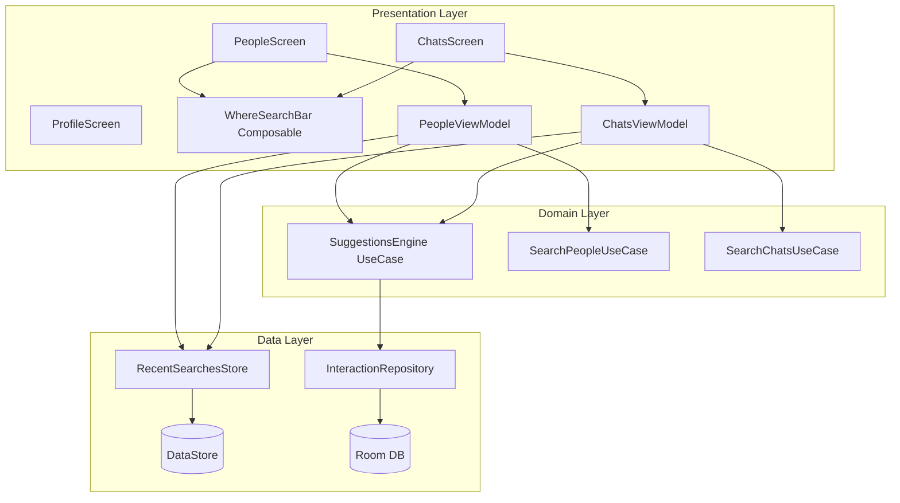

# Design Document: Messenger-Style Search

## Overview

This feature replaces the Material `TopAppBar` on the three main tab screens (Profile, People, Chats) with a Messenger-style always-visible search bar on People and Chats. The Profile screen simply removes its top bar. The search bar provides a premium, animated experience with recent searches persisted via DataStore and suggestions based on recent interactions (messages sent, profiles viewed).

The Map tab is unaffected.

### Key Design Decisions

1. **Shared composable**: A single `WhereSearchBar` composable is reused across People and Chats with configurable placeholder text and callbacks.
2. **DataStore for recent searches**: Leverages the existing `DataStore<Preferences>` infrastructure already used by `UserPreferences`. A new `RecentSearchesStore` class uses `stringSetPreferencesKey` with JSON-encoded ordered lists to maintain per-screen search histories.
3. **Suggestions from local data**: The `SuggestionsEngine` queries the local Room database for recent interactions (messages sent, profiles viewed) rather than making network calls, keeping the feature fast and offline-capable.
4. **Debounce in ViewModel**: Search debouncing is handled in the ViewModel layer using `kotlinx.coroutines.flow.debounce()`, keeping the composable layer stateless regarding timing logic.

## Architecture



### Component Responsibilities

| Component | Responsibility |
|-----------|---------------|
| `WhereSearchBar` | Stateless UI composable: pill shape, animations, chips, suggestions row |
| `PeopleViewModel` | Manages search state, debounce, recent searches for People screen |
| `ChatsViewModel` | Manages search state, debounce, recent searches for Chats screen |
| `RecentSearchesStore` | DataStore-backed persistence of recent search queries per screen |
| `SuggestionsEngine` | Queries local interaction data, orders by recency, caps at 15 |
| `InteractionRepository` | Abstracts Room queries for recent messages and profile views |

## Components and Interfaces

### WhereSearchBar Composable

```kotlin
@Composable
fun WhereSearchBar(
    query: String,
    onQueryChanged: (String) -> Unit,
    onQuerySubmitted: (String) -> Unit,
    onClearQuery: () -> Unit,
    placeholderText: String,
    isFocused: Boolean,
    onFocusChanged: (Boolean) -> Unit,
    isLoading: Boolean = false,
    recentSearches: List<String> = emptyList(),
    onRecentSearchTapped: (String) -> Unit = {},
    onRecentSearchDeleted: (String) -> Unit = {},
    onClearAllRecentSearches: () -> Unit = {},
    suggestions: List<SuggestionUiModel> = emptyList(),
    onSuggestionTapped: (SuggestionUiModel) -> Unit = {},
    modifier: Modifier = Modifier
)
```

### RecentSearchesStore

```kotlin
@Singleton
class RecentSearchesStore @Inject constructor(
    private val dataStore: DataStore<Preferences>
) {
    companion object {
        const val MAX_ENTRIES = 15
    }

    fun getRecentSearches(screenKey: String): Flow<List<String>>
    suspend fun addSearch(screenKey: String, query: String)
    suspend fun removeSearch(screenKey: String, query: String)
    suspend fun clearAll(screenKey: String)
}
```

### SuggestionsEngine (UseCase)

```kotlin
class GetSuggestionsUseCase @Inject constructor(
    private val interactionRepository: InteractionRepository
) {
    operator fun invoke(limit: Int = 15): Flow<List<SuggestionUiModel>>
}
```

### InteractionRepository

```kotlin
interface InteractionRepository {
    fun getRecentInteractions(limit: Int): Flow<List<Interaction>>
    suspend fun recordInteraction(userId: String, type: InteractionType)
}
```

### SearchState (shared ViewModel state)

```kotlin
data class SearchUiState(
    val query: String = "",
    val isFocused: Boolean = false,
    val isLoading: Boolean = false,
    val recentSearches: List<String> = emptyList(),
    val suggestions: List<SuggestionUiModel> = emptyList(),
    val searchResults: List<Any> = emptyList(), // FriendUiModel or ConversationUiModel
    val showEmptyState: Boolean = false
)
```

## Data Models

### Interaction (Domain Model)

```kotlin
data class Interaction(
    val userId: String,
    val displayName: String,
    val photoUrl: String?,
    val type: InteractionType,
    val timestamp: Long,
    val isOnline: Boolean = false
)

enum class InteractionType {
    MESSAGE_SENT,
    PROFILE_VIEWED
}
```

### SuggestionUiModel (Presentation Model)

```kotlin
data class SuggestionUiModel(
    val userId: String,
    val displayName: String,
    val photoUrl: String?,
    val isOnline: Boolean
)
```

### InteractionEntity (Room Entity)

```kotlin
@Entity(tableName = "interactions")
data class InteractionEntity(
    @PrimaryKey val id: String, // "{userId}_{type}" for upsert
    val userId: String,
    val displayName: String,
    val photoUrl: String?,
    val type: String, // "MESSAGE_SENT" or "PROFILE_VIEWED"
    val timestamp: Long
)
```

### DataStore Keys (Recent Searches)

```kotlin
// Stored as JSON-encoded List<String> per screen
val PEOPLE_RECENT_SEARCHES = stringPreferencesKey("recent_searches_people")
val CHATS_RECENT_SEARCHES = stringPreferencesKey("recent_searches_chats")
```

## Correctness Properties

*A property is a characteristic or behavior that should hold true across all valid executions of a system — essentially, a formal statement about what the system should do. Properties serve as the bridge between human-readable specifications and machine-verifiable correctness guarantees.*

### Property 1: Clear button resets text to empty

*For any* non-empty string currently in the search bar, invoking the clear action SHALL result in the query becoming the empty string.

**Validates: Requirements 4.3**

### Property 2: Debounce emits only final value

*For any* sequence of text inputs arriving within 300ms of each other, only the final value in the sequence SHALL trigger the search callback, and it SHALL trigger exactly once after 300ms of silence.

**Validates: Requirements 5.1**

### Property 3: People search returns only matching users

*For any* list of users and any non-empty search query, all users in the filtered result SHALL contain the query as a case-insensitive substring of their display name or username, and no matching user SHALL be excluded from the result.

**Validates: Requirements 5.3, 9.1**

### Property 4: Chats search returns only matching conversations

*For any* list of conversations and any non-empty search query, all conversations in the filtered result SHALL contain the query as a case-insensitive substring of their title or last message text, and no matching conversation SHALL be excluded from the result.

**Validates: Requirements 5.4, 9.2**

### Property 5: Recent searches persistence round-trip

*For any* list of search queries added to the store, reading the store (including after re-instantiation simulating app restart) SHALL return those queries in reverse-chronological order, up to the maximum of 15.

**Validates: Requirements 6.1, 6.7**

### Property 6: Recent searches max capacity with FIFO eviction

*For any* sequence of N additions (where N > 15) to the recent searches store, the store SHALL contain exactly 15 entries, and the entries SHALL be the 15 most recently added (oldest evicted first).

**Validates: Requirements 6.2, 6.3**

### Property 7: Single entry deletion preserves others

*For any* stored list of recent searches and any single entry selected for deletion, after deletion the store SHALL contain all original entries except the deleted one, in their original order.

**Validates: Requirements 6.4**

### Property 8: Clear all results in empty list

*For any* non-empty stored list of recent searches, invoking clear-all SHALL result in an empty list with zero entries.

**Validates: Requirements 6.5**

### Property 9: Separate histories per screen

*For any* sequence of additions to the People screen's recent searches, the Chats screen's recent searches SHALL remain unchanged, and vice versa.

**Validates: Requirements 6.6**

### Property 10: Suggestions include recently interacted users

*For any* set of interactions (messages sent or profiles viewed), every user with a recorded interaction SHALL appear in the suggestions list (up to the max limit of 15), regardless of interaction type.

**Validates: Requirements 8.3, 8.4**

### Property 11: Suggestions ordered by recency

*For any* list of interactions with distinct timestamps, the suggestions output SHALL be ordered by timestamp descending (most recent interaction first).

**Validates: Requirements 8.2**

### Property 12: Suggestions max 15 invariant

*For any* number of recorded interactions (including more than 15 distinct users), the suggestions list SHALL contain at most 15 entries.

**Validates: Requirements 8.5**

## Error Handling

| Scenario | Handling Strategy |
|----------|-------------------|
| DataStore read failure | Return empty list, log error via Timber, UI shows no recent searches gracefully |
| DataStore write failure | Silently fail, log error; search still functions without persistence |
| Room query failure for interactions | Return empty suggestions list, log error |
| Search query returns error from repository | Show inline error state below search bar with retry option |
| Network timeout during people search | Show cached/local results if available, display subtle error indicator |
| Malformed JSON in DataStore | Clear corrupted entry, return empty list, log warning |
| Empty/whitespace-only query submitted | Ignore submission, do not persist to recent searches |

### Graceful Degradation

- If `RecentSearchesStore` is unavailable, the search bar still functions for live search — recent searches section simply won't appear.
- If `InteractionRepository` returns no data, the suggestions section is hidden (requirement 7.5 / 8.8 behavior).
- All errors are non-fatal; the user can always type and search manually.

## Testing Strategy

### Unit Tests (Example-Based)

- **UI Composition tests**: Verify Profile/People/Chats screens render without TopAppBar, verify Search_Bar is present with correct placeholder text.
- **Animation tests**: Verify clear button visibility toggles with text presence, verify focus triggers expansion.
- **Navigation tests**: Verify suggestion tap navigates to correct destination per screen.
- **Edge cases**: Empty query submission is rejected, whitespace-only queries are rejected.

### Property-Based Tests

**Library**: [Kotest Property Testing](https://kotest.io/docs/proptest/property-based-testing.html) with `kotest-property` artifact.

**Configuration**: Minimum 100 iterations per property test.

**Tag format**: `Feature: messenger-style-search, Property {number}: {property_text}`

Properties to implement:
1. Clear button resets text (Property 1)
2. Debounce emits only final value (Property 2)
3. People search filtering correctness (Property 3)
4. Chats search filtering correctness (Property 4)
5. Recent searches persistence round-trip (Property 5)
6. Recent searches max capacity with FIFO eviction (Property 6)
7. Single entry deletion preserves others (Property 7)
8. Clear all results in empty list (Property 8)
9. Separate histories per screen (Property 9)
10. Suggestions include recently interacted users (Property 10)
11. Suggestions ordered by recency (Property 11)
12. Suggestions max 15 invariant (Property 12)

### Integration Tests

- End-to-end flow: type query → debounce fires → results appear → tap result → navigation occurs.
- DataStore persistence across process death simulation.
- Interaction recording from chat screen and profile screen feeds into suggestions.

### What Is NOT Tested via PBT

- UI animations (spring-based expansion, stagger animations, crossfade transitions) — verified via Compose Preview and manual QA.
- Theme adaptation (light/dark) — verified via screenshot tests.
- Accessibility (content descriptions, focus order) — verified via Compose semantics tests and TalkBack manual testing.
