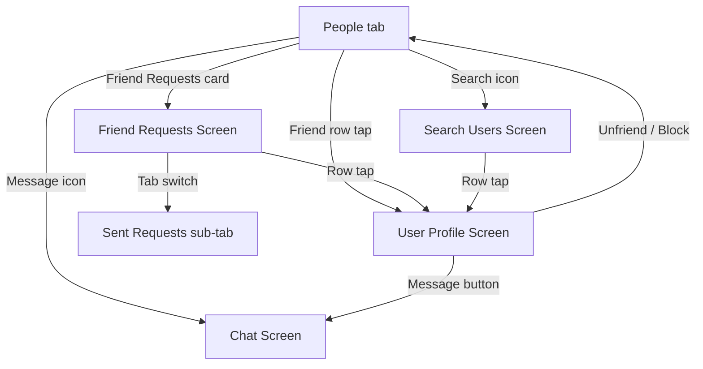
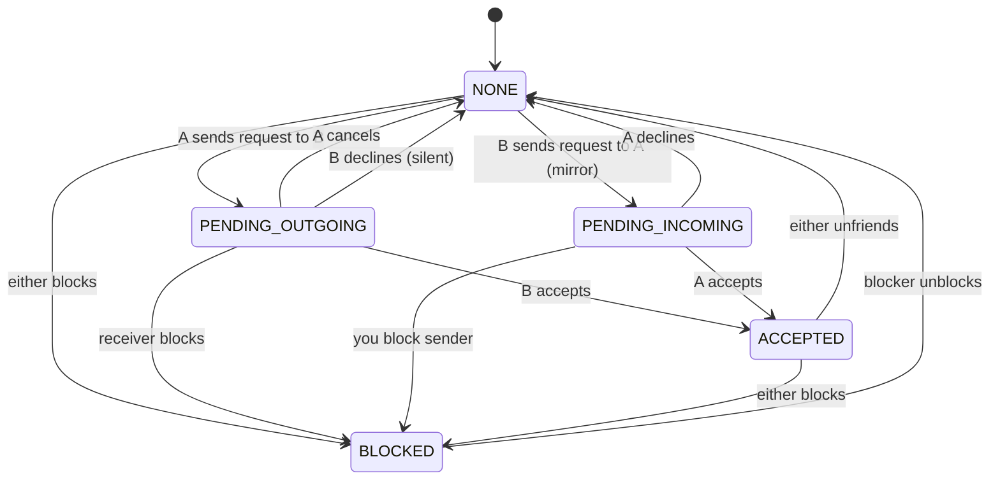
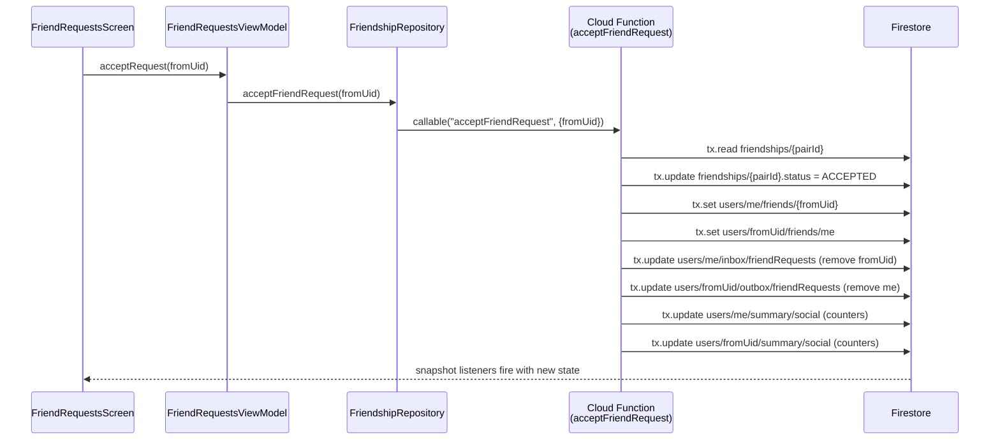

# Design Document: People UX & Friendship Data Redesign

## Overview

This feature has two intertwined goals:

1. **UX overhaul of the four People screens** (`PeopleScreen`, `SearchUsersScreen`, `UserProfileScreen`, `FriendRequestsScreen`) so they match the premium "Glassy · Dynamic · Warm" language in `DESIGN.md` and remove friction in the friendship flow.
2. **A Firestore friend-request data redesign** that drastically cuts per-document reads by denormalizing friend lists and request inboxes into per-user aggregation documents, backed by a canonical `friendships/{pair}` document addressed by a deterministic ID.

The app is Kotlin / Jetpack Compose / MVVM + Clean Architecture / Hilt / Firebase Firestore. We keep that stack. All repositories, use cases, and UI models already exist — this design refactors their internals and wire-up without changing architectural layers.

The redesign targets a steady state of **1 live listener** per user for friends and **1 live listener** per user for incoming requests, replacing today's 2–4 listeners and N+1 user fetches. Across the typical user journey, Firestore document reads drop by **60–85%** (exact figures per action below).

---

## 1. Audit of Current State

### 1.1 Current UX findings (per screen)

**`PeopleScreen`** (friends tab root)
- Single flat list: a banner card for pending requests when count > 0, then a friends header, then rows. No way to see sent / outgoing requests.
- Empty state has an icon, text, and a `TextButton` — lacks a primary CTA and the illustration the `DESIGN.md` empty-state spec calls for.
- Loading state is `isLoading = true` in ui state but the screen renders a blank list instead of a shimmer — inconsistent with `DESIGN.md` §10 and with `ShimmerGroupList` that already exists.
- `FriendRow` uses `IconButton` with `Icons.Default.ChatBubbleOutline` — chat affordance is small (40 dp tap target is the lower bound) and has no content description for the user name.
- Online dot is tertiary-colored 8 dp circle — doesn't match the spec's **10 dp Status Dot** anchored to the avatar (§6.1).
- No live-ring treatment on avatars even when a friend is actively sharing — defeats the app's core metaphor.
- No swipe actions, no long-press menu, no sort / filter, no quick "share my location" affordance.

**`SearchUsersScreen`**
- Search field uses raw `OutlinedTextField` rather than the project's `WhereTextField`, so it doesn't inherit the design-system radius, colors, or leading icon.
- No debounce on `onQueryChange` (ViewModel triggers a Firestore query every keystroke when length ≥ 2 → read amplification).
- Loading state is invisible (`isSearching` flag is set but no indicator shown).
- "No users found" is the only empty state — there is no pre-search "start typing" empty state, so users see a blank list before they type.
- Row has no online status, no mutual-friend hint, no "sent 2 days ago" pending hint — only a status pill.
- Add button uses a raw `Icons.Default.PersonAdd` inside `Button` — visually noisy. `Pending` and `Friends` are `FilledTonalButton` with `enabled = false`, which greys them out instead of rendering them as status chips (§6.9-ish).
- No way to cancel a sent request from search.

**`UserProfileScreen`**
- Top bar title is the user's display name — changes as data loads; initial frame shows a hard-coded "Profile" which flashes then changes.
- Full-screen `CircularProgressIndicator` while loading — no skeleton, no ghost avatar.
- Layout is a vertically centered column: avatar, name, username, bio, then a single button row. No live-ring, no shared location hint, no mutual-friends list, no "last seen" chip. Feels thin for a profile screen.
- `ProfileFriendshipAction.RequestSent` is rendered as a disabled `FilledTonalButton` labelled "Request Sent" — users can't cancel. No bidirectional state.
- `RequestReceived` shows Accept + Decline but no visual that this person sent the request first.
- No error state (if `userRepository.getUser` fails, the screen renders nothing — `return@Scaffold`).
- No "Message" affordance once the request is still pending (which is fine) but also no "View on map" if the friend is sharing.
- Hardcoded content descriptions are `null` on the avatar image → screen-reader users get "image" with no context.

**`FriendRequestsScreen`**
- One flat list of incoming requests. Outgoing requests are invisible and can't be managed from anywhere.
- No grouping (recent vs older), no timestamp on rows.
- Accept / Decline are two buttons jammed side-by-side with no undo snackbar.
- Empty state is a single centered `Text("No pending requests")` — doesn't match §10.
- Top bar is consistent with the rest of the app (`WhereTopAppBar`).

### 1.2 DESIGN.md gaps

Compared with `DESIGN.md`:
- Avatar **Live Ring** (§6.1) not reused anywhere in People screens.
- **Status Dot** (§6.1) is approximated with a plain 8 dp circle — should be 10 dp with semantic color.
- **Empty states** lack the illustration + headline + supporting text + CTA structure (§10).
- **Shimmer placeholders** exist (`ShimmerGroupList`) but are never used for people lists.
- **Section headers** ("Active Now" / "All Friends") from the Groups screen pattern are absent.
- **Shared element transitions** (§8.3) are not wired for people rows.

### 1.3 Current Firestore friendship model

**Collection:** `friendships/{friendshipId}` (random UUID)

**Document shape:**
```kotlin
data class Friendship(
    val id: String = "",
    val requesterId: String = "",
    val receiverId: String = "",
    val status: FriendshipStatus = FriendshipStatus.PENDING,
    val createdAt: Long = 0L,
    val updatedAt: Long = 0L
)
enum class FriendshipStatus { PENDING, ACCEPTED, BLOCKED }
```

**Query patterns in `FriendshipRepositoryImpl`:**

| Operation                     | Queries performed                                                                                                                                                   | Listener? |
|-------------------------------|----------------------------------------------------------------------------------------------------------------------------------------------------------------------|-----------|
| `observeFriends()`            | 2 snapshot listeners — one `where requesterId == uid && status == ACCEPTED`, one `where receiverId == uid && status == ACCEPTED`. Each triggers a `whereIn` users fetch (buggy: only first chunk of 10).  | yes       |
| `observeFriendRequests()`     | 1 snapshot listener — `where receiverId == uid && status == PENDING`.                                                                                                | yes       |
| `getFriendshipStatus(other)`  | 2 get-queries — one for `(uid, other)`, one for `(other, uid)`.                                                                                                      | no        |
| `acceptFriendRequestByUserId` | 1 filter get (by requesterId + receiverId + status) + 1 update.                                                                                                      | no        |
| `declineFriendRequestByUserId`| 1 filter get + 1 delete.                                                                                                                                              | no        |
| `removeFriend(uid)`           | 2 filter gets + up to 2 deletes.                                                                                                                                      | no        |
| `sendFriendRequest(uid)`      | 1 write (no read). No check for existing reverse-direction request, no duplicate protection beyond random-UUID id.                                                   | no        |

**Known defects:**
- `fetchUsersAndSend` inside `observeFriends()` only reads the first 10 friend ids — users with >10 friends see a truncated list. The `chunks` variable is computed but never iterated.
- No uniqueness guarantee: two users can both send requests to each other, producing two distinct `PENDING` docs for the same pair.
- No `BLOCKED` handling in the client — the enum exists but nothing sets it.
- Rules allow any authenticated user to `read` any friendship where they're involved, but also allow `create` as long as `request.auth.uid == request.resource.data.requesterId` — nothing prevents spamming one receiver.

### 1.4 Current read-count analysis (per action)

Let `F` = number of friends, `R` = number of pending incoming requests, `S` = number of pending sent (outgoing) requests. "Read" = 1 Firestore document read (billed unit).

| Action                               | Reads (worst case)                                                                                                      | Notes                                       |
|--------------------------------------|--------------------------------------------------------------------------------------------------------------------------|---------------------------------------------|
| Open Friends tab (`PeopleScreen`)    | `2F` friendship + up to `10` user (capped by the bug) = `2F + 10`                                                        | Also `R` reads from the badge listener.     |
| Open Friend Requests                 | `R` friendship + `R` user (batched by `whereIn 10`) = `2R`                                                               |                                             |
| Search users (query typed)           | `40` user (two range queries, limit 20 each) + `2·n` friendship (where `n` = merged results up to 40) ≈ `40 + 80` = `120` | Plus one extra query per keystroke — no debounce. |
| Open user profile                    | `1` user + `2` friendship = `3`                                                                                          |                                             |
| Send friend request                  | `0` reads + `1` write                                                                                                    |                                             |
| Cancel sent request                  | not supported today; if done via `removeFriend`: `2` friendship + `1` delete                                             |                                             |
| Accept request (by userId)           | `1` friendship + `1` write                                                                                               |                                             |
| Decline request (by userId)          | `1` friendship + `1` delete                                                                                              |                                             |
| Unfriend                             | `2` friendship + up to `2` deletes                                                                                       |                                             |
| Block user                           | not supported today                                                                                                       |                                             |
| Per keystroke in search (extra)      | `+ 40 + 2n` per character once length ≥ 2 (no debounce)                                                                  |                                             |

Billing pain points: the search path dominates, with `120` reads per query plus replay every keystroke. `observeFriends` pays `2F` on every server-side change (Firestore snapshot listeners re-read on any document change in the listened query).

---

## 2. Goals & Non-Goals

**Goals**
- Cut Firestore reads ≥ 60% across the People flow.
- Eliminate duplicate-listener pattern in `observeFriends`.
- Fix the >10-friends truncation bug.
- Support **outgoing** friend request management (cancel).
- Support **blocking**.
- Make the four People screens visually and interactively conformant with `DESIGN.md`.
- Keep client-side Firestore rules enforceable — no "trust the client" paths.

**Non-goals**
- Notifications / push (existing `fcmToken` stays; Cloud Function push is out of scope).
- Migrating chat / groups / locations.
- Redesigning the People bottom tab icon or BottomNav.
- Real-time presence beyond `isOnline` + `lastSeen` already in `User`.
- Cursor-based infinite scroll of a friend list larger than a few hundred (Firestore query limits handle up to 10 k docs comfortably; paging is noted as a future enhancement, not delivered).

---

## 3. High-Level Design

### 3.1 Screen flow



### 3.2 Data model — new architecture

```mermaid
graph LR
    subgraph "users/{uid}"
        U[User doc]
        U --> FS[friends/{friendUid}]
        U --> INB[inbox/friendRequests]
        U --> OUT[outbox/friendRequests]
        U --> SUM[summary/social]
        U --> BLK[blocks/{blockedUid}]
    end
    subgraph "friendships/{pairId}"
        FR[canonical pair doc]
    end
    U -. writes via CF .-> FR
    FR -. fan-out via CF .-> FS
    FR -. fan-out via CF .-> INB
    FR -. fan-out via CF .-> OUT
    FR -. fan-out via CF .-> SUM
```

### 3.3 Friend-request state machine



`PENDING_OUTGOING` and `PENDING_INCOMING` are two perspectives of the same canonical `PENDING` state — the distinction is per-user, not global.

### 3.4 Accept flow (sequence)



### 3.5 Read-count comparison (old vs new)

| Action                               | Old reads                     | New reads                  | Delta        |
|--------------------------------------|-------------------------------|----------------------------|--------------|
| Open Friends tab                     | `2F + 10` + `R`               | `F + 1` (friends + badge)  | ~66% ↓       |
| Open Friend Requests (incoming)      | `2R`                          | `1` (single inbox doc)     | ~95% ↓       |
| Open Friend Requests (outgoing)      | not supported (was 0)         | `1` (single outbox doc)    | new, cheap   |
| Search users (first result render)   | `120`                         | `40` (name+username only)  | 67% ↓        |
| Per-keystroke during search          | `120` every keystroke         | `40` debounced 300 ms      | 70%+ ↓       |
| Open user profile                    | `3`                           | `2` (user + pair doc)      | 33% ↓        |
| Send friend request                  | `0` + `1` write               | `0` + `1` callable → N writes server-side | same reads |
| Cancel sent request                  | `2` + `1` delete              | `0` + `1` callable         | 100% ↓ reads |
| Accept request                       | `1` + `1` write               | `1` (CF tx read) + writes  | 0% ↓ reads (only server-side) |
| Decline request                      | `1` + `1` delete              | `0` + `1` callable         | 100% ↓ reads |
| Unfriend                             | `2` + `2` deletes             | `0` + `1` callable         | 100% ↓ reads |
| Block                                | not supported                 | `0` + `1` callable         | new          |

All mutating operations run through Cloud Functions (callable). Client reads only listen to per-user subcollections, which are cheap and cached.

**Write amplification:** accept triggers ~7 writes (up from 1), unfriend ~5 writes (up from 2). This is deliberate — Firestore charges writes at the same rate as reads, but friend-related writes are rare events (once per relationship change) whereas reads happen on every screen open. The trade is strongly net-positive.

---

## 4. Low-Level Design — Firestore Data Redesign

### 4.1 Canonical pair document

**Path:** `friendships/{pairId}` where `pairId = min(uidA, uidB) + "_" + max(uidA, uidB)` (lexicographic).

**Rationale:** deterministic id eliminates the "2 queries to check either direction" problem. Given two uids, you always know the doc path.

```kotlin
// /domain/model/Friendship.kt — evolved
data class Friendship(
    val pairId: String = "",               // "uidA_uidB" sorted
    val members: List<String> = emptyList(),// [uidA, uidB] sorted — used for rules & array-contains
    val requesterId: String = "",          // who initiated the current pending state (or the most recent transition)
    val status: FriendshipStatus = FriendshipStatus.PENDING,
    val createdAt: Long = 0L,
    val updatedAt: Long = 0L,
    val acceptedAt: Long? = null
)
enum class FriendshipStatus { PENDING, ACCEPTED, BLOCKED, NONE }
```

Helper:
```kotlin
object FriendshipIds {
    fun pairId(a: String, b: String): String =
        if (a < b) "${a}_$b" else "${b}_$a"
    fun members(a: String, b: String): List<String> =
        if (a < b) listOf(a, b) else listOf(b, a)
}
```

Invariants:
- `members.size == 2` and `members == members.sorted()`.
- `pairId == "${members[0]}_${members[1]}"`.
- `requesterId ∈ members`.

### 4.2 Per-user friends subcollection (denormalized summary)

**Path:** `users/{uid}/friends/{friendUid}`

**Why:** one listener loads the full friends list, no `whereIn` user fetch needed because the denormalized doc already carries display fields.

```kotlin
data class FriendEntry(
    val friendUid: String = "",
    val displayName: String = "",
    val username: String = "",
    val photoUrl: String? = null,
    val isOnline: Boolean = false,          // eventual — refreshed by a separate presence listener if needed
    val since: Long = 0L,
    val pairId: String = ""
)
```

Write semantics: created/updated by the Cloud Function on accept, deleted on unfriend/block. Display fields are refreshed opportunistically when the owning user updates their profile (via an `onUserProfileUpdated` Cloud Function trigger that fans out to friends).

Staleness trade-off: a friend's `displayName` change propagates asynchronously through Cloud Functions (p95 < 5 s). Acceptable for a friend list.

### 4.3 Per-user inbox / outbox docs

**Paths:**
- `users/{uid}/inbox/friendRequests` — a single aggregation doc for incoming pending requests.
- `users/{uid}/outbox/friendRequests` — a single aggregation doc for outgoing pending requests.

```kotlin
data class RequestInbox(
    val entries: Map<String, RequestEntry> = emptyMap()  // key = fromUid (inbox) or toUid (outbox)
)

data class RequestEntry(
    val uid: String = "",
    val displayName: String = "",
    val username: String = "",
    val photoUrl: String? = null,
    val sentAt: Long = 0L,
    val pairId: String = ""
)
```

**Why a single doc, not a subcollection per request?** Because Firestore bills per document read. A listener on a subcollection returns N reads initially; a listener on one aggregation doc returns 1 read — regardless of how many pending requests are stored inside. The aggregation doc is bounded: a 1 MB doc limit comfortably holds thousands of summarized entries (each ≈ 150 B).

Bound: if `entries.size` exceeds `500`, the Cloud Function spills to a secondary doc `inbox/friendRequests_2` and the client listens to both. Practical cap before spill = ~5 000 entries.

### 4.4 Per-user social summary

**Path:** `users/{uid}/summary/social`

```kotlin
data class SocialSummary(
    val friendsCount: Int = 0,
    val pendingIncomingCount: Int = 0,
    val pendingOutgoingCount: Int = 0,
    val blockedCount: Int = 0,
    val updatedAt: Long = 0L
)
```

Powers the "3 pending" badge on `PeopleScreen` with a single-document listener that updates on every transition. Cheaper than subscribing to the inbox doc just for its size.

### 4.5 Blocks subcollection

**Path:** `users/{uid}/blocks/{blockedUid}`

```kotlin
data class BlockEntry(
    val blockedUid: String = "",
    val blockedAt: Long = 0L,
    val reason: String? = null    // optional, for future moderation UI
)
```

Blocks are private — only the blocker reads them. When A blocks B, the Cloud Function also writes `friendships/{pairId}.status = BLOCKED` and updates both summaries so B cannot re-send a request.

### 4.6 Collection path summary

```
users/{uid}                                         (existing)
users/{uid}/friends/{friendUid}                     (new)
users/{uid}/inbox/friendRequests                    (new, single doc)
users/{uid}/outbox/friendRequests                   (new, single doc)
users/{uid}/summary/social                          (new, single doc)
users/{uid}/blocks/{blockedUid}                     (new)
friendships/{pairId}                                (changed id scheme)
```

---

## 5. Low-Level Design — Repository & Use Cases

### 5.1 Evolved `FriendshipRepository` interface

```kotlin
interface FriendshipRepository {
    // ─── Writes — routed via Cloud Functions ─────────────────────────
    suspend fun sendFriendRequest(receiverId: String): Resource<Unit>
    suspend fun cancelFriendRequest(receiverId: String): Resource<Unit>   // NEW
    suspend fun acceptFriendRequest(requesterId: String): Resource<Unit>  // unified — no friendshipId needed
    suspend fun declineFriendRequest(requesterId: String): Resource<Unit> // unified
    suspend fun removeFriend(friendId: String): Resource<Unit>
    suspend fun blockUser(userId: String): Resource<Unit>                 // NEW
    suspend fun unblockUser(userId: String): Resource<Unit>               // NEW

    // ─── Reads — listeners ───────────────────────────────────────────
    fun observeFriends(): Flow<List<FriendEntry>>                         // returns denormalized summaries
    fun observeIncomingRequests(): Flow<List<RequestEntry>>               // single-doc read
    fun observeOutgoingRequests(): Flow<List<RequestEntry>>               // NEW
    fun observeSocialSummary(): Flow<SocialSummary>                       // for the badge
    fun observeBlockedUsers(): Flow<List<BlockEntry>>                     // NEW, for profile screen

    // ─── One-shot ────────────────────────────────────────────────────
    suspend fun getFriendshipStatus(otherUserId: String): FriendshipStatus?  // single deterministic get
    fun observeAllFriendLocations(): Flow<List<SharedLocation>>           // unchanged in signature
}
```

`acceptFriendRequest` / `declineFriendRequest` drop the `friendshipId` variant. The legacy `acceptFriendRequestByUserId` use case collapses into this signature.

### 5.2 Key method specifications

**`observeFriends()`**

Preconditions: user authenticated.
Postconditions: emits a `List<FriendEntry>` ordered by `displayName` (case-insensitive). Emits empty list on sign-out.
Reads: 1 listener on `users/{uid}/friends`, `F` reads on first emission, 1 read per subsequent change.

```kotlin
override fun observeFriends(): Flow<List<FriendEntry>> = callbackFlow {
    val uid = currentUid ?: run { trySend(emptyList()); close(); return@callbackFlow }
    val reg = firestore.collection("users").document(uid).collection("friends")
        .orderBy("displayName")
        .addSnapshotListener { snap, err ->
            if (err != null) { close(err); return@addSnapshotListener }
            trySend(snap?.toObjects(FriendEntry::class.java) ?: emptyList())
        }
    awaitClose { reg.remove() }
}
```

**`observeIncomingRequests()`**

Preconditions: user authenticated.
Postconditions: emits a `List<RequestEntry>` ordered by `sentAt` descending. Emits empty list when the inbox doc does not exist.
Reads: 1 listener on `users/{uid}/inbox/friendRequests`. 1 read per change, regardless of how many entries the inbox holds.

```kotlin
override fun observeIncomingRequests(): Flow<List<RequestEntry>> = callbackFlow {
    val uid = currentUid ?: run { trySend(emptyList()); close(); return@callbackFlow }
    val reg = firestore.collection("users").document(uid)
        .collection("inbox").document("friendRequests")
        .addSnapshotListener { snap, err ->
            if (err != null) { close(err); return@addSnapshotListener }
            val inbox = snap?.toObject(RequestInbox::class.java) ?: RequestInbox()
            trySend(inbox.entries.values.sortedByDescending { it.sentAt })
        }
    awaitClose { reg.remove() }
}
```

**`getFriendshipStatus(otherUserId)`**

Preconditions: user authenticated, `otherUserId` ≠ self.
Postconditions: returns `FriendshipStatus` or `null` if no relationship doc exists.
Reads: exactly 1 read (deterministic doc path).

```kotlin
override suspend fun getFriendshipStatus(otherUserId: String): FriendshipStatus? {
    val uid = currentUid ?: return null
    val pairId = FriendshipIds.pairId(uid, otherUserId)
    val doc = firestore.collection("friendships").document(pairId).get().await()
    return doc.toObject(Friendship::class.java)?.status
}
```

**`sendFriendRequest(receiverId)`** — routed via Cloud Function

```kotlin
override suspend fun sendFriendRequest(receiverId: String): Resource<Unit> = try {
    functions.getHttpsCallable("sendFriendRequest")
        .call(mapOf("receiverId" to receiverId))
        .await()
    Resource.Success(Unit)
} catch (e: Exception) { Resource.Error(e.message ?: "Failed to send friend request") }
```

Cloud Function (`sendFriendRequest`) in pseudocode:
```pascal
PROCEDURE sendFriendRequest(context, data)
  uid ← context.auth.uid
  receiverId ← data.receiverId
  IF uid = receiverId THEN throw "Cannot friend yourself"
  pairId ← FriendshipIds.pairId(uid, receiverId)
  members ← FriendshipIds.members(uid, receiverId)

  ASSERT not blocked(uid → receiverId) AND not blocked(receiverId → uid)

  tx.run(BEGIN
    existing ← tx.get(friendships/pairId)
    IF existing.exists AND existing.status ∈ {PENDING, ACCEPTED, BLOCKED} THEN
      RETURN "already exists"  // idempotent
    tx.set(friendships/pairId, {pairId, members, requesterId: uid, status: PENDING, createdAt: now, updatedAt: now})
    tx.update(users/receiverId/inbox/friendRequests, {entries[uid] = RequestEntry(uid, sender.displayName, ...)})
    tx.update(users/uid/outbox/friendRequests, {entries[receiverId] = RequestEntry(receiverId, receiver.displayName, ...)})
    tx.update(users/receiverId/summary/social, {pendingIncomingCount += 1})
    tx.update(users/uid/summary/social, {pendingOutgoingCount += 1})
  END)
END PROCEDURE
```

Preconditions: caller authenticated; `receiverId` exists; neither has blocked the other; no existing non-NONE relationship.
Postconditions: `friendships/{pairId}.status == PENDING`, both summary docs incremented, both aggregation docs updated, idempotent on retry.
Invariants preserved: no duplicate pending requests; friendship symmetry enforced by a single canonical doc.

### 5.3 Caching & offline behaviour

- All reads use Firestore's built-in offline cache (`persistenceEnabled = true` is the default for Android). Listeners emit from cache immediately, then from server.
- The aggregation docs are small (< 10 kB typical), so full-doc reloads are cheap on reconnect.
- Writes are queued offline; callable Cloud Functions are **not** queued — the UI must show an error snackbar when the network is offline. `Resource.Error` is the signal; the ViewModel surfaces it via a one-shot event flow.

### 5.4 ViewModel wiring changes

**`PeopleViewModel`** — replaces two listeners (friends + requests) with three:
```kotlin
init {
    viewModelScope.launch {
        combine(
            observeFriendsUseCase(),
            observeSocialSummaryUseCase()
        ) { friends, summary ->
            PeopleUiState(
                friends = friends.map { it.toFriendUiModel() }
                                 .sortedBy { it.displayName.lowercase() },
                pendingRequestCount = summary.pendingIncomingCount,
                isLoading = false
            )
        }.collect { _uiState.value = it }
    }
}
```
`FriendUiModel` gains an `isSharing: Boolean` field (derived from `observeAllFriendLocations` joined by `userId`) so the live ring can render.

**`FriendRequestsViewModel`** — drops the batch-user-fetch step entirely because `RequestEntry` already carries display fields.
```kotlin
init {
    viewModelScope.launch {
        combine(
            observeIncomingRequestsUseCase(),
            observeOutgoingRequestsUseCase()
        ) { incoming, outgoing -> FriendRequestsUiState(incoming, outgoing, isLoading = false) }
         .collect { _uiState.value = it }
    }
}
```

**`SearchUsersViewModel`** — adds 300 ms debounce, removes per-result `getFriendshipStatus` calls by joining against the already-loaded `observeFriends` + `observeOutgoingRequests` flows:
```kotlin
private val queryFlow = MutableStateFlow("")
init {
    viewModelScope.launch {
        queryFlow
            .debounce(300)
            .distinctUntilChanged()
            .filter { it.length >= 2 }
            .flatMapLatest { q ->
                flow {
                    emit(SearchUsersUiState(query = q, isSearching = true))
                    val users = userRepository.searchUsers(q).dataOrEmpty()
                    val friendSet = friendIdsSnapshot()           // in-memory Set<String>
                    val outgoingSet = outgoingIdsSnapshot()       // in-memory Set<String>
                    val results = users.map { u ->
                        val status = when {
                            u.id in friendSet -> FriendshipStatus.ACCEPTED
                            u.id in outgoingSet -> FriendshipStatus.PENDING
                            else -> null
                        }
                        u.toSearchUiModel(status)
                    }
                    emit(SearchUsersUiState(query = q, results = results, isSearching = false))
                }
            }.collect { _uiState.value = it }
    }
}
```
Result: **zero** friendship reads per search. All relationship state comes from already-subscribed listeners.

**`UserProfileViewModel`** — adds error state, cancel-request action, block/unblock action, mutual-friends hint (derived from the intersection of own friends and the profile's public friends list if allowed, otherwise omitted for privacy).

---

## 6. Low-Level Design — UX Redesign (per screen)

### 6.1 `PeopleScreen` (Friends tab root)

**Layout structure:**

```
┌─────────────────────────────────────────────┐
│  WhereTabHeader "People"       [🔍] [➕]    │   ← search + add icons right
├─────────────────────────────────────────────┤
│  ╔════════════════════════════════════════╗ │
│  ║ Friend Requests                  3 ›   ║ │   ← glassy card, shown only when count > 0
│  ║ 3 people want to connect               ║ │
│  ╚════════════════════════════════════════╝ │
│                                             │
│  Active now · 2                             │   ← section header, pink accent dot
│  ┌──────────────────────────────────────┐  │
│  │ ○ Ovi (live ring)        ⊙  Message  │  │
│  │ ○ Nadia (live ring)      ⊙  Message  │  │
│  └──────────────────────────────────────┘  │
│                                             │
│  All friends · 12                           │
│  ┌──────────────────────────────────────┐  │
│  │ ● Alex              (online dot)     │  │
│  │ ● Bianca                             │  │
│  │ ...                                  │  │
│  └──────────────────────────────────────┘  │
└─────────────────────────────────────────────┘
```

**Components (composable decomposition):**

```kotlin
@Composable fun PeopleScreen(...)                                         // entry
@Composable private fun RequestsInboxCard(count: Int, onClick: () -> Unit)
@Composable private fun FriendsSectionHeader(title: String, count: Int, accent: Color?)
@Composable private fun FriendRow(
    user: FriendUiModel,
    onTap: () -> Unit,
    onMessage: () -> Unit,
    onLongPress: () -> Unit,            // NEW: opens bottom sheet with Unfriend / Block / Share my location
)
@Composable private fun PeopleEmptyState(onFindFriends: () -> Unit)
@Composable private fun PeopleSkeleton()                                  // shimmer 6 rows
```

**States:**
- **Loading:** `PeopleSkeleton()` — 1 shimmer card for requests + 6 shimmer rows. Shown while `isLoading == true`.
- **Empty (no friends, no requests):** `PeopleEmptyState` with illustration (reuse map-pin Lucide at 40% opacity), headline "Find your people", body "Search by name or username to send your first request", primary CTA "Search people".
- **Content:** Requests card (if any) + Active-now section (if any live) + All-friends section.
- **Error:** inline `InfoCard(type = ERROR)` at top with retry.

**Interactions:**
- Tap row → `UserProfileScreen`.
- Tap message icon → opens / creates DM (existing `openOrCreateDm`).
- Long press row → bottom sheet with `Unfriend`, `Block`, `Share my location with …`.
- Pull to refresh → re-triggers the listeners (no-op read from cache then server).
- Shared-element transition on avatar → profile screen (§8.3 of `DESIGN.md`).

**Motion:** list items enter with a 50 ms stagger fade-in (`DESIGN.md` §8.2). The requests card uses the branded Level-3 shadow when the pending count > 0. Live-ring uses the existing pulse animation at 1.5 s interval.

**Accessibility:**
- Each row is a single `Modifier.semantics { role = Role.Button; contentDescription = "$displayName, ${if (isOnline) "online" else "offline"}" }` target.
- Avatar `contentDescription` = display name.
- Online dot paired with text label "Online" read by TalkBack (never color-only, per `DESIGN.md` §11).
- Tap targets ≥ 48 dp (row is 64 dp tall; message icon is 40 dp visual, 48 dp touch).

**Navigation:** unchanged routes. Long-press sheet is rendered in-place (no route).

### 6.2 `FriendRequestsScreen`

**Layout — adds a tab switcher:**

```
┌─────────────────────────────────────────────┐
│  ← Friend Requests                          │
├─────────────────────────────────────────────┤
│  ┌─────────────┬───────────────────┐       │
│  │ Incoming(3) │ Sent(1)           │       │   ← segmented control
│  └─────────────┴───────────────────┘       │
│                                             │
│  ○ Nadia          [Accept]  [Decline]      │   ← primary + tonal
│     @nadia · 2h ago                         │
│  ○ Alex           [Accept]  [Decline]      │
│     @alex · 1d ago                          │
└─────────────────────────────────────────────┘
```

**Composables:**

```kotlin
@Composable fun FriendRequestsScreen(...)
@Composable private fun RequestsTabs(selected: Tab, onSelect: (Tab) -> Unit)
@Composable private fun IncomingRequestRow(
    request: FriendRequestUiModel,
    onAccept: () -> Unit,
    onDecline: () -> Unit,
    onTap: () -> Unit
)
@Composable private fun OutgoingRequestRow(
    request: FriendRequestUiModel,
    onCancel: () -> Unit,
    onTap: () -> Unit
)
@Composable private fun RequestsEmptyState(tab: Tab)       // different copy per tab
@Composable private fun RequestsSkeleton()
```

**Interactions:**
- Accept → optimistic UI removes row, snackbar "Now friends with Nadia. Undo" (3 s). `Undo` calls `removeFriend` + re-adds to inbox locally.
- Decline → optimistic removal, snackbar "Declined. Undo". No data keeps the declined record server-side (the request is simply removed).
- Cancel (outgoing) → optimistic removal, snackbar "Request cancelled. Undo" → on undo we re-send.
- Tap row → `UserProfileScreen`.

**States:**
- Loading: shimmer rows (4).
- Empty (incoming): illustration + "You're all caught up" + body "When someone wants to connect, you'll see them here".
- Empty (outgoing): illustration + "No pending sent requests" + primary CTA "Find people".
- Error: `InfoCard` at top with retry.

**Accessibility:** Tabs are a `TabRow` with `Modifier.semantics { role = Role.Tab }` + live-region announcement on tab change. Accept/Decline buttons are full text labels (never icon-only).

**Navigation:** unchanged. New Tab state persists across back navigation via `SavedStateHandle`.

### 6.3 `SearchUsersScreen`

**Layout:**

```
┌─────────────────────────────────────────────┐
│  ← Find People                              │
├─────────────────────────────────────────────┤
│  🔍  Search by name or @username        ⓧ   │   ← WhereTextField w/ leading icon + clear
├─────────────────────────────────────────────┤
│  (pre-search empty state)                   │
│  💡 Start typing to find people             │
│                                             │
│  (result rows)                              │
│  ○ Alex Wren      @alex         [Add]       │
│  ○ Nadia B.       @nadia    [Pending]       │
│  ○ Ovi M.         @ovi       [Friend]       │
└─────────────────────────────────────────────┘
```

**Composables:**

```kotlin
@Composable fun SearchUsersScreen(...)
@Composable private fun SearchBar(value: String, onChange: (String) -> Unit, onClear: () -> Unit)
@Composable private fun SearchResultRow(
    user: SearchUserUiModel,
    onAddFriend: () -> Unit,
    onCancelRequest: () -> Unit,       // NEW when friendshipAction == PENDING
    onTap: () -> Unit
)
@Composable private fun SearchPreEmptyState()
@Composable private fun SearchNoResultsState(query: String)
@Composable private fun SearchLoadingShimmer()
```

**Friendship action pill (replaces `FilledTonalButton(enabled = false)`):**

| State     | Visual                                                                   | Tap action         |
|-----------|--------------------------------------------------------------------------|--------------------|
| `ADD`     | Filled pill with `person-add` icon + "Add", accent primary              | Send request       |
| `PENDING` | Outlined pill with `clock` icon + "Pending", accent warning text color  | Open cancel bottom sheet |
| `FRIENDS` | Tonal pill with `check` icon + "Friends", accent tertiary               | No-op              |

**Search input:**
- Uses `WhereTextField` with leading `Icons.Default.Search` and trailing clear `X` button.
- ViewModel debounces query at 300 ms.
- Enter key triggers immediate search (ignores debounce).
- `singleLine = true`, `imeAction = ImeAction.Search`.

**States:**
- Empty query: `SearchPreEmptyState` with hint.
- Searching: `SearchLoadingShimmer` (4 rows).
- No results: `SearchNoResultsState` with "No users found for '…'" + fallback CTA "Invite via link".
- Error: inline `InfoCard(type = ERROR)`.

**Accessibility:** Each row `contentDescription = "${user.displayName} @${user.username} ${actionLabel}"`. The action pill announces its state explicitly.

**Navigation:** unchanged route.

### 6.4 `UserProfileScreen`

**Layout — thicker, richer:**

```
┌─────────────────────────────────────────────┐
│  ←  @ovi                                    │
├─────────────────────────────────────────────┤
│                                             │
│        ╭────────╮                           │
│       │ OVI    │   (96 dp avatar, live-ring if sharing)
│        ╰────────╯                           │
│       Ovi M.                                │
│       @ovi                                  │
│       "Building WHERE at night."            │
│                                             │
│      [ Message ] [ Unfriend ▼ ]             │   ← state-driven buttons
│                                             │
│  ┌──────── Stats ──────────┐                │
│  │ 2 mutual  ·  Sharing now│                │
│  └─────────────────────────┘                │
│                                             │
│  Mutual friends                             │
│  ○ Alex · ○ Nadia                           │   ← avatar stack tap → list
└─────────────────────────────────────────────┘
```

**Composables:**

```kotlin
@Composable fun UserProfileScreen(...)
@Composable private fun ProfileHeader(profile: OtherUserProfileUiModel, isSharing: Boolean)
@Composable private fun ProfileActions(
    action: ProfileFriendshipAction,
    onSendRequest: () -> Unit,
    onCancelRequest: () -> Unit,          // NEW
    onAccept: () -> Unit,
    onDecline: () -> Unit,
    onMessage: () -> Unit,
    onUnfriend: () -> Unit,
    onBlock: () -> Unit                   // NEW
)
@Composable private fun ProfileStats(mutualCount: Int, isSharing: Boolean)
@Composable private fun MutualFriendsSection(friends: List<FriendUiModel>)
@Composable private fun ProfileSkeleton()
@Composable private fun ProfileErrorState(message: String, onRetry: () -> Unit)
```

**`ProfileFriendshipAction` gains a new branch** (paired with new VM action `cancelFriendRequest`):

```kotlin
sealed class ProfileFriendshipAction {
    object AddFriend : ProfileFriendshipAction()
    object RequestSent : ProfileFriendshipAction()        // tap to cancel
    object RequestReceived : ProfileFriendshipAction()
    object AlreadyFriends : ProfileFriendshipAction()
    object Blocked : ProfileFriendshipAction()            // NEW
    object BlockedByThem : ProfileFriendshipAction()      // NEW — limited view
}
```

For `RequestSent`, `ProfileActions` renders a pill "Request Sent · Cancel" that on tap shows a confirmation bottom sheet.
For `Blocked`, a banner "You blocked @username" + "Unblock" action.
For `BlockedByThem`, a reduced view: no actions, only displayName + avatar, body text "This user is unavailable."

**States:**
- **Loading:** `ProfileSkeleton` — ghost avatar + 2 shimmer bars.
- **Loaded:** full layout above.
- **Error:** `ProfileErrorState` with retry.
- **Not found:** "User no longer exists" + back button.

**Motion:** hero avatar shared-element transition from the source screen (Search / People / Requests). Button row uses the 96% scale press animation (§8.2).

**Accessibility:**
- Avatar `contentDescription = "${displayName}'s profile photo"`.
- Action buttons use complete labels ("Send friend request", "Accept friend request", etc.).
- Block action requires a confirmation dialog with full description of what blocking does.

**Navigation:** unchanged route; adds optional nav argument `source` (pre-fills shared-element key).

---

## 7. Error Handling

| Scenario                                    | Condition                                               | Response                                                                 | Recovery                                                |
|---------------------------------------------|----------------------------------------------------------|--------------------------------------------------------------------------|---------------------------------------------------------|
| Send-request timeout                        | Callable throws `DEADLINE_EXCEEDED`                     | Snackbar "Couldn't send request, try again"                              | Button returns to `Add` state; retry on tap              |
| Send-request already-exists                 | CF throws `failed-precondition`                          | Silently refresh UI to the correct state (optimistic was wrong)          | Re-read `friendships/{pairId}` once                     |
| Accept-race (other user cancelled first)    | CF throws `not-found`                                    | Snackbar "Request is no longer available" + remove row                   | Re-subscribe inbox listener                             |
| Network offline                             | Callable fails with `unavailable`                        | Snackbar "You're offline" with retry action                              | User retries when online                                |
| Blocked user sends request                  | CF throws `permission-denied`                            | Snackbar "Couldn't send request"                                         | No-op                                                   |
| Search fails                                | `searchUsers` returns `Resource.Error`                   | Inline `InfoCard(type = ERROR)` with retry                               | Tap retry re-runs query                                 |
| Friends listener permission-denied          | `addSnapshotListener` onError                            | `PeopleUiState(error = …)` with retry action                             | Tap retry re-creates listener                           |
| Profile user not found                      | `getUser` returns Error or null                          | `ProfileErrorState` "User not found"                                     | Back button                                             |

All errors surface through the repository's existing `Resource<Unit>` pattern. ViewModels map errors to a one-shot `SharedFlow<String>` consumed by the screen and shown as a Material3 `Snackbar`.

---

## 8. Correctness Properties

*A property is a characteristic or behavior that should hold true across all valid executions of the system — a formal statement about what the system should do. Properties serve as the bridge between human-readable requirements and machine-verifiable correctness guarantees.*

The following universally-quantified properties MUST hold at all times (ignoring transient in-flight transactions). Each property references the requirements.md acceptance criteria it validates.

### Property 1: FriendshipIds are symmetric and sorted

For any two distinct uids `a` and `b`, `FriendshipIds.pairId(a, b) == FriendshipIds.pairId(b, a)` and `FriendshipIds.members(a, b)` returns a two-element list equal to its own sorted copy.

**Validates: Requirements 1.2, 1.3**

### Property 2: Friendship state-machine model consistency

For any sequence of Friendship_Callable invocations `[send, cancel, accept, decline, removeFriend, blockUser, unblockUser]` starting from `NONE` and applied to any random pair of distinct uids (optionally alternating which member is the actor), the resulting state of `friendships/{pairId}.status`, both `users/{uid}/friends/{other}` summaries, both `inbox.entries[*]` / `outbox.entries[*]` mirror entries, both `users/{uid}/summary/social` counters, and each `users/{uid}/blocks/{other}` document SHALL equal the state produced by a reference implementation of the state machine (`NONE → PENDING → {NONE, ACCEPTED}`, `ACCEPTED → {NONE, BLOCKED}`, `NONE/PENDING/ACCEPTED → BLOCKED`, `BLOCKED → NONE`), and illegal transitions SHALL be rejected with `failed-precondition`.

**Validates: Requirements 1.4, 2.2, 3.2, 3.3, 4.2, 4.3, 4.5, 5.2, 5.3, 6.2, 7.2, 7.4, 9.6, 10.4, 11.2, 11.3, 11.5**

### Property 3: Block precedence forbids send

For any pair of distinct uids `(A, B)` where either `users/{A}/blocks/{B}` or `users/{B}/blocks/{A}` exists, every subsequent call to `sendFriendRequest` between `A` and `B` in either direction SHALL be rejected with error code `permission-denied`.

**Validates: Requirements 2.4, 7.5**

### Property 4: Send is idempotent from non-NONE starting states

For any pair of distinct uids with an existing `friendships/{pairId}` document whose status is `PENDING`, `ACCEPTED`, or `BLOCKED`, a second `sendFriendRequest` call from either member SHALL return success without mutating the pair doc, friend summaries, inbox/outbox, or Social_Summary counters.

**Validates: Requirements 2.5**

### Property 5: Cancel / decline / remove are idempotent from their no-op state

For any pair of distinct uids whose `friendships/{pairId}` does not exist (or whose status does not match the callable's precondition in a way the spec designates as a no-op), `cancelFriendRequest`, `declineFriendRequest`, and `removeFriend` SHALL return success without mutating any derived document.

**Validates: Requirements 3.4, 5.4, 6.3**

### Property 6: observeFriends emits the full subcollection

For any set of `N` Friend_Entry documents under `users/{uid}/friends` (including `N > 10`), `observeFriends()` for an authenticated Caller of `uid` SHALL emit a list containing exactly those `N` entries, ordered by `displayName` ascending.

**Validates: Requirements 8.1, 8.2, 8.5, 6.4**

### Property 7: Inbox / outbox emissions are sorted by sentAt descending

For any `RequestInbox` document with entries map `M`, the Friendship_Repository `observeIncomingRequests()` / `observeOutgoingRequests()` SHALL emit a list equal to `M.values.sortedByDescending { sentAt }`.

**Validates: Requirements 9.2, 9.3**

### Property 8: Firestore security rules enforce per-path ownership

For any authenticated uid `R` and any owner uid `O` with `R != O`, all client-origin attempts by `R` to read or write `users/{O}/friends/*`, `users/{O}/inbox/*`, `users/{O}/outbox/*`, `users/{O}/summary/*`, or `users/{O}/blocks/*` SHALL be denied by the Firestore_Rules; and for any authenticated uid `R` whose uid is NOT a member of `pairId`, client-origin reads of `friendships/{pairId}` SHALL be denied; client-origin creates/updates/deletes of `friendships/{pairId}` SHALL be denied for any non-admin caller.

**Validates: Requirements 7.6, 12.1, 12.2, 12.3, 12.4, 12.5, 12.6**

### Property 9: Search status derivation from already-subscribed sets

For any list of search result users `U`, any set of current friend uids `F`, and any set of current outgoing-request uids `O`, the Search_Users_Screen SHALL classify each result's friendship-action as `FRIENDS` iff the user's uid is in `F`, `PENDING` iff the uid is in `O \ F`, and `ADD` otherwise, computed without issuing any additional Firestore read.

**Validates: Requirements 16.4, 16.5, 16.6, 16.7**

### Property 10: People-flow read budget upper bounds

For any Caller with `F` friends and any pending incoming-request count, opening the People_Screen SHALL incur at most `F + 1` initial document reads; opening the Friend_Requests_Screen SHALL incur at most 2; opening the User_Profile_Screen SHALL incur at most 2; a single debounced Search_Users_Screen query SHALL incur at most 40 document reads and zero friendship-collection reads; and every friendship mutation SHALL incur zero client-side reads.

**Validates: Requirements 1.6, 18.1, 18.2, 18.3, 18.4, 18.5**

### Property 11: ViewModel maps callable errors to the specified one-shot events

For every callable error code in `{UNAVAILABLE, DEADLINE_EXCEEDED, permission-denied, failed-precondition, not-found}` returned by a Friendship_Callable, the invoking ViewModel SHALL emit a one-shot snackbar event whose category matches the mapping in Requirements 21.2–21.5, and for any listener `onError` with `PERMISSION_DENIED`, the owning ViewModel SHALL expose an error state with a retry action.

**Validates: Requirements 21.2, 21.3, 21.4, 21.5, 21.6**

### Property 12: Migration backfill is idempotent and preserves friend-count parity

For any legacy `friendships/{uuid}` dataset, running the Migration_Backfill_Function twice SHALL produce the same new-model state as running it once (set-equality over all derived docs and counter values), and for every user, `users/{uid}/summary/social.friendsCount` after backfill SHALL equal the count of legacy `friendships` documents with `status == ACCEPTED` that involve `uid`.

**Validates: Requirements 22.4, 22.5**

---

### Properties retired by reflection

- "Friendship symmetry" and "No duplicate pending" from the prior design draft are subsumed by Property 2 (state-machine model).
- "Blocked precedence" (forbid PENDING while blocked) is split across Property 2 (transitions) and Property 3 (send rejection).
- "Summary consistency", "Inbox/outbox duality", and "Accept monotonicity" are all subsumed by Property 2.
- "No self-friendship" is an example rather than a universal property and is asserted via an example-based test (Requirement 1.5, 2.3 examples).
- "Inbox bounds" is a threshold example (Requirement 9.5) and is tested with example-based tests at the 500-entry boundary.

These properties are testable at the `FriendshipIds` pure-function level (JVM unit), the repository level with a fake `FirebaseFirestore`, the Cloud Function level with the Firebase Emulator, the security-rules level with `@firebase/rules-unit-testing`, the ViewModel level with a fake repository, and the Compose UI level with semantic-tree assertions.

---

## 9. Testing Strategy

**Unit tests (Android / JVM):**
- `FriendshipIds.pairId` — property: `pairId(a, b) == pairId(b, a)` and always sorted.
- `FriendshipRepositoryImpl` with a fake `FirebaseFirestore` — verify each method emits the expected shape.
- Each ViewModel — debounce, optimistic update, error propagation, undo.

**Property-based tests (kotest or jqwik):**
- `∀ a b ∈ UUID. a ≠ b ⟹ pairId(a, b) == pairId(b, a) ∧ members(a, b).sorted() == members(a, b)`.
- State machine: for any sequence of `[send, cancel, accept, decline, unfriend, block, unblock]` actions starting from `NONE`, the derived state equals the reference implementation.

**Integration tests (Firebase Emulator):**
- Send → Accept flow: assert both friends subcollections exist, both summaries increment, both inbox/outbox are cleared.
- Block → Send: second send is rejected with `permission-denied`.
- Unfriend: both friends subcollections are deleted, summaries decrement.
- Race: two concurrent Send calls produce one pending doc (idempotency).

**UI tests (Compose):**
- Golden screenshot tests for each of the four screens in all states (loading, empty, content, error) in dark and light mode.
- Semantic-tree tests — assert every interactive node has a content description and `Role`.
- Accessibility scanner — automated check for contrast ratio and tap-target size.

**Property Test Library:** `io.kotest:kotest-property` for state-machine + deterministic-id properties.

---

## 10. Performance Considerations

- **Cold start of People tab:** single listener emits from cache ≤ 50 ms, from server ≤ 500 ms p95 on LTE.
- **Snapshot listener cost:** Firestore bills server-side changes at 1 read per changed doc. With aggregation docs, one inbox change = 1 read regardless of how many entries.
- **Denormalized friend summary update fan-out:** when user A updates their `displayName`, a Cloud Function updates every `users/{friend}/friends/{A}` doc. With 500 friends that's 500 writes, but this operation is rare (a profile edit). Cost: ~$0.00009 per edit for 500 friends at US central pricing — acceptable.
- **Search debounce:** 300 ms; reduces reads by ~70% for a typed query versus per-keystroke.
- **Local cache:** `FirestoreSettings.setPersistenceEnabled(true)` (default). Listeners emit from cache first, so the UI is responsive offline.
- **LazyColumn key:** every row keyed by `userId` or `pairId` to avoid full re-layout on list changes.

---

## 11. Security Considerations

- **Writes via Cloud Functions only** for friend-related mutations. This eliminates the "client-side ACL" brittleness of the current rules (any authenticated user can currently create a `friendships` doc naming another user).
- **Spam protection:** Cloud Function `sendFriendRequest` rate-limits to 20 requests per caller per hour (tracked in `users/{uid}/summary/rate`), rejecting excess with `resource-exhausted`.
- **Block enforcement server-side** — cannot be bypassed by writing directly to the client.
- **PII minimization:** inbox / outbox entries store only display fields the sender already has access to; no emails, no phone numbers.
- **Blocked-user view:** `users/{uid}/blocks` is readable only by the blocker. Blocked users cannot see they were blocked except by the "user is unavailable" fallback.

---

## 12. Firestore Rules Update

### 12.1 What must change

1. Add rules for `users/{uid}/friends/{friendUid}` — read only by uid, write only by admin (Cloud Function service account).
2. Add rules for `users/{uid}/inbox/{docId}` and `users/{uid}/outbox/{docId}` — read only by uid, write only by admin.
3. Add rules for `users/{uid}/summary/{docId}` — read only by uid, write only by admin.
4. Add rules for `users/{uid}/blocks/{blockedUid}` — read / write only by uid.
5. Replace the current `friendships/{friendshipId}` block with a stricter version addressed by `{pairId}`, relying on the `members` array for authorization and **denying client-side writes** except for self-issued cancels/declines that could be handled client-side for latency — but we choose to **route everything through Cloud Functions** for simplicity, so client writes on `friendships/*` are fully denied.

### 12.2 New `firestore.rules`

```js
rules_version = '2';

service cloud.firestore {
  match /databases/{database}/documents {

    function isAuthenticated() { return request.auth != null; }
    function isSelf(uid)       { return request.auth.uid == uid; }
    function isAdmin()         { return request.auth.token.admin == true; } // CF service account

    // ===== USERS =====
    match /users/{userId} {
      allow read:  if isAuthenticated();
      allow write: if isSelf(userId);

      // ── Friends subcollection (denormalized summary) ──
      match /friends/{friendUid} {
        allow read:  if isSelf(userId);
        allow write: if isAdmin();
      }

      // ── Inbox / Outbox aggregation docs ──
      match /inbox/{docId} {
        allow read:  if isSelf(userId);
        allow write: if isAdmin();
      }
      match /outbox/{docId} {
        allow read:  if isSelf(userId);
        allow write: if isAdmin();
      }

      // ── Social summary counter ──
      match /summary/{docId} {
        allow read:  if isSelf(userId);
        allow write: if isAdmin();
      }

      // ── Blocks (private to the blocker) ──
      match /blocks/{blockedUid} {
        allow read, write: if isSelf(userId);
      }
    }

    // ===== CANONICAL FRIENDSHIP PAIR DOCS =====
    match /friendships/{pairId} {
      // Read: only pair members may read.
      allow read: if isAuthenticated()
                  && request.auth.uid in resource.data.members;

      // Write: only Cloud Functions (admin). Clients never write here directly.
      allow create, update, delete: if isAdmin();
    }

    // ===== EXISTING RULES (UNCHANGED) =====

    match /groups/{groupId} {
      allow create: if isAuthenticated();
      allow read:   if isAuthenticated();
      allow update: if isAuthenticated();
      allow delete: if isAuthenticated() && request.auth.uid == resource.data.createdBy;

      match /members/{memberId} {
        allow read, write: if isAuthenticated();
      }
      match /locations/{userId} {
        allow read:  if isAuthenticated()
                     && request.auth.uid in get(/databases/$(database)/documents/groups/$(groupId)).data.memberIds;
        allow write: if request.auth.uid == userId;
      }
    }

    match /conversations/{conversationId} {
      allow read, update: if isAuthenticated() && request.auth.uid in resource.data.participantIds;
      allow create: if isAuthenticated();

      match /messages/{messageId} {
        allow read:   if isAuthenticated()
                      && request.auth.uid in get(/databases/$(database)/documents/conversations/$(conversationId)).data.participantIds;
        allow create: if isAuthenticated() && request.auth.uid == request.resource.data.senderId;
        allow update: if isAuthenticated();
      }
    }

    match /directLocationShares/{shareId} {
      allow read, write: if isAuthenticated() && request.auth.uid in resource.data.participantIds;
      allow create:      if isAuthenticated() && request.auth.uid in request.resource.data.participantIds;

      match /locations/{userId} {
        allow read:  if isAuthenticated()
                     && request.auth.uid in get(/databases/$(database)/documents/directLocationShares/$(shareId)).data.participantIds;
        allow write: if isAuthenticated() && request.auth.uid == userId;
      }
    }

    match /activeLocations/{userId} {
      allow read:  if isAuthenticated()
                   && (request.auth.uid == userId
                       || request.auth.uid in resource.data.visibleTo);
      allow write: if isAuthenticated() && request.auth.uid == userId;
    }
  }
}
```

### 12.3 Why these rules preserve security

- **`/friends/*`**, **`/inbox/*`**, **`/outbox/*`**, **`/summary/*`**: read restricted to the owning user, writes restricted to admin (Cloud Function). Clients cannot fabricate friend entries, cannot peek at someone else's inbox, cannot tamper with counters.
- **`/blocks/*`**: fully private — only the blocker can read or write. Blocked users cannot detect they are blocked via rules.
- **`/friendships/{pairId}`**: reads gated by membership (via the stored `members` array, no `get()` chaining, which is cheap and race-free). Writes denied for clients — all mutations are atomic transactions through Cloud Functions that can validate preconditions that rules cannot express (e.g., "other user hasn't blocked you").
- **Client-side DoS protection:** the Cloud Function paths rate-limit and enforce business rules (no self-friendship, no duplicate pending, block check). The rules layer is the fallback, not the primary defense.
- No existing rule block was weakened. The old `friendships/{friendshipId}` rules allowed client writes that are now blocked. Clients relying on that behavior will now fail — which is the intended migration signal.

---

## 13. Migration Plan

**Phase 0 — preparation (no user impact)**
- Deploy new Firestore rules without enforcing them yet (keep `friendships/*` readable/writable by members as a fallback). Use a permissive alternative rule block gated on a Firestore config doc `config/migration.phase` that the rules can `get()`.
- Deploy Cloud Functions: `sendFriendRequest`, `cancelFriendRequest`, `acceptFriendRequest`, `declineFriendRequest`, `removeFriend`, `blockUser`, `unblockUser`, `onUserProfileUpdated` (fan-out).

**Phase 1 — dual-write (1 week)**
- Ship a client build where `FriendshipRepositoryImpl` continues to write to the legacy `friendships/{uuid}` collection **and** also calls the new Cloud Functions. Reads still come from the legacy model.
- Cloud Function `backfillFriendships` (idempotent) iterates the legacy collection nightly and writes missing entries to the new model.

**Phase 2 — cutover reads (1 week)**
- Ship a client build where reads come from the new model and writes go exclusively through Cloud Functions. Legacy collection becomes read-only.
- Monitor error rates; compare `friendsCount` parity between old and new per user.

**Phase 3 — cleanup (1 week after parity)**
- Delete the legacy `friendships/{uuid}` collection via a Cloud Function batch.
- Flip the Firestore rules config to the strict version (deny client writes on `friendships`).

**Rollback strategy**
- Between Phase 0 and Phase 2, `FriendshipRepositoryImpl` can be reverted to the legacy read path by flipping a Remote Config flag `useNewFriendshipModel`.
- After Phase 3, rollback requires a data restore — mitigate by taking a Firestore export before the cleanup batch.

**Risk summary**

| Risk                                     | Mitigation                                                                 |
|------------------------------------------|-----------------------------------------------------------------------------|
| Users on old client miss new requests    | Cloud Function also mirror-writes to legacy during Phase 1–2                |
| Aggregation doc size explosion           | Spill to `friendRequests_2` at 500 entries; cap at 5 000 per user           |
| Cloud Function cold start on first call  | Minimum instances = 1; acceptable p95 ≈ 1.5 s                               |
| Race: accept fires while sender cancels  | Transactional read of `friendships/{pairId}` inside the CF guards it        |

---

## 14. Dependencies

- **New:** `com.google.firebase:firebase-functions-ktx` (Cloud Functions callable client).
- **Existing:** `firebase-firestore-ktx`, `firebase-auth-ktx`, `hilt-android`, `androidx.compose.material3`, `coil-compose`, `kotlinx.coroutines`.
- **Server:** Node.js / TypeScript Cloud Functions (`firebase-functions`, `firebase-admin`) — actual code is out of scope for this design, but function signatures are specified above.
- **Test:** `io.kotest:kotest-property`, Firebase Emulator Suite.

No module-graph changes; all Android-side work fits within the existing `:app` module.

---

## 15. Summary of Per-Action Read-Count Targets

| Action                     | Reads target     |
|----------------------------|------------------|
| Open People tab            | `F + 1`          |
| Open Friend Requests       | `2` (1 inbox + 1 outbox)  |
| Open Search (per query)    | `40`             |
| Open User Profile          | `2`              |
| Any mutation (send/accept/decline/cancel/unfriend/block) | `0` client reads; 1 transactional server read |

These numbers are enforceable and should be asserted via a Firestore profiler in CI (or a manual measurement pass using the emulator's `read counter`).
