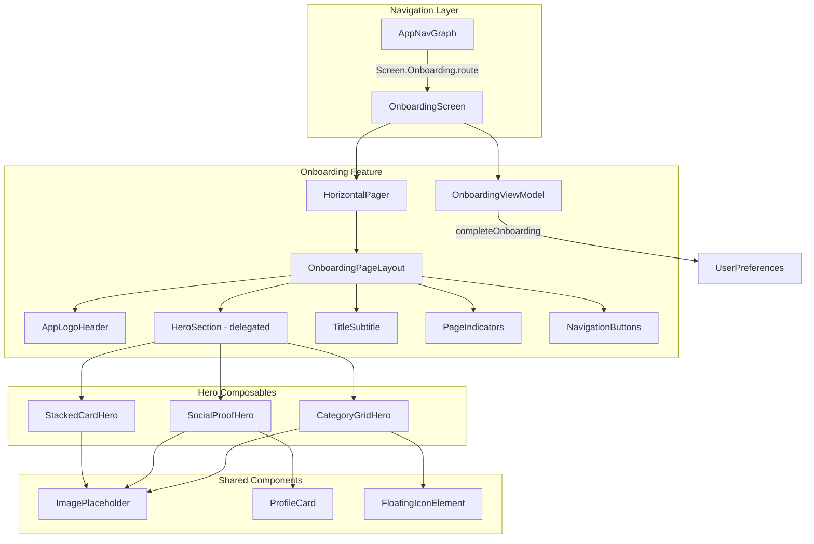
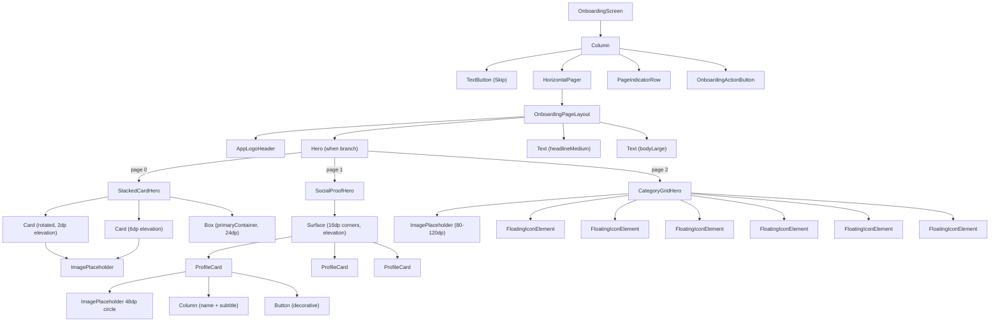

# Design Document: Premium Onboarding Redesign

## Overview

This design replaces the existing simple icon-in-circle onboarding with a premium, visually rich three-screen experience. The new implementation retains the same `Screen.Onboarding` route, `OnboardingViewModel`, and navigation contract (`onFinish` → Login) while completely replacing the screen content with stacked card layouts, social proof user lists, and floating icon grids.

**Key Design Decisions:**
- **In-place replacement**: The new `OnboardingScreen` composable replaces the existing one at the same file path, preserving the navigation graph integration unchanged.
- **Content-driven architecture**: Each page is defined by a sealed interface (`OnboardingHeroContent`) rather than a simple data class, allowing each screen to have a unique hero section while sharing common layout structure.
- **Composable delegation**: The shared layout (logo, hero, headline, subtitle, indicators, buttons) is a single `OnboardingPageLayout` composable that delegates hero rendering to per-screen composables.
- **Theme-only colors**: All colors reference `MaterialTheme.colorScheme` tokens — no hardcoded hex values in composables.
- **Reduced motion support**: Animations respect `LocalReducedMotion` by falling back to instant transitions.

## Architecture



The architecture preserves the existing contract:
1. `AppNavGraph` routes to `OnboardingScreen(onFinish: () -> Unit)`
2. `OnboardingViewModel` remains unchanged — single `completeOnboarding()` method
3. `onFinish` callback navigates to `Screen.Login` with back-stack cleanup

## Components and Interfaces

### Top-Level Composable

```kotlin
@Composable
fun OnboardingScreen(
    onFinish: () -> Unit,
    viewModel: OnboardingViewModel = hiltViewModel()
)
```

Hosts the `HorizontalPager` with 3 pages, skip button, page indicators, and action button.

### Shared Layout: OnboardingPageLayout

```kotlin
@Composable
private fun OnboardingPageLayout(
    page: OnboardingPageData,
    modifier: Modifier = Modifier
)
```

Renders the vertical structure for each page:
1. `AppLogoHeader` — 64×64dp logo, centered
2. Hero section — delegated to `page.heroContent` composable
3. Headline — `headlineMedium` typography
4. Subtitle — `bodyLarge` typography

### Hero Composables

| Composable | Screen | Description |
|---|---|---|
| `StackedCardHero` | 1 | Two overlapping image cards with rotation, elevation, and overlay badge |
| `SocialProofHero` | 2 | 3–5 profile cards with avatar, name, subtitle, and decorative Follow button |
| `CategoryGridHero` | 3 | 6 floating icon elements around a central globe placeholder |

### Reusable Components

| Component | Purpose |
|---|---|
| `ImagePlaceholder` | Rounded container (16dp corners) with surfaceVariant fill, centered icon + label |
| `AppLogoHeader` | Renders `ic_launcher_foreground` at 64×64dp tinted primary, with fallback |
| `PageIndicatorRow` | Animated dot row (8dp idle → 24dp pill, 300ms tween) |
| `OnboardingActionButton` | Full-width pill button switching between Next/Get Started |
| `ProfileCard` | Horizontal row: avatar + name/subtitle + decorative Follow button |
| `FloatingIconElement` | Circular container (40–56dp) with Material icon and elevation |

### Component Hierarchy (Mermaid)



## Data Models

### OnboardingPageData

```kotlin
data class OnboardingPageData(
    val heroType: HeroType,
    val headline: String,        // resolved from string resource
    val subtitle: String,        // resolved from string resource
    val headlineRes: Int,        // @StringRes
    val subtitleRes: Int         // @StringRes
)

enum class HeroType {
    STACKED_CARDS,
    SOCIAL_PROOF,
    CATEGORY_GRID
}
```

### ProfileCardData (Screen 2)

```kotlin
data class ProfileCardData(
    val displayName: String,          // max 30 chars, ellipsis if exceeded
    val subtitle: String,
    val avatarContentDescription: String
)
```

### CategoryIconData (Screen 3)

```kotlin
data class CategoryIconData(
    val icon: ImageVector,
    val label: String,                // accessibility content description
    val sizeDp: Dp                    // between 40dp and 56dp
)
```

### Static Content Definition

```kotlin
private val onboardingPages = listOf(
    OnboardingPageData(
        heroType = HeroType.STACKED_CARDS,
        headlineRes = R.string.onboarding_headline_1,  // "Share Your Location"
        subtitleRes = R.string.onboarding_subtitle_1
    ),
    OnboardingPageData(
        heroType = HeroType.SOCIAL_PROOF,
        headlineRes = R.string.onboarding_headline_2,  // "Create or Join Groups"
        subtitleRes = R.string.onboarding_subtitle_2
    ),
    OnboardingPageData(
        heroType = HeroType.CATEGORY_GRID,
        headlineRes = R.string.onboarding_headline_3,  // "Stay Connected"
        subtitleRes = R.string.onboarding_subtitle_3
    )
)

private val socialProofProfiles = listOf(
    ProfileCardData("Alex Johnson", "Sharing location", "Replace with sample user avatar"),
    ProfileCardData("Maria Garcia", "In Downtown area", "Replace with sample user avatar"),
    ProfileCardData("Sam Wilson", "Active 2 min ago", "Replace with sample user avatar"),
    ProfileCardData("Jordan Lee", "At Home", "Replace with sample user avatar")
)

private val categoryIcons = listOf(
    CategoryIconData(Icons.Default.LocationOn, "Location", 56.dp),
    CategoryIconData(Icons.Default.Group, "Group", 48.dp),
    CategoryIconData(Icons.Default.Map, "Map", 52.dp),
    CategoryIconData(Icons.Default.Chat, "Chat", 44.dp),
    CategoryIconData(Icons.Default.Notifications, "Notifications", 40.dp),
    CategoryIconData(Icons.Default.Navigation, "Navigation", 48.dp)
)
```

### Animation Specifications

| Animation | Duration | Spec | Condition |
|---|---|---|---|
| Page indicator width | 300ms | `tween(300)` | Active dot: 8dp → 24dp pill |
| Page transition (swipe/tap) | 300–500ms | HorizontalPager default `animateScrollToPage` | Between pages |
| Stacked card entrance | — | Static layout, no entrance animation | Reduced motion: same |
| Reduced motion fallback | 0ms | `snap()` | `LocalReducedMotion.current == true` |

**Indicator Animation Detail:**
- Idle dot: 8dp × 8dp circle, `outlineVariant` color
- Active dot: 24dp × 8dp pill (CircleShape clip), `primary` color
- Transition: `animateDpAsState` with `tween(durationMillis = 300)`
- When `LocalReducedMotion` is true, use `snap()` instead of `tween(300)`

**Page Transition:**
- Uses `HorizontalPager` built-in scroll physics
- `animateScrollToPage` for programmatic navigation (Next button)
- Duration governed by Compose Foundation pager defaults (300–500ms range)

## Correctness Properties

*A property is a characteristic or behavior that should hold true across all valid executions of a system — essentially, a formal statement about what the system should do. Properties serve as the bridge between human-readable specifications and machine-verifiable correctness guarantees.*

### Property 1: Content description validity

*For any* content description string used by any `ImagePlaceholder` or `FloatingIconElement` in the onboarding flow, the string shall be non-empty and contain at most 80 characters.

**Validates: Requirements 2.3, 3.4, 4.7, 8.2**

### Property 2: Social proof card count invariant

*For any* valid configuration of the `Social_Proof_Section`, the number of profile cards shall be between 3 and 5 inclusive.

**Validates: Requirements 3.1**

### Property 3: Display name truncation

*For any* string used as a profile card display name, if the string length exceeds 30 characters then the rendered output shall be truncated to 30 characters followed by an ellipsis, and if the string length is 30 or fewer characters it shall be displayed in full without modification.

**Validates: Requirements 3.2**

### Property 4: Category grid structure invariant

*For any* valid `Category_Grid` configuration, the grid shall contain exactly 6 icon elements, and each icon element's container diameter shall be between 40dp and 56dp inclusive.

**Validates: Requirements 4.1, 4.2**

### Property 5: Page indicator state correctness

*For any* page count N and any current page index i in [0, N), the indicator row shall contain exactly N indicators, exactly one indicator (at position i) shall be in the selected state (24dp width), and all other (N-1) indicators shall be in the idle state (8dp width). The accessibility description shall contain the values (i+1) and N.

**Validates: Requirements 5.1, 5.2, 5.4**

### Property 6: Action button state correctness

*For any* page index i in a flow of N pages, if i < N-1 then the action button shall display "Next" with `primaryContainer` background, and if i == N-1 then the action button shall display "Get Started" with `primary` background.

**Validates: Requirements 6.1, 6.2**

### Property 7: Next navigation advances page

*For any* current page index i where i < pageCount - 1, invoking the "Next" action shall result in the current page becoming i + 1.

**Validates: Requirements 6.4**

## Error Handling

| Scenario | Handling |
|---|---|
| App logo drawable fails to load | Display a 64×64dp `Box` filled with `primary` color as fallback. Use `painterResource` wrapped in a try-catch or Coil's error state. |
| Image placeholder has no image resource | Show `Icons.Default.Image` at 48dp in `onSurfaceVariant` color with a text label below. This is the default state for all placeholders. |
| Pager state out of bounds | `HorizontalPager` with `pageCount = { pages.size }` prevents invalid indices. `animateScrollToPage` clamps to valid range. |
| Display name exceeds 30 characters | `Text` composable uses `maxLines = 1` and `overflow = TextOverflow.Ellipsis` with a `Modifier.widthIn(max = ...)` constraint. |
| Reduced motion enabled | All `animateDpAsState` calls check `LocalReducedMotion.current` and use `snap()` instead of `tween(300)`. Page transitions use instant scroll. |
| Screen height < 600dp | `Modifier.weight(1f)` on the pager section allows it to shrink. Hero composables use `Modifier.fillMaxWidth()` with aspect ratio constraints rather than fixed heights. |

## Testing Strategy

### Property-Based Tests (Kotest + Kotest Property)

The project will use **Kotest Property** (`io.kotest:kotest-property`) for property-based testing. Each property test runs a minimum of 100 iterations with generated inputs.

| Property | Test Approach | Generator |
|---|---|---|
| P1: Content description validity | Generate random strings, verify all placeholder content descriptions are non-empty and ≤80 chars | `Arb.string(1..80)` for valid, `Arb.string(0..200)` for validation |
| P2: Social proof card count | Generate lists of ProfileCardData with size 1..10, verify only 3..5 are accepted | `Arb.list(arbProfileCard, 1..10)` |
| P3: Display name truncation | Generate random strings of length 0..100, apply truncation logic, verify output | `Arb.string(0..100)` |
| P4: Category grid structure | Generate lists of CategoryIconData with varying sizes, verify exactly 6 with valid sizes | `Arb.list(arbCategoryIcon, 1..10)` + `Arb.int(30..70).map { it.dp }` |
| P5: Page indicator state | Generate page counts (1..10) and current indices, verify indicator states | `Arb.int(1..10)` for count, derived index |
| P6: Action button state | Generate page indices and page counts, verify button text/style | `Arb.int(1..10)` for count, derived index |
| P7: Next navigation | Generate page indices < pageCount-1, verify advancement | `Arb.int(1..9)` for count, derived index |

**Tag format:** `// Feature: premium-onboarding-redesign, Property {N}: {title}`

### Unit Tests (JUnit 5 + Compose UI Test)

- Verify each page renders correct headline and subtitle text
- Verify logo is present on all 3 pages
- Verify Skip button is present and triggers `onFinish`
- Verify Get Started on last page triggers `completeOnboarding()` + `onFinish`
- Verify stacked card hero has 2 cards with overlay badge
- Verify social proof hero has Follow buttons that are non-interactive
- Verify category grid has center placeholder

### Integration Tests

- Navigation: OnboardingScreen → Login after completion
- ViewModel: `completeOnboarding()` persists flag to DataStore
- Gatekeeper: After onboarding complete, app skips onboarding on next launch

### Accessibility Tests

- All image placeholders have non-empty content descriptions
- Page indicators have semantic description ("Page X of Y")
- Buttons have appropriate labels
- Touch targets meet 48dp minimum

