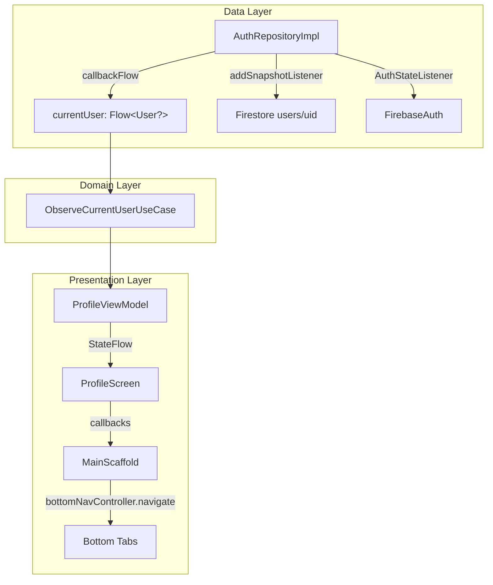

# Design Document: Profile Screen Fixes

## Overview

This design addresses three issues with the Profile Screen in the Where Android app:

1. **Real-Time Profile Data Sync** — Replace the one-shot Firestore `get()` inside `AuthStateListener` with a persistent `addSnapshotListener` so profile edits are reflected immediately.
2. **Profile Screen Redesign** — Retain and polish the existing layout (animated gradient ring avatar, centered info, stats row, action buttons, quick actions card) ensuring consistent Material 3 theming.
3. **Quick Action Navigation** — Wire the currently empty `onClick` handlers in `QuickActionRow` to navigation callbacks that switch bottom tabs.

All changes are scoped to the data layer (`AuthRepositoryImpl`), the presentation layer (`ProfileScreen`, `MainScaffold`), and their connecting interfaces.

## Architecture



**Data flow for Fix 1:**
1. `AuthStateListener` detects sign-in → attaches `addSnapshotListener` on `users/{uid}`
2. Snapshot listener fires on every document change → emits updated `User` via `trySend`
3. `AuthStateListener` detects sign-out → removes snapshot listener → emits `null`
4. `awaitClose` cleans up both listeners

**Navigation flow for Fix 3:**
1. `ProfileScreen` receives `onNavigateToMessages`, `onNavigateToGroups`, `onNavigateToLocationSharing` callbacks
2. `MainScaffold` provides these callbacks, each calling `bottomNavController.navigate(tab.route)`
3. Quick action rows invoke the appropriate callback on tap

## Components and Interfaces

### Modified: `AuthRepositoryImpl.currentUser` (Fix 1)

The `currentUser` flow property is rewritten to combine `AuthStateListener` with a Firestore snapshot listener:

```kotlin
override val currentUser: Flow<User?>
    get() = callbackFlow {
        var snapshotRegistration: ListenerRegistration? = null

        val authListener = FirebaseAuth.AuthStateListener { auth ->
            val firebaseUser = auth.currentUser
            // Remove previous snapshot listener on any auth state change
            snapshotRegistration?.remove()
            snapshotRegistration = null

            if (firebaseUser != null) {
                // Attach real-time snapshot listener on user document
                snapshotRegistration = firestore
                    .collection(AppConstants.FIRESTORE_COLLECTION_USERS)
                    .document(firebaseUser.uid)
                    .addSnapshotListener { snapshot, error ->
                        if (error != null) {
                            Timber.w(error, "Snapshot listener error, falling back to Auth data")
                            trySend(
                                User(
                                    id = firebaseUser.uid,
                                    displayName = firebaseUser.displayName ?: "",
                                    email = firebaseUser.email ?: "",
                                    photoUrl = firebaseUser.photoUrl?.toString(),
                                    isEmailVerified = firebaseUser.isEmailVerified
                                )
                            ).isSuccess
                            return@addSnapshotListener
                        }
                        if (snapshot != null && snapshot.exists()) {
                            val user = snapshot.toObject(User::class.java)
                            val merged = (user ?: User(
                                id = firebaseUser.uid,
                                displayName = firebaseUser.displayName ?: "",
                                email = firebaseUser.email ?: "",
                                photoUrl = firebaseUser.photoUrl?.toString()
                            )).copy(isEmailVerified = firebaseUser.isEmailVerified)
                            trySend(merged).isSuccess
                        }
                    }
            } else {
                trySend(null).isSuccess
            }
        }

        firebaseAuth.addAuthStateListener(authListener)
        awaitClose {
            snapshotRegistration?.remove()
            firebaseAuth.removeAuthStateListener(authListener)
        }
    }
```

**Key changes:**
- Import `com.google.firebase.firestore.ListenerRegistration`
- Replace one-shot `.get()` with `.addSnapshotListener`
- Store `ListenerRegistration` to remove on sign-out or `awaitClose`
- On snapshot error, fall back to Firebase Auth data (satisfies Requirement 1.5)

### Modified: `ProfileScreen` composable (Fix 2 & Fix 3)

**New parameters added:**

```kotlin
@Composable
fun ProfileScreen(
    onNavigateToEditProfile: () -> Unit,
    onNavigateToSettings: () -> Unit,
    onNavigateToMessages: () -> Unit,      // NEW
    onNavigateToGroups: () -> Unit,         // NEW
    onNavigateToLocationSharing: () -> Unit, // NEW
    viewModel: ProfileViewModel = hiltViewModel()
)
```

**Quick action wiring:**

```kotlin
QuickActionRow(
    icon = Icons.AutoMirrored.Outlined.Chat,
    title = "Messages",
    subtitle = "Your conversations",
    onClick = onNavigateToMessages  // was: { /* handled by bottom nav */ }
)
QuickActionRow(
    icon = Icons.Outlined.Group,
    title = "Groups",
    subtitle = "Manage your groups",
    onClick = onNavigateToGroups  // was: { /* handled by bottom nav */ }
)
QuickActionRow(
    icon = Icons.Outlined.LocationOn,
    title = "Location Sharing",
    subtitle = "Active sharing sessions",
    onClick = onNavigateToLocationSharing  // was: { /* handled by bottom nav */ }
)
```

### Modified: `MainScaffold` composable (Fix 3)

The `ProfileScreen` call site in `MainScaffold` provides the new navigation callbacks:

```kotlin
composable(BottomTab.Profile.route) {
    ProfileScreen(
        onNavigateToEditProfile = onNavigateToEditProfile,
        onNavigateToSettings = onNavigateToSettings,
        onNavigateToMessages = {
            bottomNavController.navigate(BottomTab.Chats.route) {
                popUpTo(BottomTab.Map.route) { saveState = true }
                launchSingleTop = true
                restoreState = true
            }
        },
        onNavigateToGroups = {
            // Groups are part of the People tab in current nav structure
            // Navigate to People tab which shows groups
            bottomNavController.navigate(BottomTab.People.route) {
                popUpTo(BottomTab.Map.route) { saveState = true }
                launchSingleTop = true
                restoreState = true
            }
        },
        onNavigateToLocationSharing = {
            bottomNavController.navigate(BottomTab.Map.route) {
                popUpTo(BottomTab.Map.route) { saveState = true }
                launchSingleTop = true
                restoreState = true
            }
        }
    )
}
```

**Design decision:** The "Groups" quick action navigates to the People tab (which contains group management), and "Location Sharing" navigates to the Map tab (which shows active sharing sessions). This matches the existing bottom tab structure without introducing new tabs.

## Data Models

No new data models are introduced. The existing `User` domain model and `UserProfileUiModel` presentation model remain unchanged.

**Existing models used:**

| Model | Location | Role |
|-------|----------|------|
| `User` | `domain/model/User.kt` | Firestore document mapping, emitted by `currentUser` flow |
| `UserProfileUiModel` | `presentation/model/UserProfileUiModel.kt` | UI-ready profile data consumed by `ProfileScreen` |
| `ProfileUiState` | `presentation/profile/ProfileViewModel.kt` | Composite UI state with profile + stats |

## Error Handling

| Scenario | Handling |
|----------|----------|
| Firestore snapshot listener error | Fall back to Firebase Auth data (`displayName`, `email`, `photoUrl`, `isEmailVerified`). Log warning via Timber. |
| User document doesn't exist in Firestore | Construct minimal `User` from Firebase Auth fields. |
| Auth state changes to signed-out | Remove snapshot listener, emit `null` through flow. |
| Navigation callback not provided | Not possible — all callbacks are required parameters (non-nullable `() -> Unit`). |

## Testing Strategy

**PBT Assessment:** Property-based testing is NOT applicable for this feature. The changes involve:
- Firebase integration (Firestore snapshot listeners) — external service wiring
- UI rendering (Compose layout) — visual output
- Navigation callbacks — specific event-driven interactions

None of these have universal properties that vary meaningfully with input. All testing should use example-based unit tests and integration tests.

**Unit Tests:**
- `AuthRepositoryImpl` — Mock `FirebaseAuth` and `FirebaseFirestore` to verify:
  - Snapshot listener is attached when user is authenticated
  - Updated `User` is emitted when snapshot fires
  - Fallback to Auth data on snapshot error
  - Listener is removed on sign-out
  - Both listeners cleaned up on `awaitClose`

**Compose UI Tests:**
- `ProfileScreen` — Verify:
  - All profile fields are displayed (name, username, bio, avatar)
  - Stats row shows correct counts
  - Quick action taps invoke the correct navigation callbacks
  - Edit Profile and Settings buttons trigger their callbacks

**Integration Tests:**
- End-to-end flow: Edit profile → Firestore update → Snapshot fires → ProfileScreen updates (requires Firebase emulator or instrumented test)

**Test Framework:** JUnit 5 + MockK for unit tests, Compose Testing (`createComposeRule`) for UI tests.
